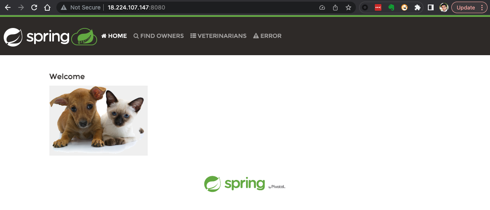

# Foundational Workshop #1 — Containers and Kubernetes

**Duration:** ~1.5 hours · **Prerequisite:** [Host setup](../00-setup/index.md) complete

In this module you'll turn a Java web application into a container image, deploy it
into a Kubernetes cluster, expose it to the outside world, and switch on the Kubernetes
audit log — the security trail that Foundational Workshop #2 will start collecting.

By the end you will have:

- [x] A running single-node Kubernetes cluster with API auditing enabled
- [x] The Spring PetClinic application built from source
- [x] That application packaged as a container image
- [x] The image deployed to Kubernetes and reachable from your browser

## Session variables

Every command below uses these. Load them into **each** terminal you use — including the
second one you'll open for load testing:

```bash
source ~/.workshop-env
echo "$WS_USER on $LOCAL_IP ($PUB_DNS)"
```

??? info "Missing, or starting from a fresh shell?"
    The file is created during [host setup](../00-setup/index.md). If it isn't there:

    ```bash
    cat > ~/.workshop-env <<'EOF'
    export WS_USER=<your-username>
    export LOCAL_IP=$(ec2metadata --local-ipv4)
    export PUB_DNS=$(ec2metadata --public-hostname)
    export CHART_VERSION=0.158.0
    export JAVA_HOME=/usr/lib/jvm/java-21-openjdk-amd64
    EOF
    chmod 600 ~/.workshop-env
    source ~/.workshop-env
    ```

    Values added by later modules:

    | Variable | Set in | Used for |
    |---|---|---|
    | `HEC_TOKEN` | FW #2 step 3 | Collector → Splunk Enterprise |
    | `O11Y_REALM` | AW #2 step 1 | Observability Cloud realm, e.g. `us1` |

    Tokens themselves stay in files (`~/.o11y-token`, `~/.rum-token`) rather than in here,
    so they're never echoed to a terminal.

---

## 1. Verify your toolchain

Log in as the `splunk` user. Everything in this workshop runs as `splunk` — the cluster,
the application, and Splunk Enterprise all live under that account.

```bash
sudo -i -u splunk
whoami
```

Confirm the three tools are on your path:

```bash
minikube version
kubectl version --client -o json | jq -r .clientVersion.gitVersion
helm version --short
```

<details>
<summary>Expected output</summary>

```
minikube version: v1.38.1
v1.36.3
v4.2.4+g3900f43
```

`kubectl` may print `The connection to the server localhost:8080 was refused` — that's
expected. There's no cluster yet.
</details>

---

## 2. Start Kubernetes

!!! abstract "Learning moment — what minikube actually is"
    minikube runs a complete single-node Kubernetes cluster inside a **Docker container**
    on your host. The `--driver=docker` flag selects that approach.

    That detail matters later: the cluster has its own container image store, separate
    from your host's. When you build the PetClinic image, you'll build it *into*
    minikube's store so Kubernetes can find it without a registry.

```bash
minikube config set driver docker
minikube start \
  --driver=docker \
  --container-runtime=docker \
  --subnet=192.168.49.0/24
```

!!! warning "Why `--container-runtime=docker` is explicit"
    From minikube v1.39 the default runtime becomes `containerd`. This workshop builds
    images directly into minikube's Docker daemon, so we pin the runtime rather than
    depending on the default of whichever version you installed.

Check the cluster is up:

```bash
minikube status
kubectl get nodes
```

<details>
<summary>Expected output</summary>

```
minikube
type: Control Plane
host: Running
kubelet: Running
apiserver: Running
kubeconfig: Configured

NAME       STATUS   ROLES           AGE   VERSION
minikube   Ready    control-plane   61s   v1.35.1
```

If `STATUS` shows `NotReady`, wait 30 seconds and re-run — the network plugin takes a
moment to initialise.
</details>

---

## 3. Turn on the Kubernetes audit log

!!! abstract "Learning moment — why the audit log matters"
    The Kubernetes API server can record **every request made against the cluster**: who
    made it, what they asked for, and whether it was allowed. That's the primary evidence
    source for detecting a compromised cluster.

    minikube does not enable auditing by default. You'll switch it on now, and in
    Foundational Workshop #2 you'll ship those events to Splunk and search them.

Create an audit policy. This one logs every request at `Metadata` level — fine for a lab,
far too much for production.

```bash
mkdir -p ~/.minikube/files/etc/ssl/certs
cat > ~/.minikube/files/etc/ssl/certs/audit-policy.yaml <<'YAML'
# Log all requests at the Metadata level.
apiVersion: audit.k8s.io/v1
kind: Policy
rules:
- level: Metadata
YAML

cat ~/.minikube/files/etc/ssl/certs/audit-policy.yaml
```

Restart the cluster with auditing enabled. `audit-log-path=-` sends audit records to the
API server's stdout, where a log collector can pick them up.

```bash
minikube stop
minikube start \
  --driver=docker \
  --container-runtime=docker \
  --subnet=192.168.49.0/24 \
  --extra-config=apiserver.audit-policy-file=/etc/ssl/certs/audit-policy.yaml \
  --extra-config=apiserver.audit-log-path=-
```

### ✅ Checkpoint

```bash
kubectl logs kube-apiserver-minikube -n kube-system \
  | grep -c 'audit.k8s.io/v1'
```

A number greater than zero means auditing is on. If you get `0`, the policy file didn't
reach the node — re-check the path in the `--extra-config` flag.

---

## 4. Build the PetClinic application

```bash
mkdir -p ~/k8s_workshop/petclinic
cd ~/k8s_workshop/petclinic
git clone --depth 1 https://github.com/spring-projects/spring-petclinic.git
cd spring-petclinic
```

Build it. The first run downloads the Maven dependency tree and takes a few minutes.

```bash
export JAVA_HOME=/usr/lib/jvm/java-21-openjdk-amd64
./mvnw -B -DskipTests package
```

Find the jar that was produced:

```bash
JAR=$(ls -1 target/*.jar | grep -v 'sources\|javadoc\|original' | head -1)
echo "$JAR"
```

!!! danger "Don't hardcode the jar name"
    PetClinic's version changes upstream — it has already moved from `3.0.0-SNAPSHOT` to
    `4.0.0-SNAPSHOT`. Always detect the filename as above. Every later step, including the
    `Dockerfile`, refers to `$JAR` rather than a literal name.

### ✅ Checkpoint — run it directly

```bash
java -jar "$JAR" &
sleep 25
curl -s -o /dev/null -w '%{http_code}\n' http://localhost:8080/
kill %1
```

`200` means the application is good. Anything else, check the build output above.

---

## 5. Package it as a container image

!!! abstract "Learning moment — why the base image is a JRE"
    A container image should carry only what it needs at runtime. We compiled with a full
    JDK, but running the jar needs only a **Java runtime**, so the image is based on
    `eclipse-temurin:21-jre-noble`.

    That single choice takes the image from roughly 514 MB to 360 MB. In a microservice
    architecture with dozens of services and frequent redeploys, that difference compounds
    into real bandwidth, storage, and start-up time.

Point your shell at minikube's Docker daemon. This is the step that makes the image land
where Kubernetes can see it:

```bash
eval $(minikube -p minikube docker-env)
echo "$DOCKER_HOST"          # should print tcp://192.168.49.2:2376
```

Create the `Dockerfile` in the build output directory:

```bash
cd ~/k8s_workshop/petclinic/spring-petclinic/target
JARNAME=$(basename "$JAR")

cat > Dockerfile <<EOF
# syntax=docker/dockerfile:1
FROM eclipse-temurin:21-jre-noble
WORKDIR /app
COPY ${JARNAME} ./app.jar
CMD ["java", "-jar", "app.jar"]
EOF

cat Dockerfile
```

Build it:

```bash
docker build --tag ${WS_USER}/petclinic-otel:v1 .
docker images | grep petclinic
```

### ✅ Checkpoint

```bash
docker images --format '{{.Repository}}:{{.Tag}}' | grep "^${WS_USER}/petclinic-otel:v1$"
```

The tag echoing back means the image exists inside minikube's store.

---

## 6. Deploy to Kubernetes

!!! abstract "Learning moment — Deployments and Services"
    Two objects do the work here:

    - A **Deployment** tells Kubernetes what to run and how many copies. It watches the
      pods and replaces any that die.
    - A **Service** gives those pods a stable network identity. Pods come and go with
      changing IPs; the Service does not.

    We use a `NodePort` Service, which publishes the application on a fixed port on the
    cluster node — the simplest option for a single-node lab.

Download the manifest and substitute your username:

```bash
mkdir -p ~/k8s_workshop/petclinic/k8s_deploy
cd ~/k8s_workshop/petclinic/k8s_deploy

curl -fsSL -o petclinic.yml.tmpl \
  https://raw.githubusercontent.com/gdcosta/k8s-otel-workshop/main/labs/manifests/petclinic.yml

WS_USER=$WS_USER envsubst < petclinic.yml.tmpl > ${WS_USER}-petclinic-k8s-manifest.yml
cat ${WS_USER}-petclinic-k8s-manifest.yml
```

!!! tip "Why a file instead of a long command"
    Earlier versions of this workshop generated manifests with chained `sed` commands,
    because copying indented YAML out of a Word document mangled the whitespace. In a
    web page, the copy button preserves it exactly — so we ship the real file. It's also
    the file you'd commit to a Git repository in production.

Apply it:

```bash
kubectl apply -f ${WS_USER}-petclinic-k8s-manifest.yml
kubectl rollout status deployment/${WS_USER}-petclinic-otel-deployment --timeout=300s
```

!!! note "`rollout status` is a real gate here"
    The manifest defines a `readinessProbe` against `/actuator/health`, so `rollout status`
    only returns once the application is genuinely serving traffic — not merely once the
    container has started. Without a probe it returns roughly 15 seconds early, and the
    next command appears to fail for no reason.

Inspect what you created:

```bash
kubectl get deployments
kubectl get pods -o wide
kubectl get services
```

---

## 7. Reach the application

```bash
minikube ip
curl -s -o /dev/null -w '%{http_code}\n' http://$(minikube ip):30000/
```

The hostname `minikube` was mapped to that IP during host setup, so this also works:

```bash
curl -s -o /dev/null -w '%{http_code}\n' http://minikube:30000/
```

To reach it from your laptop's browser, forward the port:

```bash
kubectl port-forward --address 0.0.0.0 service/${WS_USER}-petclinic-srv 8080:8080
```

Leave that running and open PetClinic in a browser:

```bash
echo "http://$PUB_DNS:8080"
```


<!-- STATUS: pending-recapture · 2023 · replace with 4.0.0-SNAPSHOT UI -->

Click around — find owners, add a pet, look at the veterinarians list. Then click
**ERROR** in the menu bar. That deliberately throws an exception, and in the next module
you'll find the resulting stack trace in Splunk.

---

## ✅ Module checkpoint

Run the verification script:

```bash
~/k8s-otel-workshop/scripts/verify-fw1.sh
```

<details>
<summary>What it checks</summary>

1. minikube node is `Ready`
2. API server is emitting audit events
3. `minikube` resolves via `/etc/hosts`
4. The PetClinic image exists in minikube's Docker store
5. The Deployment has an available replica
6. The NodePort Service answers `HTTP 200`
</details>

---

## Troubleshooting

??? failure "`kubectl get nodes` says `NotReady`"
    The CNI plugin needs a moment after start. Wait 30 seconds. If it persists:
    `minikube delete && minikube start ...` with the flags from step 2.

??? failure "`docker build` can't find the jar"
    You're probably in the wrong directory. The `Dockerfile` and the jar must both be in
    `~/k8s_workshop/petclinic/spring-petclinic/target`.

??? failure "Pod status is `ErrImageNeverPull` or `ImagePullBackOff`"
    The image wasn't built into minikube's Docker daemon. Re-run
    `eval $(minikube -p minikube docker-env)` and rebuild — `docker images` must list
    `${WS_USER}/petclinic-otel:v1` *after* that eval.

??? failure "`curl http://minikube:30000` fails but the IP works"
    The `/etc/hosts` entry is missing. It's created during host setup and needs root:
    ```bash
    exit                                  # back to the ubuntu user
    echo -e "$(minikube ip)\tminikube" | sudo tee -a /etc/hosts
    ```

---

**Next:** [Foundational Workshop #2 — Collecting logs with OpenTelemetry](../02-foundational-2/index.md)
