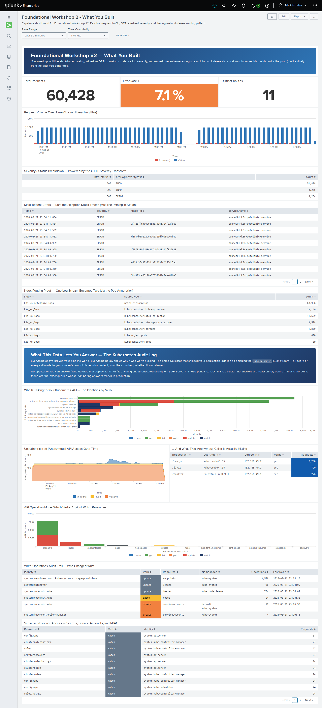
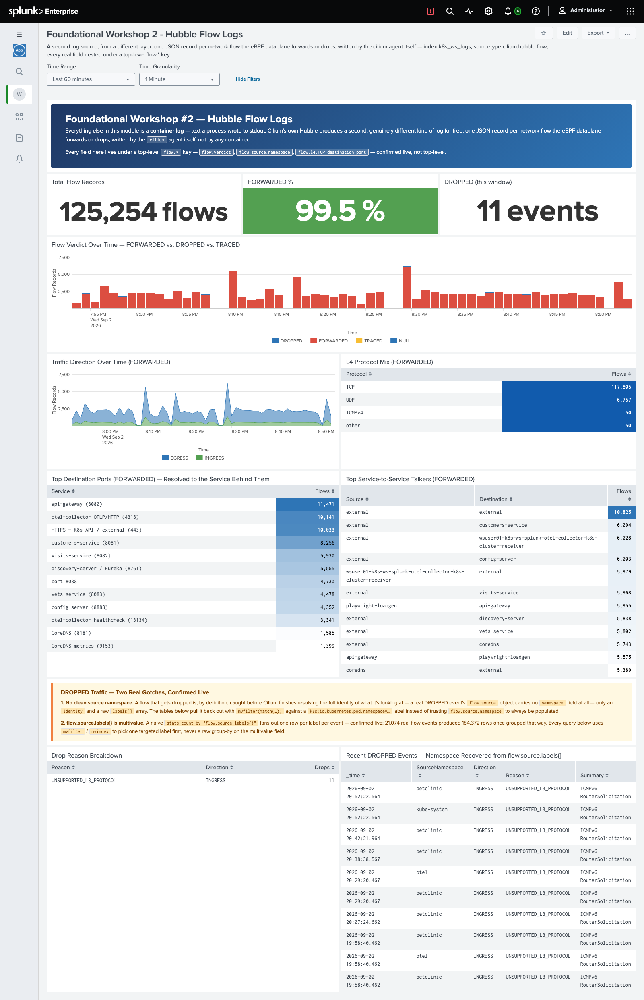

# Foundational Workshop #2 — Collecting logs with OpenTelemetry

**Duration:** ~2 hours · **Prerequisite:** [FW #1b](../01b-foundational-1b/index.md) complete
(`./scripts/verify-fw1b.sh` passes)

In FW #1 you got an application running on Kubernetes. It's generating logs, the API server
is generating an audit trail — and none of it is going anywhere. In this module you'll
deploy the OpenTelemetry Collector and start capturing all of it into Splunk.

By the end you will have:

- [x] Splunk Enterprise running locally with indexes and an HTTP Event Collector endpoint
- [x] The Splunk OTel Collector deployed via Helm, shipping container and audit logs
- [x] Java stack traces arriving as single events instead of fragments
- [x] Pod metadata attached to events using annotations
- [x] Application logs routed to their own index
- [x] Log events reshaped in flight with an OTTL transform

Background reading: [The OpenTelemetry Collector and Helm](../concepts/otel-collector.md)

## Session variables

Every command below uses these. Load them into **each** terminal you use — including the
second one you'll open for load testing:

```bash
source ~/.workshop-env
echo "$WS_USER on $LOCAL_IP ($PUB_DNS)"
```

??? info "Missing, or starting from a fresh shell?"
    The file is created during [host setup](../00-setup/index.md). If it isn't there:

    ```bash
    cat > ~/.workshop-env <<'EOF'
    export WS_USER=<the username you were assigned, e.g. wsuser01>
    export LOCAL_IP=$(ec2metadata --local-ipv4)
    export PUB_DNS=$(ec2metadata --public-hostname)
    export CHART_VERSION=0.158.0
    export JAVA_HOME=/usr/lib/jvm/java-21-openjdk-amd64
    EOF
    chmod 600 ~/.workshop-env
    source ~/.workshop-env
    ```

    Values added by later modules:

    | Variable | Set in | Used for |
    |---|---|---|
    | `HEC_TOKEN` | FW #2 step 3 | Collector → Splunk Enterprise |
    | `O11Y_REALM` | AW #2 step 1 | Observability Cloud realm, e.g. `us1` |

    Tokens themselves stay in files (`~/.o11y-token`, `~/.rum-token`) rather than in here,
    so they're never echoed to a terminal.


!!! note "`${WS_USER}` in YAML you edit by hand"
    Shell commands expand `${WS_USER}` for you. A **text editor does not** — typing it into
    a YAML file leaves the literal characters. Every "Full command sequence" below therefore
    includes a `sed` line that resolves it after you save:

    ```bash
    sed -i "s|\${WS_USER}|$WS_USER|g" <the-file>
    ```

    Run it, or just type your username directly instead of the placeholder. Either is fine —
    what matters is that no `${WS_USER}` survives into the deployed config.


---

## 1. Start Splunk Enterprise

```bash
sudo -i -u splunk
/opt/splunk/bin/splunk start --accept-license --answer-yes --no-prompt
/opt/splunk/bin/splunk status
```

Open Splunk Web and log in as `admin` with the password `Workshop2026!`:

```bash
echo "http://$PUB_DNS:8000"
```


<!-- STATUS: pending-recapture · 2023 · Splunk 10.4 login screen differs -->

---

## 2. Create the indexes

!!! abstract "Learning moment — why separate indexes"
    An index is Splunk's unit of **retention and access control**. Splitting data across
    indexes lets you keep infrastructure logs for 30 days and application logs for a year,
    or let the app team read their own logs without seeing cluster-wide audit data.

    You'll create five now and use them across this module and both Advanced workshops.

=== "Splunk Web"

    **Settings → Indexes → New Index**. Create these:

    | Index | Type |
    |---|---|
    | `k8s_ws_logs` | Events |
    | `k8s_ws_petclinic_logs` | Events |
    | `k8s_ws_traces` | Events |
    | `k8s_ws_metrics` | Metrics |
    | `k8s_ws_petclinic_metrics` | Metrics |

=== "Command line"

    ```bash
    SPLUNK=/opt/splunk/bin/splunk
    AUTH="-auth admin:Workshop2026!"

    for idx in k8s_ws_logs k8s_ws_petclinic_logs k8s_ws_traces; do
      $SPLUNK add index $idx $AUTH
    done

    for idx in k8s_ws_metrics k8s_ws_petclinic_metrics; do
      $SPLUNK add index $idx -datatype metric $AUTH
    done

    $SPLUNK list index $AUTH | grep k8s_ws
    ```

    !!! note "Every `/opt/splunk/bin/splunk` command prints a TLS warning"
        Each invocation emits `WARNING: Server Certificate Hostname Validation is disabled.
        Please see server.conf/[sslConfig]/cliVerifyServerName for details.` — once per
        command, here and everywhere else the CLI is used. It's expected on a lab instance
        with a self-signed certificate. Ignore it; it isn't a symptom of anything.

---

## 3. Create an HTTP Event Collector token

HEC is the HTTP endpoint the Collector will push events to.

!!! danger "Two toggles on the Global Settings page — you need to change both"
    On a clean Splunk 10.x install HEC ships **disabled**, and SSL ships **on**. Neither
    default is what this workshop needs, and changing only one of them still leaves you with
    a Collector that delivers nothing.

    **Settings → Data Inputs → HTTP Event Collector → Global Settings**:

    - Set **All Tokens** to **Enabled**. It ships **Disabled**, which means nothing is
      listening on 8088 at all — the smoke test below gets *connection refused*, not an
      authentication error.
    - Untick **Enable SSL**. This changed from earlier releases: in Splunk 10 HEC listens on
      **HTTPS** out of the box, so pointing the Collector at `http://…:8088` gets the
      connection reset, with **no useful error**.
    - Leave **HTTP Port Number** at `8088`, then **Save**.

=== "Splunk Web"

    **Settings → Data Inputs → HTTP Event Collector → New Token**

    - Name: `k8s-ws-hec`
    - Allowed indexes: all five you just created
    - Default index: `k8s_ws_logs`

    Copy the token value.

=== "Command line"

    Both halves of the step — the Global Settings change and the token — without needing a
    tunnel to port 8000.

    ```bash
    SPLUNK=/opt/splunk/bin/splunk
    AUTH="-auth admin:Workshop2026!"

    # Global Settings: enable HEC, turn SSL off, keep the port at 8088
    curl -sk -u admin:Workshop2026! -X POST \
      https://localhost:8089/servicesNS/nobody/splunk_httpinput/data/inputs/http/http \
      -d enableSSL=0 -d disabled=0 -d port=8088

    # New Token
    $SPLUNK http-event-collector create k8s-ws-hec -index k8s_ws_logs \
      -indexes k8s_ws_logs,k8s_ws_petclinic_logs,k8s_ws_traces,k8s_ws_metrics,k8s_ws_petclinic_metrics \
      -uri https://localhost:8089 $AUTH
    ```

    !!! warning "The subcommand is `http-event-collector`, and `-uri` is required"
        `splunk http create` — the shorter, more guessable form — **is not a valid command**
        on this Splunk version:
        ```
        Command error: 'http' is not a valid command.
        ```
        The real subcommand is `http-event-collector`, and unlike `add index` in step 2 it
        does not infer the management URI from context — omit `-uri https://localhost:8089`
        and it fails with `Splunk server uri is missing`, not an error you'd think to search
        for.

    The token value is printed in the output of the `http-event-collector create` command.
    As in step 2, each `$SPLUNK` call also prints the `Server Certificate Hostname
    Validation is disabled` warning — expected, ignore it.

Then confirm the whole path works before going further:

```bash
# Keep the token in the env file so you don't have to go looking for it again.
# Nothing sources this file for you — run `source ~/.workshop-env` in every new terminal.
echo 'export HEC_TOKEN=<your-token>' >> ~/.workshop-env
source ~/.workshop-env

curl -s -w '\n%{http_code}\n' "http://${LOCAL_IP}:8088/services/collector/event" \
  -H "Authorization: Splunk ${HEC_TOKEN}" \
  -H 'Content-Type: application/json' \
  --data-binary '{"event":"hec-smoketest","sourcetype":"workshop:test","index":"k8s_ws_logs"}'
```

### ✅ Checkpoint

You want `{"text":"Success","code":0}` and `200`.

<details>
<summary>If you get something else</summary>

| Response | Cause |
|---|---|
| Empty body, `000` | SSL still enabled on HEC — see the warning above |
| `{"text":"Invalid token"}` | Token copied incorrectly |
| `{"text":"Incorrect index"}` | Index not in the token's allowed list |
| Connection refused | **All Tokens** still `Disabled` in Global Settings, or Splunk not running |
</details>

Now find it in Splunk: `index=k8s_ws_logs hec-smoketest`

---

## 4. Deploy the OpenTelemetry Collector

!!! tip "We install from the chart repository, not a Git clone"
    Earlier versions of this workshop cloned the chart repo and edited its `values.yaml`
    in place. We use a small **overlay file** instead. It's a fraction of the size, it's
    the file you'd commit to Git in production, and — importantly — it survives a chart
    upgrade. Edits to a vendored `values.yaml` do not.

```bash
helm repo add splunk-otel-collector-chart https://signalfx.github.io/splunk-otel-collector-chart
helm repo update
```

Create the overlay. This is the *entire* configuration:

```bash
mkdir -p ~/k8s_workshop/k8s_otel && cd ~/k8s_workshop/k8s_otel

cat > values-workshop.yaml <<EOF
clusterName: ${WS_USER}-minikube-cluster

splunkPlatform:
  endpoint: "http://${LOCAL_IP}:8088/services/collector"
  token: "${HEC_TOKEN}"
  index: "k8s_ws_logs"
  logsEnabled: true
  metricsEnabled: false
  tracesEnabled: false

logsCollection:
  containers:
    # Collect the Collector's own logs too — useful while learning.
    excludeAgentLogs: false

clusterReceiver:
  eventsEnabled: true
  k8sObjects:
    - name: pods
      mode: pull
      interval: 60s
    - name: events
      mode: watch
EOF
```

Preview what that produces *before* installing anything:

```bash
helm template t splunk-otel-collector-chart/splunk-otel-collector \
  --version 0.158.0 -f values-workshop.yaml | grep -A3 'splunk_hec/platform_logs'
```

Install it — the Collector gets its own `otel` namespace, kept separate from the
`petclinic` namespace the app lives in, so infrastructure and application never share one:

```bash
helm install ${WS_USER}-k8s-ws splunk-otel-collector-chart/splunk-otel-collector \
  --version 0.158.0 -f values-workshop.yaml \
  --namespace otel --create-namespace

kubectl rollout status daemonset/${WS_USER}-k8s-ws-splunk-otel-collector-agent -n otel
kubectl get pods -n otel -o wide
```

!!! warning "Always pass `--version`"
    This chart is pre-1.0 and ships breaking changes on minor releases — roughly every two
    weeks. Without an explicit version you get whatever is current, and the workshop may
    behave differently from what's written here.

### ✅ Checkpoint

Two Collector pods `1/1 Running` — an **agent** DaemonSet (one per node, reads container
logs) and a **cluster receiver** Deployment (one per cluster, talks to the Kubernetes API).

Then search Splunk over the last 15 minutes:

```
index=k8s_ws_logs | stats count by sourcetype
```

<details>
<summary>Expected sourcetypes</summary>

```
kube:container:kube-apiserver                       5815
kube:container:storage-provisioner                   896
kube:container:otel-collector                         68
kube:container:${WS_USER}-petclinic-...               46
kube:object:pods                                      10
kube:container:etcd                                    9
workshop:test                                          1
```

**The counts are illustrative.** They vary a lot with how long the cluster has been up —
it's the rows that matter, not the numbers.

`kube:container:otel-collector` is the Collector reporting on itself, because the overlay
above set `excludeAgentLogs: false`. `workshop:test` is the single smoke-test event you sent
in step 3.

`kube:object:events` may be **missing entirely at this point, and that is not a fault**. It
is collected in `mode: watch`, so it only emits when something in the cluster *changes* — on
a quiet, freshly installed cluster there may be nothing for several minutes. Force one:

```bash
kubectl delete pod <any-pod>
```

No PetClinic rows yet? The application has had no traffic. That's what the load generator
in step 7 is for — for now, `curl http://minikube:30000/` a few times to prove the path
works.
</details>

---

## 5. Explore the Kubernetes audit log

This is the trail you enabled in FW #1, now searchable.

```
index=k8s_ws_logs sourcetype="kube:container:kube-apiserver"
```

Who has been talking to the API server anonymously, and what did they get back?

```
index=k8s_ws_logs sourcetype="kube:container:kube-apiserver" "user.username"="system:anonymous"
| rename sourceIPs{} as src_ip
| stats count min(_time) as firstTime max(_time) as lastTime
        values(responseStatus.reason) values(responseStatus.code)
        values(userAgent) values(verb) values(requestURI)
        by src_ip, "user.username", "k8s.cluster.name"
| eval firstTime=strftime(firstTime,"%c"), lastTime=strftime(lastTime,"%c")
```

!!! abstract "Learning moment — what this is worth"
    That single query is the basis of a whole family of Kubernetes detections: cluster
    scanning, service accounts hitting forbidden endpoints, access to sensitive objects.
    A set of ready-made searches ships in the [facilitator guide](../facilitator/index.md).

---

## 6. Make the application actually log

!!! abstract "Why `customers-service`, and not all six"
    All six services are Spring Boot, so this applies identically to any of them — the
    lesson only needs one. `customers-service` is the one you built by hand in FW #1, so
    it's the one you already understand best.

Before searching, there's a problem worth discovering yourself. Run some traffic, then look
at what the container emitted:

```bash
for i in $(seq 1 30); do curl -s -o /dev/null http://minikube:30000/api/customer/owners; done
kubectl logs deploy/customers-service -n petclinic --since=1m | wc -l
```

**Zero.** Thirty successful requests produced no log lines at all.

!!! tip "Do it in the browser too — it makes the point better"
    If your tunnel from [host setup](../00-setup/index.md) is still up, open
    **http://localhost:8080** and click around: find an owner, open their pet, add a visit.
    Otherwise reconnect with:

    ```bash
    ssh -i <your-key.pem> -L 8080:192.168.49.2:30000 splunk@<your-instance>
    ```

    Then re-run the `kubectl logs` line above. Still zero. Thirty automated requests are
    easy to dismiss; a few minutes of genuinely using an application and getting **not one
    line of output** is the thing worth remembering.

    No extra security-group rule is needed for this — the tunnel rides port 22.

!!! abstract "Learning moment — most applications are silent when healthy"
    Spring Boot logs at startup and when something throws. Successful requests produce
    nothing. That's normal and usually sensible — logging every request costs storage and
    tells you little that metrics don't.

    But it means an observability workshop built only on application logs would have almost
    nothing to look at, and it's why *access logs* exist as a separate concern: one line
    per request, recording what was asked for, what came back, and how long it took.

Enable Tomcat's access log, writing to stdout so the Collector picks it up like any other
container output. Add to the container's `env:` block in your manifest:

```yaml
        - name: SERVER_TOMCAT_ACCESSLOG_ENABLED
          value: "true"
        - name: SERVER_TOMCAT_ACCESSLOG_DIRECTORY
          value: "/dev"
        - name: SERVER_TOMCAT_ACCESSLOG_PREFIX
          value: "stdout"
        - name: SERVER_TOMCAT_ACCESSLOG_SUFFIX
          value: ""
        - name: SERVER_TOMCAT_ACCESSLOG_FILE_DATE_FORMAT
          value: ""
        - name: SERVER_TOMCAT_ACCESSLOG_BUFFERED
          value: "false"
        - name: SERVER_TOMCAT_ACCESSLOG_PATTERN
          value: '%h %l %u %t "%r" %s %b %D'
```

??? example "What your manifest should look like around here"
    Your manifest has six `Deployment` blocks in it now, one per service — find
    `customers-service`'s specifically (`name: customers-service`, `containerPort: 8081`).
    It has **no `env:` key at all** at this point — FW #1's file doesn't create one, and
    nothing before this step has needed it. Add `env:` as a new sibling of `ports:` inside
    *that one container spec only*, then the seven access-log variables under it as its
    first list items. The other five services are untouched by this step.

    The OTel telemetry variables (`SPLUNK_OTEL_AGENT`, `OTEL_EXPORTER_OTLP_ENDPOINT`) you'll
    see in the reference manifest at the bottom of this page don't exist yet — those are
    added in **AW #1**. The profiler variables and `LOGGING_PATTERN_LEVEL` come later still,
    in **AW #2**. Don't go looking for either now; access logging is genuinely alone here.

    ```yaml
          ports:
          - containerPort: 8081
          env:
          # --- FW2: access logging -----------------------------------------------
          # PetClinic logs nothing for successful requests — only startup and
          # exceptions. One line per request is what makes the log exercises work.
          # directory=/dev + prefix=stdout + empty suffix resolves to /dev/stdout.
          - name: SERVER_TOMCAT_ACCESSLOG_ENABLED
            value: "true"
          - name: SERVER_TOMCAT_ACCESSLOG_DIRECTORY
            value: "/dev"
          - name: SERVER_TOMCAT_ACCESSLOG_PREFIX
            value: "stdout"
          - name: SERVER_TOMCAT_ACCESSLOG_SUFFIX
            value: ""
          - name: SERVER_TOMCAT_ACCESSLOG_FILE_DATE_FORMAT
            value: ""
          - name: SERVER_TOMCAT_ACCESSLOG_BUFFERED
            value: "false"
          # Single quotes: the pattern contains double quotes.
          - name: SERVER_TOMCAT_ACCESSLOG_PATTERN
            value: '%h %l %u %t "%r" %s %b %D'
    ```

??? abstract "Full command sequence — manifest change (no image rebuild)"
    ```bash
    cd ~/k8s_workshop/petclinic/k8s_deploy
    ne ${WS_USER}-petclinic-k8s-manifest.yml     # or: vi

    # A text editor writes ${WS_USER} literally. Resolve it to your username:
    sed -i "s|\${WS_USER}|$WS_USER|g" ${WS_USER}-petclinic-k8s-manifest.yml

    kubectl apply -f ${WS_USER}-petclinic-k8s-manifest.yml
    kubectl rollout status deployment/customers-service -n petclinic --timeout=180s

    # Confirm the pod picked it up
    kubectl exec deploy/customers-service -n petclinic -- env | grep -E '^OTEL|^SPLUNK|^SERVER|^LOGGING'
    ```

    `kubectl apply` re-applies the **whole file** — all six Deployments — but only
    `customers-service`'s pod actually restarts, because that's the only one whose spec
    changed. The other five are untouched, and `rollout status` only needs to watch the
    one that did.

    Environment and annotation changes do **not** need a new image — they live in the
    Deployment. Only changes inside the jar require a rebuild.

!!! tip "Why `/dev` + `stdout` + empty suffix"
    Tomcat builds its log filename from directory, prefix, date format and suffix. Setting
    them this way resolves to `/dev/stdout` — so access logs join the container's normal
    output instead of landing in a file nobody collects.

    Note the **single quotes** around the pattern: it contains double quotes, and YAML
    would otherwise need them escaped.

```bash
kubectl apply -f ~/k8s_workshop/petclinic/k8s_deploy/${WS_USER}-petclinic-k8s-manifest.yml
kubectl rollout status deployment/customers-service -n petclinic
```

### ✅ Checkpoint

```bash
for i in $(seq 1 30); do curl -s -o /dev/null http://minikube:30000/api/customer/owners; done
kubectl logs deploy/customers-service -n petclinic --since=1m | tail -3
```

<details>
<summary>Expected — one line per request</summary>

```
10.244.0.20 - - [29/Aug/2026:19:55:51 +0000] "GET /owners HTTP/1.1" 200 2359 789292
10.244.0.20 - - [29/Aug/2026:19:55:52 +0000] "GET /owners HTTP/1.1" 200 2359 178242
```

One line per request — thirty of them, against zero before. The trailing number is the
response time in microseconds, which becomes useful shortly.

!!! note "The path is `/owners`, not `/api/customer/owners`"
    You curled `/api/customer/owners`; Tomcat logged `/owners`. `api-gateway` strips the
    first two path segments before forwarding — that's `StripPrefix=2` on its route — so
    this is what actually reached `customers-service`. The source IP is the gateway pod's,
    not your own; every request to this service arrives through it, never directly.
</details>

---

## 7. Set up the load generator

You have one line per request now — but only for the requests you make by hand. Everything
from here on (multiline stack traces, annotations, transforms, and all of both Advanced
workshops) works far better with steady, repeatable traffic. From here on that traffic comes
from an always-on Playwright deployment living in the cluster — not a second terminal you
have to keep alive.

!!! abstract "Learning moment — why a real browser, not just a load-testing tool"
    Observability tooling only shows you what actually happened. With no traffic there are
    no application logs to transform, no error rates to read, and no traces to follow.

    JMeter can generate that traffic — and still does, later in this module and again in
    Advanced Workshop #2, for exercises that specifically need it (more on that below). But
    a real headless browser gets you two things from the same running process: it drives the
    same journey through the app — list owners, browse vets, view an owner, edit them, add a
    visit — captured from a real browser session against this exact deployment, not guessed
    from source; **and**, once Advanced Workshop #2 injects the RUM snippet into
    `api-gateway`'s served page, that same process starts producing real RUM data with
    **zero redeployment** — because it's already a real browser executing real JavaScript on
    every page it visits. `curl` and JMeter can never do that; they don't run a page's
    JavaScript at all. One deployment now saves standing up a second load source three
    modules from now.

### No custom image — pull the official Playwright image and mount the script

The official `mcr.microsoft.com/playwright/python` image already bundles Chromium and every
OS dependency it needs. Mounting the script via a `ConfigMap` + `subPath` volume — the same
pattern Advanced Workshop #2's `inject-rum-snippet.sh` uses for the RUM snippet itself — means
this stays a prebuilt image with a script dropped in, not a custom-built container. It would
otherwise be the first Dockerfile anywhere in this workshop.

```bash
mkdir -p ~/k8s_workshop/loadgen && cd ~/k8s_workshop/loadgen

curl -fsSLO https://raw.githubusercontent.com/gdcosta/k8s-otel-workshop-2026/main/labs/loadgen/petclinic_loadgen.py
curl -fsSLO https://raw.githubusercontent.com/gdcosta/k8s-otel-workshop-2026/main/labs/loadgen/playwright-loadgen.yaml

sed -i "s|\${WS_USER}|$WS_USER|g" playwright-loadgen.yaml

kubectl create configmap petclinic-loadgen-script -n petclinic \
  --from-file=petclinic_loadgen.py=petclinic_loadgen.py
```

`petclinic_loadgen.py` loops two concurrent async browser contexts inside one Chromium
process forever (SIGTERM-aware, for a clean shutdown), each pausing 3–8s between passes
through the app — a deliberately modest concurrency, not the `-Jthreads=5` this pod
originally approximated; see the sizing note below. It targets `api-gateway`'s real
in-cluster ClusterIP Service directly, not the NodePort/Ingress paths built for external
access — this pod is a real in-cluster caller, with no reason to route through the same
access path a human uses.

!!! note "Why concurrency 2, not 5 — confirmed live, not a guess"
    An earlier revision ran `CONCURRENCY=5`. Confirmed live on a long-running instance
    (up ~44h under continuous load): this pod alone drove a sustained 130% CPU, with
    `api-gateway` — the single endpoint it hits — right next to it at 150%, and every
    PetClinic service was restarting under the resulting contention (one measured Spring
    Boot startup took 494 seconds against a normal ~10-15s). Pausing this Deployment
    entirely stabilized the whole fleet within minutes with no other change — direct
    evidence of cause, not correlation. Two contexts is still real concurrent multi-user
    traffic for demo purposes, just without the sustained multi-core draw five produced.

    One side effect worth knowing: each worker below reuses one page/context for its
    entire lifetime, and AngularJS caches the vets list in a JS-heap-resident `$http`
    promise for the life of the running app instance — so a plain `#!/vets` visit only
    ever fetches it from the backend once per worker, not once per pass. The script
    forces a real `page.reload()` every 4th iteration specifically to keep that traffic
    (and `vets-service`'s own database dependency) visible in Observability Cloud without
    reverting to a fresh page — and therefore full app reload — on every single pass.

```yaml
apiVersion: apps/v1
kind: Deployment
metadata:
  name: playwright-loadgen
  namespace: petclinic
  labels:
    app.kubernetes.io/name: playwright-loadgen
spec:
  replicas: 1
  selector:
    matchLabels:
      app.kubernetes.io/name: playwright-loadgen
  template:
    metadata:
      labels:
        app.kubernetes.io/name: playwright-loadgen
    spec:
      restartPolicy: Always
      containers:
        - name: playwright-loadgen
          image: mcr.microsoft.com/playwright/python:v1.62.0-noble
          # The base image bundles Chromium/Firefox/WebKit + OS deps at
          # /ms-playwright (PLAYWRIGHT_BROWSERS_PATH), matching this exact
          # tag's version — but NOT the `playwright` pip package itself.
          # Confirmed live: `pip install playwright==1.62.0` here reuses the
          # already-installed browser (no re-download, ~seconds) rather than
          # fetching a fresh one, because the version pin matches the tag
          # exactly. This is a startup step, not a custom image build.
          command:
            - bash
            - -c
            - |
              set -e
              pip3 install --quiet --no-cache-dir --root-user-action=ignore playwright==1.62.0
              exec python3 /scripts/petclinic_loadgen.py
          env:
            - name: PETCLINIC_URL
              value: "http://${WS_USER}-petclinic-srv.petclinic.svc.cluster.local:8080"
            - name: CONCURRENCY
              value: "2"
            - name: PAUSE_MIN
              value: "3"
            - name: PAUSE_MAX
              value: "8"
          volumeMounts:
            - name: loadgen-script
              mountPath: /scripts/petclinic_loadgen.py
              subPath: petclinic_loadgen.py
          resources:
            requests:
              cpu: "500m"
              memory: "768Mi"
            limits:
              cpu: "2"
              memory: "2Gi"
      volumes:
        - name: loadgen-script
          configMap:
            name: petclinic-loadgen-script
```

!!! note "`pip install` in a container `command`, not a Dockerfile — confirmed a real dead end first"
    The first attempt just ran the script directly against the pulled image and hit
    `ModuleNotFoundError: No module named 'playwright'` — confirmed live via a throwaway pod.
    The image bundles the *browsers*, not the Python package that drives them. Installing it
    with `pip3 install playwright==1.62.0` in the container's own `command`, before launching
    the script, fixes it without a Dockerfile: it's a startup step, not an image build, so the
    "pull an official image, mount a script" pattern still holds. Pinning the pip version to
    match the image tag exactly (`v1.62.0-noble` ↔ `playwright==1.62.0`) matters beyond just
    reproducibility — confirmed live, a matching version reuses the image's pre-baked browsers
    in seconds; a mismatch would trigger Playwright's own browser download instead.

```bash
kubectl apply -f playwright-loadgen.yaml
kubectl rollout status deployment/playwright-loadgen -n petclinic --timeout=120s
```

!!! danger "A new pod is a new Cilium identity — `api-gateway`'s policy doesn't know it yet"
    `api-gateway`'s `CiliumNetworkPolicy` from [FW #1b §2.5](../01b-foundational-1b/index.md#25-api-gateway)
    only allows ingress from `fromEntities: [host, world, ingress]` — none of which cover an
    arbitrary new pod's own identity. Expect the pod's own log to show exactly this the moment
    it starts:

    ```
    2026-09-02 05:52:35,725 [worker-0] iteration 0 failed: Page.goto: Timeout 30000ms exceeded.
    Call log:
      - navigating to "http://wsuser01-petclinic-srv.petclinic.svc.cluster.local:8080/", waiting until "networkidle"
    ```

    (`wsuser01` is this recording's own `$WS_USER` — yours reads your own username instead.)

    Confirmed live, not a network glitch — every one of the five workers hits this on its
    first pass. Fix it with one new `fromEndpoints` entry, matched on `playwright-loadgen`'s
    own label:

    ```bash
    kubectl patch cnp api-gateway -n petclinic --type=json -p='[
      {"op": "add", "path": "/spec/ingress/-", "value": {
        "fromEndpoints": [{"matchLabels": {"app.kubernetes.io/name": "playwright-loadgen"}}],
        "toPorts": [{"ports": [{"port": "8080", "protocol": "TCP"}]}]
      }}
    ]'
    ```

    Confirm the drops actually stop, not just that the patch applied:

    ```bash
    kubectl -n kube-system exec ds/cilium -- hubble observe \
      --to-pod petclinic/playwright-loadgen --verdict DROPPED --last 10
    ```

    No output is the pass — confirmed live, zero drops in the minutes following the fix,
    against continuous drops before it. This is the exact same pattern FW #1b §2 built —
    Service-mediated traffic still needs an explicit allow for the calling pod's real
    identity — just arriving for the first time against a pod FW #1b never knew existed.

### ✅ Checkpoint — traffic flowing, no restarts

```bash
kubectl get pods -n petclinic -l app.kubernetes.io/name=playwright-loadgen
kubectl logs -n petclinic deploy/playwright-loadgen --tail=5
```

<details>
<summary>Expected output</summary>

```
NAME                                  READY   STATUS    RESTARTS   AGE
playwright-loadgen-7f9c786947-9j85t   1/1     Running   0          2m32s
```

```
2026-09-03 21:18:27,541 [worker-0] completed 10 iterations (ok=19 err=0 total)
2026-09-03 21:18:29,113 [worker-1] completed 10 iterations (ok=20 err=0 total)
```

The pod name's random suffix will be different for you, and with `CONCURRENCY=2` you'll only
see `worker-0`/`worker-1`, not five. What matters: `RESTARTS` at `0`, and `err` **not
climbing** — `ok`/`err` are a shared counter across both workers (not per-worker), so `ok`
keeps outpacing whatever `err` count you have on every subsequent log line. Confirmed live:
real sustained operation, 0 restarts, 0 errors from a fresh pod — real browser
round-tripping full forms against `api-gateway`'s real ClusterIP, not a sampler replaying a
fixed payload.
</details>

### JMeter isn't going away — it becomes a deliberately-triggered tool

Playwright is what runs continuously from here on, unattended, for the rest of this module and
most of both Advanced workshops. JMeter stays installed and available for two specific
exercises later in the series that need a *controllable, countable* load run — start it, run a
fault window, read its own exact tally afterward — rather than a background pod's steadily
climbing counters: step 8 below, and Advanced Workshop #2's own closing exercise. Install it
now, so it's ready when you need it.

### Install JMeter

```bash
mkdir -p ~/k8s_workshop/jmeter && cd ~/k8s_workshop/jmeter

curl -fsSLO https://archive.apache.org/dist/jmeter/binaries/apache-jmeter-5.6.3.tgz
tar -xzf apache-jmeter-5.6.3.tgz
rm apache-jmeter-5.6.3.tgz
./apache-jmeter-5.6.3/bin/jmeter --version
```

!!! note "Stock JMeter, no plugins"
    Earlier versions of this workshop used a custom 111 MB JMeter build. It isn't needed —
    this test plan uses only standard HTTP samplers. Advanced Workshop #2's own RUM section
    uses Playwright too, driven by hand rather than this always-on deployment.

### Get the test plan

```bash
curl -fsSLO https://raw.githubusercontent.com/gdcosta/k8s-otel-workshop-2026/main/labs/jmeter/petclinic_test_plan.jmx
curl -fsSLO https://raw.githubusercontent.com/gdcosta/k8s-otel-workshop-2026/main/labs/jmeter/petclinic_owner_pets.csv
ls -l
```

Both files must sit in the same directory — the plan reads the CSV by relative path.

??? info "What's in the CSV, and why it exists"
    PetClinic's seed data has 10 owners and 13 pets, and they are **not** numbered in
    parallel — owner 3 has two pets, so owner 4's pet is number 5, and it drifts from there:

    ```
    1→1   2→2   3→3,4   4→5   5→6   6→7,8   7→9   8→10   9→11   10→12,13
    ```

    An earlier version of this plan generated the two IDs with independent counters, which
    desynchronised after the third iteration and made ~90% of "add visit" requests fail
    with HTTP 500. The CSV supplies only real, verified pairs.

### Confirm it runs — you won't leave it running yet

```bash
./apache-jmeter-5.6.3/bin/jmeter -n \
  -t petclinic_test_plan.jmx \
  -JPETCLINIC_HOST=minikube \
  -JPETCLINIC_PORT=30000 \
  -l results.jtl
```

`-n` means non-GUI mode. 5 threads × 50 loops takes roughly **2 minutes** — the test plan
is shorter now, seven samplers against REST endpoints rather than eleven against
server-rendered pages and static assets.

<details>
<summary>Expected output</summary>

```
summary =    140 in 00:00:27 =    5.1/s Avg:    59 Min:    13 Max:   427 Err:     0 (0.00%)
```

Recorded 2026-08-29, all six services healthy. **Zero errors is correct here** — unlike the
old single-pod plan, nothing in this run deliberately fails. Every sampler talks to a
healthy service, so a clean run is the expected outcome, not a fluke. Worry if you see
errors at this point — check `kubectl get pods -n petclinic` before continuing, since it
means something is unhealthy, not that the test plan is working as designed.
</details>

Stop early with ++ctrl+c++ if you need to. To run longer, raise the loop count:

```bash
./apache-jmeter-5.6.3/bin/jmeter -n -t petclinic_test_plan.jmx \
  -JPETCLINIC_HOST=minikube -JPETCLINIC_PORT=30000 \
  -Jloops=500 -l results.jtl
```

!!! tip "Don't leave this one running"
    Unlike earlier revisions of this module, there's no reason to babysit a JMeter terminal
    for the rest of this module — Playwright's already covering that continuously. Let this
    confirmation run finish (or ++ctrl+c++ it) and move on; step 8 tells you exactly when to
    start JMeter again, deliberately, for a reason.

---

## 8. Cause a real failure, and find it in Splunk

!!! abstract "Learning moment — the fault lives outside the test plan now"
    The old single-pod version baked its error into the test plan itself: one sampler in
    thirteen called `/oups`, a dead-simple endpoint that throws on purpose. Six independent
    services don't have — and don't need — an equivalent. A far more realistic fault is
    already sitting there: **take one of them down** and watch what happens to the ones
    that depend on it. That's an infrastructure action, not an HTTP request, so it happens
    in a second terminal while JMeter keeps running in the first.

This is exactly the exercise step 7 flagged JMeter for: a controllable, countable run whose
own final summary line you can read directly, rather than diffing Playwright's steadily
climbing counters over a window. Start one now — the same command step 7 already had you
confirm, whose ~2-minute run time comfortably spans the fault window below:

```bash
cd ~/k8s_workshop/jmeter
./apache-jmeter-5.6.3/bin/jmeter -n -t petclinic_test_plan.jmx \
  -JPETCLINIC_HOST=minikube -JPETCLINIC_PORT=30000 \
  -l results.jtl
```

Leave that running in this terminal. Open a **second** terminal (`source ~/.workshop-env`
there too) and take `visits-service` down for a minute:

```bash
kubectl scale deployment/visits-service -n petclinic --replicas=0
sleep 60
kubectl scale deployment/visits-service -n petclinic --replicas=1
kubectl wait --for=condition=available deployment/visits-service -n petclinic --timeout=90s
```

!!! danger "Don't skip the last two lines"
    Same rule as step 9's `discovery-server` demo: leaving `visits-service` at zero
    replicas means every visit-related request keeps failing until you scale it back up.
    The `wait` confirms it's genuinely healthy again, not just that the scale command was
    accepted.

### ✅ Checkpoint — JMeter's own number

Switch back to the first terminal and wait for the run to finish. Two of this test plan's
seven samplers touch `visits-service` — "Visits for pet" and "New visit" — so **2/7 of all
traffic fails while it's down**, a **28.57%** ceiling if every sample landed exactly on that
ratio:

```
summary =    315 in 00:01:10 = 4.5/s ... Err:    90 (28.57%)
```

!!! note "That's one real run, not a fixed constant"
    28.57% is the arithmetic ceiling (2/7), and a run this long tends to land close to it —
    but thread-group timing and concurrency mean your own number will legitimately differ,
    sometimes by a wide margin on a shorter or busier run. Treat "near 2/7 of requests
    failing" as the thing to confirm, not the specific digits after the decimal point.

Recorded 2026-08-29, real run. JMeter knows this precisely because it knows, for every
request it made, whether that request succeeded — no log parsing required. That's the
baseline every other view has to reconcile against.

### What Splunk sees

```
index=k8s_ws_petclinic_logs sourcetype="kube:container:api-gateway" earliest=-10m
| stats count by severity
```

!!! note "`sourcetype`, not `service.name` — that promotion doesn't exist yet"
    `service.name` is a real, useful field, but step 10 is what promotes it — using it here,
    ahead of that step, would return an empty table with no error, for a reason nothing on
    this page yet explains. `sourcetype` is already scoped per-container by the Collector
    itself and needs no extra config, which is exactly why it's the right tool for this
    checkpoint specifically. Once you've done step 10, the equivalent
    `service.name="api-gateway"` filter works too — feel free to come back and try it.

`api-gateway` is the right place to look, not `visits-service` — a service at zero
replicas produces no logs of its own, but the gateway trying to reach it very much does:

```
severity  count
WARN        222
ERROR        20
```

!!! abstract "Learning moment — one failed request, more than one log line"
    242 log lines against 90 failed requests is not a discrepancy to fix — it's what
    actually happens when a load balancer discovers a dependency is gone. Read the raw
    events and two genuinely different things are being logged, at two different
    severities, for what a user experiences as one failure:

    ```
    WARN  ... RoundRobinLoadBalancer : No servers available for service: visits-service
    ERROR ... AbstractErrorWebExceptionHandler : 500 Server Error for HTTP GET "/api/visit/..."
        io.netty.channel.AbstractChannel$AnnotatedNoRouteToHostException: ...
    ```

    The `WARN` is the steady-state, fast-fail path: the load balancer already knows there's
    no instance and returns `503` immediately, without attempting a connection — often more
    than one `WARN` line per request, from different components reaching the same
    conclusion. The `ERROR` is a second, transient failure mode: for the first few seconds
    right after a service goes to zero, some in-flight requests still hit a **stale**
    registry entry, attempt a real connection, and fail at the OS level with an actual
    stack trace (`NoRouteToHostException`) — that's the multi-line event step 9 already
    taught you to recombine.

    This is the same lesson the single-pod version taught with stack-trace line counts —
    *what you count decides whether you agree* — one level deeper. There, the fix was
    counting requests instead of log lines. Here, even after multiline recombine has done
    its job, one user-facing failure can still legitimately produce several log events,
    because a distributed system's own internal retries and fallbacks are themselves
    observable events. Neither JMeter's 90 nor Splunk's 242 is wrong. They're answering
    different questions: "how many of my requests failed" and "how many things did the
    system log while that was happening." Both matter, and conflating them is the mistake.

!!! tip "Trigger one yourself and find it"
    Open **http://localhost:8080/api/customer/owners/abc** through your tunnel — a
    non-numeric ID `customers-service` can't parse — then note the time and search for
    that event. Following one failure you caused by hand, from click to log line, is a far
    better rehearsal for the Advanced workshops than reading a stream of machine-generated
    ones. This particular request returns a handled `400`, not a raw exception — a third,
    still-different case from the `WARN`/`ERROR` pair above, and the severity note in step
    11 covers why all three are classified correctly.

---

## 9. Reassemble stack traces with multiline configuration

!!! abstract "Learning moment — why this happens"
    A container log line is one JSON record per line of stdout. A 100-line Java stack trace
    is 100 separate records, and the Collector has no inherent way to know they belong
    together.

    You tell it: a **new** event starts at a line beginning with a non-whitespace character.
    Continuation lines are indented, so they get folded into the event above.

Add to `values-workshop.yaml`, under `logsCollection.containers`:

```yaml
logsCollection:
  containers:
    excludeAgentLogs: false
    multilineConfigs:
      - namespaceName:
          value: petclinic
        podName:
          value: .*
          useRegexp: true
        firstEntryRegex: ^[^\s].*
```

!!! abstract "Learning moment — why namespace, and not one container"
    The old single-pod version scoped this to one exact container name, because there was
    exactly one container to scope to. All six services here share the `petclinic`
    namespace and none of them are anywhere else, so `namespaceName: petclinic` +
    `podName: .*` catches every one of them with a single rule — and nothing outside the
    namespace, so the Kubernetes system pods and Splunk's own logs are untouched. There's
    no `containerName` field at all: it isn't narrowing anything the namespace scope
    doesn't already narrow, so it's simply not there.

    Verified live, 2026-08-29: scaling `discovery-server` to zero forces a real multi-line
    `TransportException` in the other five services' Eureka clients. Every one of those
    traces — 44, 46 and 50 lines observed — recombined into a single event, confirming this
    rule applies across the whole namespace, not just one service.

??? example "What your values file should look like around here"
    `multilineConfigs` is a sibling of `excludeAgentLogs`, both nested under `logsCollection.containers`.

    ```yaml
    # [FW2] Container log collection, plus multiline recombine.
    logsCollection:
      containers:
        excludeAgentLogs: false
        # Scoped to the petclinic namespace only, not a single container — six
        # services now share this namespace and all of them are Spring Boot, so
        # one broad rule recombines stack traces from any of them. Nothing else
        # lives in this namespace.
        multilineConfigs:
          - namespaceName:
              value: petclinic
            podName:
              value: .*
              useRegexp: true
            firstEntryRegex: ^[^\s].*
    ```

??? abstract "Full command sequence — collector change"
    ```bash
    cd ~/k8s_workshop/k8s_otel
    ne values-workshop.yaml          # or: vi values-workshop.yaml

    # A text editor writes ${WS_USER} literally. Resolve it to your username:
    sed -i "s|\${WS_USER}|$WS_USER|g" values-workshop.yaml
    grep -n "$WS_USER" values-workshop.yaml | head    # confirm

    # Validate first. The chart schema is the only check in this workshop that
    # fails loudly instead of silently doing nothing.
    helm upgrade ${WS_USER}-k8s-ws splunk-otel-collector-chart/splunk-otel-collector \
      --version 0.158.0 -f values-workshop.yaml --namespace otel --dry-run=client

    # Apply
    helm upgrade ${WS_USER}-k8s-ws splunk-otel-collector-chart/splunk-otel-collector \
      --version 0.158.0 -f values-workshop.yaml --namespace otel

    kubectl rollout status daemonset/${WS_USER}-k8s-ws-splunk-otel-collector-agent -n otel --timeout=300s

    # Confirm the change actually reached the running config
    kubectl get cm ${WS_USER}-k8s-ws-splunk-otel-collector-otel-agent -n otel \
      -o go-template='{{index .data "relay"}}' | grep -A5 'transform/'
    ```

```bash
helm upgrade ${WS_USER}-k8s-ws splunk-otel-collector-chart/splunk-otel-collector \
  --version 0.158.0 -f values-workshop.yaml --namespace otel
kubectl rollout status daemonset/${WS_USER}-k8s-ws-splunk-otel-collector-agent -n otel
```

Now produce a real multi-line stack trace to prove the recombine works. Every service here
is a Eureka client, and Eureka clients log a full `TransportException` when they can't
reach the registry — so briefly taking `discovery-server` down is a reliable, deterministic
way to generate one:

```bash
kubectl scale deployment/discovery-server -n petclinic --replicas=0
sleep 35
kubectl scale deployment/discovery-server -n petclinic --replicas=1
kubectl wait --for=condition=available deployment/discovery-server -n petclinic --timeout=90s
```

Then:

```
index=k8s_ws_petclinic_logs earliest=-5m
| eval lines=mvcount(split(_raw,"
")) | stats count by lines | sort -lines
```

<details>
<summary>Recorded, 2026-08-29</summary>

```
lines  count
   50      4
   46      6
   44      4
    2    229
```

Events at 44–50 lines are the recombined `TransportException` traces — one Splunk event
per exception, not one per line. Yours will differ in exact line count and how many
services logged one, but the shape is the same: a handful of long events standing well
apart from the flood of ordinary 1–2 line entries.
</details>

!!! danger "Don't leave `discovery-server` at 0 replicas"
    The last command above brings it back and waits for it to report ready. If you stop
    partway through, every other service's Eureka client will keep retrying and logging
    the same exception until you scale it back up.

### ✅ Checkpoint

Events with dozens of lines instead of a flood of 1–2 line events. The full trace is now
one searchable record.

---

## 10. Pod metadata, and why the annotation is already there

!!! abstract "Learning moment — annotations vs labels"
    **Labels** are for *selection* — Kubernetes uses them to find objects. **Annotations**
    are for *metadata* — arbitrary information attached to an object for tools to read.

    The Collector can promote annotations onto every event from that pod, which is how you
    tag telemetry with ownership, cost centre, or application version without touching
    application code.

Look at any pod template in your manifest — every one of the six already carries this:

```yaml
      annotations:
        docker_image_author: "${WS_USER}"
        splunk.com/index: "k8s_ws_petclinic_logs"
```

!!! note "Why it's already there, and what that means"
    In the single-pod version of this workshop, this was the step where you added these
    annotations for the first time. Here, FW #1's manifest already carries them on all six
    services — index routing has genuinely been working since before this module started;
    you just haven't been told yet, or asked to verify it. `docker_image_author` is a plain
    Kubernetes annotation, inert on its own. `splunk.com/index` is different: the Splunk
    OTel Collector chart recognises that specific key natively and routes the event's
    index accordingly, with no Collector-side configuration required at all — that's why
    `index=k8s_ws_petclinic_logs` has had data in it since step 6, and every search since
    has already been reading from the right place.

### ✅ Checkpoint — confirm it, don't add it

```
| tstats count where index=k8s_ws_logs OR index=k8s_ws_petclinic_logs by index
```

Both indexes have data. `k8s_ws_petclinic_logs` isn't new in this step — it's been
populated the whole time.

### See the granularity: remove it from one service

`docker_image_author` still needs Collector-side config to promote it onto events — that
part genuinely is new. But first, a more useful demonstration than adding an annotation
that's everywhere by default: what happens when only *some* pods carry `splunk.com/index`?
A single application can never show this — every request hits the same pod. Six services
can.

```bash
kubectl patch deployment vets-service -n petclinic --type=json \
  -p='[{"op":"remove","path":"/spec/template/metadata/annotations/splunk.com~1index"}]'
kubectl rollout status deployment/vets-service -n petclinic --timeout=90s

for i in $(seq 1 15); do curl -s -o /dev/null http://minikube:30000/api/vet/vets; done
```

```
index=k8s_ws_logs sourcetype="kube:container:vets-service" | stats count
index=k8s_ws_petclinic_logs sourcetype="kube:container:vets-service" | stats count
```

Same reasoning as step 8: `sourcetype` rather than `service.name`, since the promotion that
makes `service.name` usable is still two subsections away. `vets-service`'s new events land
in `k8s_ws_logs`, the default — everything else still
lands in `k8s_ws_petclinic_logs`. Nothing else changed: same Collector, same OTTL, same
five other services untouched. Index routing is decided **per pod**, and this is what that
looks like in practice, not just in theory.

Put it back before continuing:

```bash
kubectl apply -f ~/k8s_workshop/petclinic/k8s_deploy/${WS_USER}-petclinic-k8s-manifest.yml
kubectl rollout status deployment/vets-service -n petclinic --timeout=90s
```

### Now the part that's actually new: promoting `docker_image_author` — and giving every service a name

Tell the Collector to pick that annotation up — add to `values-workshop.yaml`. While you're in
here, add one more promotion at the same time: `app.kubernetes.io/name`, the label every one of
the six PetClinic pods already carries, promoted onto `service.name`. Scraped container logs
carry no `service.name` of their own — without this, every log event from all six services is
indistinguishable by service in a search, and every checkpoint from here through Advanced
Workshop #2 that filters by `service.name` returns nothing, silently, with no error to point at:

```yaml
extraAttributes:
  fromLabels:
    - key: app.kubernetes.io/name
      from: pod
      tag_name: service.name
  fromAnnotations:
    - key: docker_image_author
      from: pod
      tag_name: docker_image_author
```

!!! tip "`tag_name` gives you a clean field name"
    Without it the attribute arrives as `k8s.pod.annotations.docker_image_author`.
    `tag_name` sets the final name directly, so no post-processing is needed to strip the
    prefix. Same reasoning for `service.name` above — a promoted label with no `tag_name`
    would land as `k8s.pod.labels.app.kubernetes.io/name`, not something any later checkpoint
    filters on.

```bash
helm upgrade ${WS_USER}-k8s-ws splunk-otel-collector-chart/splunk-otel-collector \
  --version 0.158.0 -f values-workshop.yaml --namespace otel
kubectl rollout status daemonset/${WS_USER}-k8s-ws-splunk-otel-collector-agent -n otel --timeout=300s
```

### ✅ Checkpoint

```
| tstats count where index=k8s_ws_logs OR index=k8s_ws_petclinic_logs by index
index=k8s_ws_petclinic_logs | stats count by docker_image_author
index=k8s_ws_petclinic_logs | stats count by service.name
```

The `splunk.com/index` annotation **rerouted PetClinic logs to their own index**,
`docker_image_author` is now a field on every one of those events, and the third query should
show up to six distinct `service.name` values — however many of the six services have logged
something in your search window. A narrow burst of traffic against just one or two services is
enough to make this look like fewer than six; that's the window, not a broken promotion — widen
`earliest` or generate broader traffic if you want to see all six at once.

---

## 11. Reshape events in flight with OTTL

!!! abstract "Learning moment — transform before it lands"
    Splunk can rewrite data at index time, but doing it in the Collector means it happens
    once, close to the source, and applies no matter which backend the data goes to. The
    language is **OTTL** — the OpenTelemetry Transformation Language.

!!! abstract "Learning moment — one namespace, six services, one set of rules"
    The old single-pod version matched every statement here to one exact container name,
    because there was exactly one container. `k8s.namespace.name == "petclinic"` catches
    all six services with a single predicate, reused throughout — no per-service copies of
    the same statement, and a seventh service later would need zero changes here.

    Verified live, 2026-08-29: sourcetype rewrite, log-level extraction, and access-log
    field extraction all confirmed working identically across every one of the six
    services, not just the one that used to be the only container in the workshop.

Add to `values-workshop.yaml`:

```yaml
agent:
  config:
    processors:
      transform/petclinic_logs:
        log_statements:
          - set(resource.attributes["com.splunk.sourcetype"], "petclinic:app:log")
              where resource.attributes["k8s.namespace.name"] == "petclinic"
          - merge_maps(log.attributes,
              ExtractPatterns(log.body, "(?P<log_level>INFO|WARN|ERROR|DEBUG|TRACE)"),
              "upsert")
              where resource.attributes["k8s.namespace.name"] == "petclinic"
          # Severity: set the RECORD's severity_text, not an attribute.
          - set(log.severity_text, log.attributes["log_level"])
              where log.attributes["log_level"] != nil
          - set(log.severity_number, SEVERITY_NUMBER_ERROR) where log.attributes["log_level"] == "ERROR"
          - set(log.severity_number, SEVERITY_NUMBER_WARN)  where log.attributes["log_level"] == "WARN"
          - set(log.severity_number, SEVERITY_NUMBER_INFO)  where log.attributes["log_level"] == "INFO"
          - set(log.severity_number, SEVERITY_NUMBER_DEBUG) where log.attributes["log_level"] == "DEBUG"

          # A recombined stack trace begins with the exception class and carries
          # no level token of its own, so classify it explicitly.
          - set(log.severity_text, "ERROR")
              where log.attributes["log_level"] == nil and IsMatch(log.body, "Exception")
          - set(log.severity_number, SEVERITY_NUMBER_ERROR) where log.severity_text == "ERROR"

          # Access logs carry no level token either. Parse them into fields, then
          # derive a severity from the HTTP status — a 5xx is an error even though
          # the line never says so.
          - merge_maps(log.attributes,
              ExtractPatterns(log.body,
                "^\\S+ \\S+ \\S+ \\[[^\\]]+\\] \"(?P<http_method>[A-Z]+) (?P<http_path>\\S+)[^\"]*\" (?P<http_status>\\d{3}) (?P<http_bytes>\\S+) (?P<http_duration_us>\\d+)"),
              "upsert")
              where resource.attributes["k8s.namespace.name"] == "petclinic"
          - set(log.severity_text, "INFO")  where log.attributes["http_status"] != nil
          - set(log.severity_text, "WARN")  where IsMatch(log.attributes["http_status"], "^4")
          - set(log.severity_text, "ERROR") where IsMatch(log.attributes["http_status"], "^5")
          - set(log.severity_number, SEVERITY_NUMBER_INFO) where log.severity_text == "INFO"
          - set(log.severity_number, SEVERITY_NUMBER_WARN) where log.severity_text == "WARN"

          # Log Observer's Severity column reads the RECORD's severity_text — which the
          # splunk_hec exporter writes to Splunk as `otel.log.severity.text`, not as
          # something you'd think to search on. Mirror it to an attribute so the same
          # value is also a plain `severity` field in Splunk. One source of truth, two
          # consumers. Leave this out and every `severity` search in this module, and in
          # AW #2, returns nothing.
          - set(log.attributes["severity"], log.severity_text) where log.severity_text != nil
    service:
      pipelines:
        logs:
          processors:
            - memory_limiter
            - k8s_attributes
            - filter/logs
            - transform/petclinic_logs
            - batch
            - resource_detection
            - resource
            - resource/logs
```

??? abstract "Full command sequence — collector change"
    ```bash
    cd ~/k8s_workshop/k8s_otel
    ne values-workshop.yaml          # or: vi values-workshop.yaml

    # A text editor writes ${WS_USER} literally. Resolve it to your username:
    sed -i "s|\${WS_USER}|$WS_USER|g" values-workshop.yaml
    grep -n "$WS_USER" values-workshop.yaml | head    # confirm

    # Validate first. The chart schema is the only check in this workshop that
    # fails loudly instead of silently doing nothing.
    helm upgrade ${WS_USER}-k8s-ws splunk-otel-collector-chart/splunk-otel-collector \
      --version 0.158.0 -f values-workshop.yaml --namespace otel --dry-run=client

    # Apply
    helm upgrade ${WS_USER}-k8s-ws splunk-otel-collector-chart/splunk-otel-collector \
      --version 0.158.0 -f values-workshop.yaml --namespace otel

    kubectl rollout status daemonset/${WS_USER}-k8s-ws-splunk-otel-collector-agent -n otel --timeout=300s

    # Confirm the change actually reached the running config
    kubectl get cm ${WS_USER}-k8s-ws-splunk-otel-collector-otel-agent -n otel \
      -o go-template='{{index .data "relay"}}' | grep -A5 'transform/'
    ```

!!! danger "Three things here bite people — read before you debug"
    **1. Paths must be context-prefixed.** Write `log.attributes[...]` and
    `resource.attributes[...]`, not bare `attributes[...]`. Older syntax using
    `context: log` with bare paths **parses, deploys, and silently does nothing.**

    **2. Know which context an attribute lives in.** `com.splunk.sourcetype` and everything
    under `k8s.*` are **resource** attributes. Fields you extract from the log body are
    **log record** attributes. Target the wrong one and your `where` clause never matches.

    **3. Severity is a record field, not an attribute.** Setting
    `log.attributes["severity"]` produces a searchable field in Splunk but leaves
    Observability Cloud's Severity column showing **UNKNOWN**. Only `log.severity_text`
    and `log.severity_number` drive it. That's why the last statement in the block sets
    **both**: the record field for Log Observer, the mirrored attribute for Splunk search.

    There is no error for any of these. The Collector stays healthy and no data changes.

!!! warning "`severity_text` is empty, not nil"
    A tempting fallback is `where log.severity_text == nil`. It never matches — an unset
    `severity_text` is an **empty string**. Test the thing you actually extracted
    (`log.attributes["log_level"] == nil`) instead. This one cost real debugging time.

```bash
helm upgrade ${WS_USER}-k8s-ws splunk-otel-collector-chart/splunk-otel-collector \
  --version 0.158.0 -f values-workshop.yaml --namespace otel
kubectl rollout status daemonset/${WS_USER}-k8s-ws-splunk-otel-collector-agent -n otel
```

### ✅ Checkpoint

Three searches. The sourcetype should have been rewritten, severity should be derived from
the HTTP status, and response times should now be measurable straight from the logs:

```
index=k8s_ws_petclinic_logs | stats count by sourcetype
```

```
index=k8s_ws_petclinic_logs | stats count by http_status, severity
```

```
index=k8s_ws_petclinic_logs http_duration_us=*
| eval ms=http_duration_us/1000
| stats count, avg(ms) as avg_ms by http_path
| eval avg_ms=round(avg_ms,1)
| sort -count
```

!!! note "`round()` goes after `stats`, not inside it"
    Writing `| stats count, round(avg(ms),1) as avg_ms by http_path` looks reasonable and is
    rejected: *`Error in 'stats' command: The argument 'round(avg(ms),1)' is invalid`*.
    `stats` takes aggregates, not eval functions wrapping aggregates — round afterwards, in
    its own `eval`. In Splunk Web this arrives as a red banner over an empty results pane,
    which reads like "no data" rather than "bad query".

<details>
<summary>Expected</summary>

!!! warning "Real counts await the load-generator rewrite — see step 8"
    Both tables below are confirmed correct in *shape* — verified live, 2026-08-29, with
    `severity` correctly derived from `http_status` (`INFO`/`WARN`/`ERROR` for 2xx/4xx/5xx)
    and `http_duration_us` correctly extracted and parseable as milliseconds. What isn't
    filled in is realistic *volume*, because that needs JMeter's rewritten test plan
    driving sustained traffic, not a handful of manual curls. Don't treat the row counts
    below as anything but illustrative shape.

Second search — severity derived from the status code (only `customers-service` is
access-logged at this point in the module — see step 6):

```
http_status  severity  count
200          INFO          …
400          WARN          …
```

Third search — response times per endpoint. Note the paths: this is a REST API now, not
server-rendered pages, so what shows up is `/owners`, `/owners/{id}`, not the old
monolith's `/vets.html` or static asset requests:

```
http_path            count  avg_ms
/owners                 …      …
/owners/{ownerId}       …      …
```

Neither of these searches was possible before access logging, regardless of how the row
counts eventually fill in.

Second search came back **empty**? `stats by` on a field that does not exist returns zero
rows rather than an error, so an empty table means `severity` was never created — not that
your `where` clauses failed to match. Check the mirror statement
(`set(log.attributes["severity"], log.severity_text)`) is present in your transform.

Still seeing `kube:container:...`? The transform didn't apply. Read the *generated* config
— this is the debugging move that resolves it:

```bash
kubectl get cm ${WS_USER}-k8s-ws-splunk-otel-collector-otel-agent -n otel \
  -o go-template='{{index .data "relay"}}' | grep -A15 'transform/petclinic'
```
</details>

---

## 12. Hubble flow logs — a second log source, from a different layer

!!! abstract "Learning moment — this module's own thesis, one layer down"
    Everything so far has been a **container log** — text a process wrote to stdout, whether
    that's `customers-service`'s Tomcat access log or `kube-apiserver`'s audit trail. This
    module's title is "Collecting logs with OpenTelemetry," not "collecting *container*
    logs" — and Cilium's own Hubble already produces a second, genuinely different kind of
    log for free: one JSON record per network flow the eBPF dataplane forwards or drops,
    written by the `cilium` agent itself, not by any container. [FW #1b](../01b-foundational-1b/index.md)
    gave you `hubble observe` for live, in-the-moment viewing during an exercise — that
    command reads Hubble's in-memory ring buffer and shows you *now*. Nothing from FW #1b has
    ever piped that data anywhere durable. This section closes that gap the same way the rest
    of this module closed it for container logs: land it in Splunk, searchable and retained,
    not just visible for as long as your terminal is open.

### Turn on Hubble's flow-log export

Cilium ships this as `hubble.export.static` — a single file the agent appends one JSON flow
record to per line, deliberately simpler than the chart's other `hubble.export.dynamic`
variant (which supports runtime-reconfigurable filters and rotation). Nothing here needs
runtime reconfiguration, so the static exporter is the right one.

Upgrade the same Cilium release [FW #1b](../01b-foundational-1b/index.md) already installed,
with `--reuse-values` — exactly the pattern that module used for `kubeProxyReplacement` and
the Ingress controller:

```bash
helm upgrade cilium cilium/cilium --version 1.20.1 --namespace kube-system \
  --reuse-values \
  --set hubble.export.static.enabled=true \
  --set hubble.export.static.filePath=/var/run/cilium/hubble/events.log
```

!!! danger "`--reuse-values`, always — an unqualified `helm upgrade` here would wipe out FW #1b's own config"
    `helm get values cilium -n kube-system` shows what FW #1b already put on this release
    before this module ever touched it: `ingressController.enabled`/`loadbalancerMode`,
    `kubeProxyReplacement`, `k8sServiceHost`/`k8sServicePort`, `operator.replicas`. An
    `--set`-only upgrade with no `--reuse-values` **replaces** the release's values wholesale
    — Cilium would fall back to its own chart defaults for every one of those, silently
    undoing full kube-proxy replacement and the Ingress controller FW #1b spent a whole
    module building. `--reuse-values` merges your new `--set` flags on top of whatever is
    already there instead — the same reasoning as this workshop's own overlay-file pattern
    for the Collector, applied to a chart you don't own the values file for.

Confirm it landed without disturbing anything else:

```bash
helm get values cilium -n kube-system
```

<details>
<summary>Expected — your new keys, plus every one of FW #1b's, untouched</summary>

```yaml
USER-SUPPLIED VALUES:
hubble:
  export:
    static:
      enabled: true
      filePath: /var/run/cilium/hubble/events.log
ingressController:
  enabled: true
  loadbalancerMode: dedicated
k8sServiceHost: 192.168.49.2
k8sServicePort: 8443
kubeProxyReplacement: true
operator:
  replicas: 1
```

Recorded live, 2026-09-02. If `ingressController`, `kubeProxyReplacement` or
`k8sServiceHost`/`k8sServicePort` are missing here, `--reuse-values` was dropped somewhere —
re-run the upgrade with it before continuing; PetClinic's Ingress path and kube-proxy-free
networking depend on those staying in place.
</details>

Watch a real flow record land on the node, before wiring the Collector to it at all — this
confirms the file itself is being written, independent of anything downstream:

```bash
minikube ssh -- sudo tail -n1 /var/run/cilium/hubble/events.log
```

!!! danger "The record is nested under a top-level `\"flow\"` key — matters the moment you `spath` this"
    A real captured line looks like this (abridged):
    ```json
    {"flow":{"time":"2026-09-02T18:27:21.089747870Z","verdict":"FORWARDED",
      "IP":{"source":"10.0.0.9","destination":"192.168.49.2"},
      "l4":{"TCP":{"source_port":44198,"destination_port":4318}},
      "source":{"namespace":"petclinic","pod_name":"config-server-b5d98b857-rnnnb",
        "labels":["k8s:app.kubernetes.io/name=config-server", "..."]},
      "destination":{"labels":["reserved:host","reserved:kube-apiserver"]},
      "Type":"L3_L4","node_name":"minikube","traffic_direction":"EGRESS"},
     "node_name":"minikube","time":"2026-09-02T18:27:21.089747870Z"}
    ```
    Every field you care about — `verdict`, `source.namespace`, `l4.TCP.destination_port` —
    lives under `flow.*`, not at the top level. `| spath verdict` against this JSON returns
    nothing; the field is `flow.verdict`. The top-level `time`/`node_name` pair is Hubble's
    own export-file envelope, duplicated from inside `flow` for convenience — easy to reach
    for by habit and get an empty result for no obvious reason.

### Wire the Collector to read it

This is the same purpose-built mechanism the chart already uses for tailing the Kubernetes
audit log: `logsCollection.extraFileLogs`, plus `agent.extraVolumes`/`extraVolumeMounts` to
actually expose the hostPath the file lives on to the agent DaemonSet's containers. Add to
`values-workshop.yaml`:

```yaml
logsCollection:
  containers:
    # ... existing FW #2 config, unchanged ...
  extraFileLogs:
    file_log/hubble_flows:
      include: [/var/run/cilium/hubble/events.log]
      start_at: beginning
      include_file_path: true
      include_file_name: false
      resource:
        com.splunk.source: /var/run/cilium/hubble/events.log
        host.name: 'EXPR(env("K8S_NODE_NAME"))'
        com.splunk.sourcetype: cilium:hubble:flow

agent:
  extraVolumes:
    - name: cilium-hubble-flows
      hostPath:
        path: /var/run/cilium/hubble
        type: DirectoryOrCreate
  extraVolumeMounts:
    - name: cilium-hubble-flows
      mountPath: /var/run/cilium/hubble
      readOnly: true
  config:
    # ... existing FW #2 processors/service config, unchanged ...
```

!!! tip "This auto-creates its own pipeline — nothing here touches the existing `logs` pipeline"
    `extraFileLogs` isn't a new receiver you have to wire into `service.pipelines.logs`
    yourself. The chart generates a complete standalone `logs/host` pipeline for it —
    `file_log/hubble_flows` as the receiver, `memory_limiter`/`batch`/`resource_detection`/
    `resource` as processors, `splunk_hec/platform_logs` as the exporter — confirmed live by
    reading the generated config:
    ```bash
    kubectl get cm ${WS_USER}-k8s-ws-splunk-otel-collector-otel-agent -n otel \
      -o go-template='{{index .data "relay"}}' | grep -A8 'logs/host:'
    ```
    That exporter is the same one `splunkPlatform.index` (`k8s_ws_logs`) already feeds, so
    flow records land there with zero risk of disturbing §11's `transform/petclinic_logs`
    pipeline — the two pipelines share an exporter, not a processor chain.

`agent.extraVolumes`/`extraVolumeMounts` is the same `agent:` top-level key §11 already put
in your file — add these two keys alongside `config:`, don't create a second `agent:` block.
The `hostPath` points at `/var/run/cilium/hubble`, the same directory Cilium's own DaemonSet
already mounts as `cilium-run` — `events.log` lives inside it on every node.

??? abstract "Full command sequence — collector change"
    ```bash
    cd ~/k8s_workshop/k8s_otel
    ne values-workshop.yaml          # or: vi values-workshop.yaml
    sed -i "s|\${WS_USER}|$WS_USER|g" values-workshop.yaml
    grep -n "$WS_USER" values-workshop.yaml | head    # confirm

    # Validate first. The chart schema is the only check in this workshop that
    # fails loudly instead of silently doing nothing.
    helm upgrade ${WS_USER}-k8s-ws splunk-otel-collector-chart/splunk-otel-collector \
      --version 0.158.0 -f values-workshop.yaml --namespace otel --dry-run=client

    # Apply
    helm upgrade ${WS_USER}-k8s-ws splunk-otel-collector-chart/splunk-otel-collector \
      --version 0.158.0 -f values-workshop.yaml --namespace otel

    kubectl rollout status daemonset/${WS_USER}-k8s-ws-splunk-otel-collector-agent -n otel --timeout=300s
    ```

```bash
helm upgrade ${WS_USER}-k8s-ws splunk-otel-collector-chart/splunk-otel-collector \
  --version 0.158.0 -f values-workshop.yaml --namespace otel
kubectl rollout status daemonset/${WS_USER}-k8s-ws-splunk-otel-collector-agent -n otel
```

!!! danger "A Helm SSA field-manager conflict on the Instrumentation CR can leave this release `failed` — not caused by anything above, but it can strike here"
    This chart's `helm upgrade` also reconciles the `Instrumentation` custom resource
    (untouched by this section — that CR belongs to the auto-instrumentation work AW #1 and
    AW #2 add later). If something else has ever applied to that CR outside Helm's own
    tracking — a `kubectl apply --server-side` from an earlier debugging session, for
    example — a later `helm upgrade` on this release can hit a Server-Side Apply
    field-manager conflict and leave the release in `STATUS=failed`, even though every
    *running* resource looks perfectly healthy (spans flowing, zero export failures) because
    the failure is in reconciling one Kubernetes object, not in anything actually
    processing data. Confirmed live, more than once on this project, always the same class
    of problem:
    ```bash
    helm status ${WS_USER}-k8s-ws -n otel
    ```
    If that shows anything other than `deployed`, the fix is **not** to edit your YAML
    further — the values are fine, Helm is stuck fighting another field manager for
    ownership of one object it's trying to reconcile. Identify the conflicting object from
    the `helm upgrade` error text (it names the object and the field), then re-apply that
    *exact* object's own manifest with Server-Side Apply, telling Helm's field manager to
    win the conflict:
    ```bash
    kubectl apply --server-side --force-conflicts -f <that-object's-own-manifest.yaml>
    helm upgrade ${WS_USER}-k8s-ws splunk-otel-collector-chart/splunk-otel-collector \
      --version 0.158.0 -f values-workshop.yaml --namespace otel
    ```
    `kubectl apply --server-side --force-conflicts` on the one conflicting object, then a
    clean re-`upgrade`, is the fix — the same class of fix as this project's original
    `deployment.environment` field-manager incident. It's rare enough that it may never
    happen to you, but if a `helm upgrade` in this section (or later, in AW #1) ever fails
    with a webhook or field-manager error rather than a schema error, check `helm status`
    before assuming your YAML is wrong.

### ✅ Checkpoint

```
index=k8s_ws_logs sourcetype="cilium:hubble:flow" earliest=-5m | stats count
```

<details>
<summary>Recorded live, 2026-09-02</summary>

```
count
11681
```

Real, confirmed sourcetype (`cilium:hubble:flow`), real index (`k8s_ws_logs` — the default
`splunkPlatform.index`, exactly as `logs/host`'s exporter above predicts), **11,681 flow
records in 5 minutes** on this instance's own traffic. Yours will differ with however much
traffic is actually crossing the node — the row existing at all, with this sourcetype, is
the thing to confirm, not the exact count.
</details>

The raw JSON is already searchable with `spath`, remembering the `flow.` prefix from the
danger box above:

```
index=k8s_ws_logs sourcetype="cilium:hubble:flow" earliest=-10m
| spath
| stats count by "flow.verdict"
```

<details>
<summary>Recorded live, 2026-09-02</summary>

```
flow.verdict  count
DROPPED               4
FORWARDED         41064
TRACED                72
```

Overwhelmingly `FORWARDED` on this lockdown — [FW #1b](../01b-foundational-1b/index.md)'s
six `CiliumNetworkPolicy` objects are doing their job of *allowing* the traffic the
application actually needs, not generating a wall of drops. A handful of `DROPPED` here is
expected background noise (IPv6 router solicitation and similar housekeeping traffic no
policy needs to allow), not a sign anything is broken.
</details>

!!! note "No OTTL transform for this data yet — deliberately"
    Every other log source in this module got an OTTL transform (§11) — sourcetype rewrite,
    severity derivation, field extraction. Flow logs don't, yet. The raw JSON is already
    queryable via `spath` as shown above, which is enough to confirm the pipeline works end
    to end; turning specific fields (`flow.verdict`, `flow.l4.TCP.destination_port`,
    `flow.source.namespace`) into indexed, `ExtractPatterns`-free fields the way §11 did for
    access logs is real, useful follow-up work, intentionally left for a later pass rather
    than guessed at here. Don't read this section as "flow logs are fully built out" — they
    reach Splunk correctly and that's genuinely as far as this pass takes them.

---

## 13. Install the workshop dashboard app

Every capstone dashboard in this series ships as one Splunk app, installed once, here.
You will not download a dashboard again — AW #1 and AW #2 just point you at the ones you
already have.

```bash
cd ~/k8s_workshop
curl -fsSLO https://raw.githubusercontent.com/gdcosta/k8s-otel-workshop-2026/main/labs/dashboards/dist/k8s-ws-dashboards-1.0.5.tgz
sudo -i -u splunk /opt/splunk/bin/splunk install app \
  "$PWD/k8s-ws-dashboards-1.0.5.tgz" -auth admin:Workshop2026!
```

!!! success "No restart needed"
    The app contains only dashboards, so Splunk picks them up immediately — this was tested,
    not assumed: install, then open a dashboard, with no restart in between. If you have
    installed Splunk apps before and are expecting a restart prompt, you are not missing a
    step — there isn't one.

    The command prints a TLS warning about certificate hostname validation before the
    success line. That is unrelated boilerplate about the CLI talking to the management
    port, and it appears on this instance for every `splunk` CLI call.

The dashboards appear two ways, and both work:

- **K8s + OTel Workshop** — a new app in the app menu, with the dashboards ordered by module
- **Search & Reporting → Dashboards** — where you have been working all along

That second one is not an accident. The app exports its views to the system, which is also
the fix for a subtler problem: a dashboard pasted into the UI by hand lands in *your private
namespace* and is invisible to every other user on the instance. An app shares it properly.

??? abstract "What's in the app, and what deliberately isn't"
    Seven dashboards:

    | Dashboard | Filled in by |
    |---|---|
    | Foundational Workshop 2 — What You Built | this module |
    | Foundational Workshop 2 — Hubble Flow Logs | this module (§12) |
    | Advanced Workshop #1 — Metrics & Traces | AW #1 |
    | Advanced Workshop #1 — Infrastructure & Collector Health | AW #1 |
    | Advanced Workshop #1 — Cilium & Hubble Metrics | AW #1 |
    | Advanced Workshop #2 — Correlation | AW #2 |
    | Application Trace Information v4.0.0 | AW #1 |

    The five you have not earned yet will open to empty panels. That is expected — treat
    them as a preview of what you are about to build. The AW dashboards say so in an
    orange banner at the top; *Application Trace Information v4.0.0* does not, because it is
    kept byte-for-byte as released, and it also needs you to pick a trace index by hand
    before it shows anything. *Foundational Workshop 2 — Hubble Flow Logs* is filled in by
    this same module, moments after §12 lands the data — open it right after the checkpoint
    below, not later.

    The app carries **dashboards and nav only**. It does not create your indexes, your HEC
    token, or the OTTL transform from §11 — you built those by hand in this module on
    purpose, and shipping them in an app would have deleted the lesson.

??? abstract "Alternative — install from the Splunk Web UI"
    If you would rather not use the CLI: **Apps ⚙ → Manage Apps → Install app from file**,
    choose the `.tgz`, and upload. The web installer may offer a restart; you can decline it.

### The dashboard for this module

Open **Foundational Workshop 2 — What You Built**.



The first half is the proof of your own pipeline, all backed by queries verified against
live workshop data: Total Requests, Error Rate %, Distinct Routes, a request-volume
timechart splitting 5xx from everything else, the severity/status breakdown that proves
§11's OTTL transform, and the index-routing proof from §10: one log stream, split in two.

!!! note "A sixth panel used to live here"
    An earlier revision of this dashboard also fed a live table of `RuntimeException` stack
    traces — the monolith this workshop's petclinic app was migrated from threw one at its
    `/oups` endpoint. The migrated, six-service topology has no equivalent: every fault path
    here surfaces as an HTTP status and a log-level change, not a Java exception with a stack
    trace, so the panel searched for text that no longer occurs anywhere in the topology and
    always came back empty. It has been removed rather than repurposed — §9's own checkpoint
    (a handful of multi-line events instead of a flood of 1–2 line fragments) already proves
    the multiline fix; nothing in this topology still throws the kind of exception that panel
    was built to display.

The second half asks what all this data is actually *worth*. The same Collector that ships
your application logs is also shipping the `kube-apiserver` audit stream — a record of every
call made to your cluster's control plane. Five panels read it: who is talking to the
Kubernetes API and with which verbs, how much unauthenticated (anonymous) access there is
and what it is hitting, the verb-against-resource mix, a write-operations audit trail of who
changed what and when, and access to sensitive resources — secrets, service accounts and
RBAC objects.

No application log can answer "who deleted that deployment?" or "is anything
unauthenticated talking to my API server?" These panels can. On this lab cluster the answers
are reassuringly boring — that is exactly the point: these are the queries whose answers
matter in production, and you now have the pipeline that feeds them.

!!! note "Distinct Routes counts routes, not URLs"
    That panel strips `;jsessionid=…` path parameters and numeric IDs before counting. Left
    raw, every session and every owner ID becomes its own "route" and the number runs into
    the thousands — on a 30-minute window this lab reports about 12 real routes against
    roughly 2,000 raw paths. Worth recognising: it is the same high-cardinality trap that
    inflates metric cardinality, and metric cardinality is what you get billed on.

### The dashboard for the flow logs you just built — §12

Open **Foundational Workshop 2 — Hubble Flow Logs**, right below the dashboard above in the
nav — it's grouped with it deliberately, since both fill in during this module rather than
later.



The top row is the same proof-of-pipeline pattern as the dashboard above, aimed at §12's own
data instead: Total Flow Records, FORWARDED %, and a DROPPED count for the current window —
all three built from `index=k8s_ws_logs sourcetype="cilium:hubble:flow"` with `spath`-derived
`flow.*` fields, exactly as this section taught you to query by hand. Confirmed live,
2026-09-02: **99.5% FORWARDED** in a 60-minute window on this instance — the same
"reassuringly boring" lockdown story as the Kubernetes audit panels above, one layer down at
the network's eBPF dataplane instead of the API server.

Below that: a stacked Flow Verdict timechart (FORWARDED so far outweighs DROPPED and TRACED
that the other two render as thin lines pinned near the axis — that flatness *is* the
finding), a Traffic Direction trend, an L4 protocol mix table (TCP dominates; the UDP slice is
DNS), and two service-topology tables — Top Destination Ports resolved to the PetClinic
service that owns each one, and Top Service-to-Service Talkers read straight off the network,
no application instrumentation involved. `external → external` leads the talkers table, with
`playwright-loadgen → api-gateway` close behind — exactly as you'd expect from an always-on
load generator hitting one entry point.

!!! abstract "Learning moment — the DROPPED panels are built to stay honest when they're empty"
    The doc's own checkpoint saw single-digit DROPPED counts per 10–30 minutes — real, but too
    thin to build a dashboard around and trust it will show something for every participant.
    The two DROPPED-focused panels (Drop Reason Breakdown, Recent DROPPED Events) use an
    `appendpipe` pattern: if the real query returns zero rows, a second stage appends exactly
    one row saying so explicitly — "No DROPPED events in this window" — instead of rendering a
    panel that looks broken or ignored. When there *is* something to show, confirmed live,
    2026-09-02: every DROPPED event on this box has been `UNSUPPORTED_L3_PROTOCOL` — IPv6
    Router Solicitation, the same background housekeeping traffic §12's own checkpoint called
    out, not a policy blocking real application traffic.

!!! note "Namespace-from-labels extraction, demonstrated on real events, not just described"
    The Recent DROPPED Events table is the two §12 gotchas made concrete: it prefers
    `flow.source.namespace` when Cilium resolved it, and falls back to
    `mvindex(split(mvfilter(match('flow.source.labels{}', "^k8s:io\.kubernetes\.pod\.namespace=")), "="), 1)`
    when it didn't — confirmed live against real DROPPED events, every one of which lacked a
    resolved `flow.source.namespace` and recovered it from the label instead. Every query on
    this dashboard that touches `flow.source.labels{}` or `flow.destination.workloads{}.name`
    goes through `mvfilter`/`mvindex` first, never a raw `stats … by "flow.source.labels{}"` —
    the fan-out §12 measured at 21,074 events → 184,372 rows is exactly what that raw form
    produces.

---

## Reference — complete files at the end of this module

If something isn't behaving, compare your files against these rather than re-reading the
steps. They're the exact files this module was tested with.


??? example "values-workshop.yaml (collector overlay)"
    This is the **final** state of the file, after AW #1 and AW #2. Each top-level
    section is tagged `[FW2]`, `[AW1]` or `[AW2]` with the module that introduces it —
    at the end of FW #2 you have the `[FW2]` sections only, and the rest is here so the
    whole series has one canonical file to compare against. Placeholders are rendered
    with `envsubst`; substitute your own values by hand if you prefer.
    ```yaml
    # Splunk OTel Collector — final workshop overlay (FW2 + AW1 + AW2).
    # Snapshot after AW2 — same operator/instrumentation config as
    # values-aw2.yaml, since AW2 is this workshop's most-evolved state.
    # Brought back into parity 2026-08-30: this file had not been touched
    # since before the operator rewrite (Phase 4a/4b) even though FW2's own
    # doc links here as the "final state" reference — it was missing the
    # entire environment:/operatorcrds:/operator:/instrumentation: block.
    #
    # Render:  WS_USER=<you> LOCAL_IP=$(ec2metadata --local-ipv4) \
    #          HEC_TOKEN=<hec> \
    #          envsubst < values-final.yaml > my-values.yaml
    #
    # The Observability Cloud ingest token is NOT rendered into the file. It is
    # passed at install time, straight out of ~/.o11y-token:
    # Install: helm upgrade <you>-k8s-ws splunk-otel-collector-chart/splunk-otel-collector \
    #            --version 0.158.0 -f my-values.yaml \
    #            --namespace otel --create-namespace \
    #            --set splunkObservability.accessToken="$(cat ~/.o11y-token)"
    #
    # Validate first — the chart schema is the only check that fails loudly:
    #          helm upgrade ... --dry-run=client
    # [FW2] Identifies this cluster on every metric, trace and log.
    clusterName: ${WS_USER}-minikube-cluster

    # [AW1] Required once operator.enabled=true + tracesEnabled=true + agent.enabled=true —
    # the chart's schema refuses to render without it (a real dry-run error, not a
    # guess). Sets the newer deployment.environment.name resource attribute.
    # [AW2] This is now also reconciled onto the OLD-semconv deployment.environment
    # (no ".name") that transform/petclinic_logs sets on logs by hand — see
    # transform/traces_index and transform/app_metrics_index below. AW2 is the
    # module about correlation fields matching exactly, so the two attributes
    # carrying the same value under two different names was worth fixing now
    # rather than leaving as an open question. Verified live 2026-08-29.
    environment: "${WS_USER}-k8s-petclinic-env"

    # [AW1] Auto-instrumentation via the OpenTelemetry Operator's admission
    # webhook, instead of a hand-built -javaagent + Dockerfile. Chosen because
    # only customers-service is built from source here — the other five are
    # pulled prebuilt images with no Dockerfile to edit. The operator injects the
    # Java agent at pod-creation time regardless of where the image came from;
    # verified live 2026-08-29 on both customers-service (hand-built) and
    # vets-service (pulled) — identical init container, identical env wiring.
    # operator.crds.create must stay false (chart default) — CRD install goes
    # through the separate operatorcrds.install key below instead, to avoid a
    # race with Helm's own resource ordering (the chart's own values.yaml docs
    # this explicitly).
    operatorcrds:
      install: true

    operator:
      enabled: true

    # [AW2] instrumentation.spec.java.env REPLACES the chart's own default env
    # list — it does not merge. Verified live 2026-08-29: installing with only
    # the profiler/logging vars below (no chart defaults re-listed) produced an
    # Instrumentation CR missing OTEL_RESOURCE_DISABLED_KEYS and
    # OTEL_JAVA_ENABLED_RESOURCE_PROVIDERS entirely, silently — no error, no
    # warning, just an agent running without those two settings. Every entry
    # below is therefore explicit: the chart's own two defaults, verbatim, PLUS
    # AW2's four additions. Drop this file's "chart defaults" entries only if
    # you've confirmed the chart's own default list hasn't changed:
    #   kubectl get instrumentation -n otel \
    #     <release>-splunk-otel-collector -o jsonpath='{.spec.java.env}'
    instrumentation:
      enabled: true
      spec:
        java:
          env:
            # --- chart defaults (would silently vanish if omitted — see above) ---
            - name: OTEL_RESOURCE_DISABLED_KEYS
              value: "process.executable.path,process.command_args"
            - name: OTEL_JAVA_ENABLED_RESOURCE_PROVIDERS
              value: "io.opentelemetry.instrumentation.resources.ContainerResourceProvider,io.opentelemetry.sdk.autoconfigure.EnvironmentResourceProvider,io.opentelemetry.instrumentation.resources.ProcessResourceProvider"
            # --- AW1: disable PetClinic's own bundled Zipkin auto-export (Spring
            # Boot Actuator's ZipkinAutoConfiguration — unrelated to the OTel Java
            # agent). See values-aw1.yaml's comment for the two fixes tried and
            # confirmed NOT to work (MANAGEMENT_ZIPKIN_TRACING_EXPORT_ENABLED,
            # MANAGEMENT_TRACING_ENABLED) before this one. Carried forward here
            # unchanged, same as the two chart defaults above it. ------------------
            - name: SPRING_AUTOCONFIGURE_EXCLUDE
              value: "org.springframework.boot.actuate.autoconfigure.tracing.zipkin.ZipkinAutoConfiguration"
            # --- AW1: a second, unrelated localhost source — every service's own
            # spring.config.import briefly tries http://localhost:8888 at startup
            # and fails before succeeding against the real config-server. See
            # values-aw1.yaml's comment for the confirmed root cause (read from
            # the upstream app's own source, not guessed) and the wrong first
            # guess (SPRING_CLOUD_CONFIG_URI — does nothing) ruled out before
            # this one. Carried forward here unchanged. ----------------------------
            - name: CONFIG_SERVER_URL
              value: "http://config-server:8888/"
            # --- AW2: AlwaysOn Profiling. Old approach set these as hand-written
            # env vars in the monolith's Deployment manifest — that mechanism
            # doesn't exist once five of six services are pulled images with no
            # manifest env block worth hand-editing per service. This applies to
            # every operator-instrumented pod uniformly, with no per-service edit
            # needed, the same way the base Java-agent attach does in AW1. ------
            - name: SPLUNK_PROFILER_ENABLED
              value: "true"
            - name: SPLUNK_PROFILER_MEMORY_ENABLED
              value: "true"
            # Real gotcha, corrected after being caught live by verify-aw2.sh: the
            # OLD manual approach's OTEL_EXPORTER_OTLP_ENDPOINT was hand-set to
            # gRPC on :4317, so that version of this workshop set "grpc" here.
            # The OPERATOR's own default endpoint is different — confirmed live
            # 2026-08-29 as http://<collector-agent-svc>:4318, i.e. HTTP, not
            # gRPC. Left as "grpc" here it looks plausible and matches nothing:
            # the profiler starts, sends nothing, no error either side. Set to
            # match whatever OTEL_EXPORTER_OTLP_ENDPOINT actually resolves to —
            # check it per pod if this chart version's default ever changes:
            #   kubectl get pod -n petclinic <pod> \
            #     -o jsonpath='{range .spec.containers[0].env[*]}{.name}={.value}{"\n"}{end}' \
            #     | grep OTEL_EXPORTER_OTLP_ENDPOINT
            - name: SPLUNK_PROFILER_OTLP_PROTOCOL
              value: "http/protobuf"
            # --- AW2: trace context in the log line. The agent already puts
            # trace_id/span_id in the MDC; Spring Boot's default pattern just
            # never prints them. Without this there is no trace_id on the logs
            # and APM <-> Logs correlation cannot work. Verified live 2026-08-29:
            # works identically via the Instrumentation CR as it did as a
            # hand-written manifest env var — Spring Boot's relaxed env binding
            # doesn't care which mechanism set it. Real captured example:
            # trace_id=7820ac2fac93e572d074c76b33c86ec5 span_id=b64efdf9a4a1d17c
            # on customers-service, matching a real span in k8s_ws_traces.
            - name: LOGGING_PATTERN_LEVEL
              value: "%5p [trace_id=%X{trace_id:-} span_id=%X{span_id:-}]"

    # [AW2] Second destination. Added without changing how anything is collected.
    splunkObservability:
      realm: "us1"
      # accessToken is deliberately absent. It is supplied at install time with
      #   --set splunkObservability.accessToken="$(cat ~/.o11y-token)"
      # so the ingest token never lands in a file that gets compared, pasted or
      # published — which is what makes this reference file safe to share.
      metricsEnabled: true
      tracesEnabled: true
      profilingEnabled: true     # enabled in step 6

    # [FW2] Splunk Enterprise via HEC.  [AW1] adds metricsIndex / tracesIndex.
    splunkPlatform:
      endpoint: "http://${LOCAL_IP}:8088/services/collector"
      token: "${HEC_TOKEN}"
      index: "k8s_ws_logs"
      metricsIndex: "k8s_ws_metrics"
      tracesIndex: "k8s_ws_traces"
      logsEnabled: true
      metricsEnabled: true
      tracesEnabled: true

    # [FW2] Container log collection, plus multiline recombine.
    logsCollection:
      containers:
        excludeAgentLogs: false
        # FW2: recombine Java stack traces into a single event.
        # A new event starts at a line beginning with a non-whitespace char.
        # Scoped to the petclinic namespace only, not a single container — six
        # services now share this namespace and all of them are Spring Boot, so one
        # broad rule recombines stack traces from any of them without narrowing by
        # pod or container name. Nothing else lives in this namespace.
        multilineConfigs:
          - namespaceName:
              value: petclinic
            podName:
              value: .*
              useRegexp: true
            firstEntryRegex: ^[^\s].*
      # [FW2 §12] Tail Cilium's own Hubble flow-log JSON export
      # (hubble.export.static, enabled on the Cilium release itself — see
      # §12). Auto-creates its own logs/host pipeline (memory_limiter, batch,
      # resource_detection, resource -> splunk_hec/platform_logs), so it lands
      # in splunkPlatform.index (k8s_ws_logs) without touching the `logs`
      # pipeline. Requires agent.extraVolumes/extraVolumeMounts below.
      extraFileLogs:
        file_log/hubble_flows:
          include: [/var/run/cilium/hubble/events.log]
          start_at: beginning
          include_file_path: true
          include_file_name: false
          resource:
            com.splunk.source: /var/run/cilium/hubble/events.log
            host.name: 'EXPR(env("K8S_NODE_NAME"))'
            com.splunk.sourcetype: cilium:hubble:flow

    # FW2: promote pod annotations to event attributes.
    # tag_name gives a clean field name directly — no regex prefix-stripping needed.
    # [FW2] Promote pod annotations onto events.
    extraAttributes:
      # Promotes each pod's app.kubernetes.io/name label to service.name. Scraped
      # container logs carry no service.name of their own, so this gives each of
      # the six services a distinct name — customers-service, api-gateway, and so
      # on — automatically, with no per-service OTTL statement. It does NOT
      # overwrite service.name on traces: k8sattributes only sets an attribute
      # that isn't already present, and the Java agent already supplies traces'
      # service.name. Verified live 2026-08-29.
      fromLabels:
        - key: app.kubernetes.io/name
          from: pod
          tag_name: service.name
      fromAnnotations:
        - key: docker_image_author
          from: pod
          tag_name: docker_image_author

    # [FW2] Cluster-level objects and events.
    clusterReceiver:
      eventsEnabled: true
      k8sObjects:
        - name: pods
          mode: pull
          interval: 60s
        - name: events
          mode: watch

    # [FW2] OTTL transforms.  [AW1] metric/trace index routing.
    # [AW2] service.name + deployment.environment for Related Content.
    # NOTE: modern OTTL requires context-prefixed paths (log.* / resource.*).
    # sourcetype and k8s.* are RESOURCE attributes, not log-record attributes.
    agent:
      # [FW2 §12] hostPath into the same directory Cilium's own DaemonSet
      # mounts as `cilium-run` (/var/run/cilium, DirectoryOrCreate) —
      # events.log lives at /var/run/cilium/hubble/events.log on the node.
      extraVolumes:
        - name: cilium-hubble-flows
          hostPath:
            path: /var/run/cilium/hubble
            type: DirectoryOrCreate
      extraVolumeMounts:
        - name: cilium-hubble-flows
          mountPath: /var/run/cilium/hubble
          readOnly: true
      config:
        receivers:
          # [AW1] Two separate Prometheus scrape targets: Hubble's own flow
          # metrics (hubble.metrics.enabled on the Cilium release, port 9965,
          # a headless kube-system Service) and Cilium agent's own
          # health/perf metrics (prometheus.enabled on the Cilium release,
          # port 9962 — no Service; the agent runs hostNetwork, so
          # ${K8S_NODE_IP} reaches it directly).
          prometheus/cilium:
            config:
              scrape_configs:
                - job_name: cilium-agent
                  scrape_interval: 30s
                  static_configs:
                    - targets: ["${K8S_NODE_IP}:9962"]
                - job_name: hubble-metrics
                  scrape_interval: 30s
                  static_configs:
                    - targets: ["hubble-metrics.kube-system.svc.cluster.local:9965"]
        processors:
          # [AW1] App metrics -> their own index. Namespace, not service.name — six
          # services now report six different names (see extraAttributes.fromLabels
          # below), so namespace membership is the simpler, single predicate that
          # still catches all of them. The splunk.com/metricsIndex annotation does
          # NOT cover OTLP metrics from the app — it only moves cluster-receiver
          # metrics (k8s.container.*, k8s.pod.phase).
          # k8s.namespace.name comes from the same k8s_attributes processor
          # regardless of signal type.
          transform/app_metrics_index:
            metric_statements:
              - set(resource.attributes["com.splunk.index"], "k8s_ws_petclinic_metrics")
                  where resource.attributes["k8s.namespace.name"] == "petclinic"
              # [AW2] Reconcile onto the OLD-semconv deployment.environment (no
              # ".name") that logs use — see the top-level environment: key's
              # comment for why the two names existed separately until now.
              - set(resource.attributes["deployment.environment"], "${WS_USER}-k8s-petclinic-env")
                  where resource.attributes["k8s.namespace.name"] == "petclinic"

          # [AW1] There is no splunk.com/tracesIndex annotation, so traces inherit
          # splunk.com/index from the pod, which overrides splunkPlatform.tracesIndex.
          # Override it for traces only. Verified live 2026-08-29 on the operator
          # spike: without this override, every span from the auto-instrumented
          # Java agent landed silently in k8s_ws_petclinic_logs instead — same
          # com.splunk.index resource attribute, same k8s_attributes processor,
          # shared across all three signal pipelines. No exporter error either
          # way; the only tell was an empty k8s_ws_traces despite the collector's
          # own otelcol_exporter_sent_spans counter climbing normally.
          transform/traces_index:
            trace_statements:
              - set(resource.attributes["com.splunk.index"], "k8s_ws_traces")
              # [AW2] Reconcile onto the OLD-semconv deployment.environment (no
              # ".name") that logs use — see the top-level environment: key's
              # comment for why the two names existed separately until now.
              - set(resource.attributes["deployment.environment"], "${WS_USER}-k8s-petclinic-env")

          transform/petclinic_logs:
            log_statements:
              - set(resource.attributes["com.splunk.sourcetype"], "petclinic:app:log")
                  where resource.attributes["k8s.namespace.name"] == "petclinic"

              # Related Content correlates on host.name, service.name and trace_id.
              # host.name arrives from resource detection; trace_id is printed by
              # the app and auto-extracted by Splunk. service.name itself is NOT
              # set here anymore — extraAttributes.fromLabels below promotes each
              # pod's own name instead, and k8s_attributes runs before this
              # transform, so a set() here would unconditionally overwrite that
              # per-service value with one shared string. deployment.environment
              # has no such per-service meaning, so it stays a single value.
              - set(resource.attributes["deployment.environment"], "${WS_USER}-k8s-petclinic-env")
                  where resource.attributes["k8s.namespace.name"] == "petclinic"

              - merge_maps(log.attributes,
                  ExtractPatterns(log.body, "(?P<log_level>INFO|WARN|ERROR|DEBUG|TRACE)"),
                  "upsert")
                  where resource.attributes["k8s.namespace.name"] == "petclinic"

              # Log Observer's Severity column reads the record's severity_text, NOT a
              # custom attribute. An attribute named "severity" leaves it UNKNOWN.
              - set(log.severity_text, log.attributes["log_level"])
                  where log.attributes["log_level"] != nil
              - set(log.severity_number, SEVERITY_NUMBER_ERROR) where log.attributes["log_level"] == "ERROR"
              - set(log.severity_number, SEVERITY_NUMBER_WARN)  where log.attributes["log_level"] == "WARN"
              - set(log.severity_number, SEVERITY_NUMBER_INFO)  where log.attributes["log_level"] == "INFO"
              - set(log.severity_number, SEVERITY_NUMBER_DEBUG) where log.attributes["log_level"] == "DEBUG"

              # A recombined stack trace starts with the exception class and carries no
              # level token, so classify it explicitly.
              - set(log.severity_text, "ERROR")
                  where log.attributes["log_level"] == nil and IsMatch(log.body, "Exception")
              - set(log.severity_number, SEVERITY_NUMBER_ERROR) where log.severity_text == "ERROR"

              # Tomcat access logs carry no level token. Parse them, then derive a
              # severity from the HTTP status — 5xx is an error even though the line
              # never says so.
              - merge_maps(log.attributes,
                  ExtractPatterns(log.body,
                    "^\\S+ \\S+ \\S+ \\[[^\\]]+\\] \"(?P<http_method>[A-Z]+) (?P<http_path>\\S+)[^\"]*\" (?P<http_status>\\d{3}) (?P<http_bytes>\\S+) (?P<http_duration_us>\\d+)"),
                  "upsert")
                  where resource.attributes["k8s.namespace.name"] == "petclinic"
              - set(log.severity_text, "INFO")  where log.attributes["http_status"] != nil
              - set(log.severity_text, "WARN")  where IsMatch(log.attributes["http_status"], "^4")
              - set(log.severity_text, "ERROR") where IsMatch(log.attributes["http_status"], "^5")
              - set(log.severity_number, SEVERITY_NUMBER_INFO)  where log.severity_text == "INFO"
              - set(log.severity_number, SEVERITY_NUMBER_WARN)  where log.severity_text == "WARN"

              # Mirror to an attribute so the value is searchable as a field too.
              - set(log.attributes["severity"], log.severity_text) where log.severity_text != nil
        service:
          pipelines:
            metrics:
              processors:
                - memory_limiter
                - k8s_attributes
                - transform/app_metrics_index
                - batch
                - resource_detection
                - resource
            traces:
              processors:
                - memory_limiter
                - k8s_attributes
                - transform/traces_index
                - batch
                - resource_detection
                - resource
            logs:
              processors:
                - memory_limiter
                - k8s_attributes
                - filter/logs
                - transform/petclinic_logs
                - batch
                - resource_detection
                - resource
                - resource/logs
            # [AW1] New pipeline, not an edit to `metrics` — these are
            # node/agent-scoped Prometheus scrapes, not k8s_attributes-
            # enrichable pod metrics, so it mirrors the chart's own
            # metrics/agent self-telemetry pipeline shape rather than the app
            # metrics one above. Splunk Platform only (k8s_ws_metrics),
            # deliberately no signalfx export — adding it to O11y too is a
            # separate call once real cardinality/cost is known.
            metrics/cilium:
              receivers:
                - prometheus/cilium
              processors:
                - memory_limiter
                - batch
                - resource_detection
                - resource
              exporters:
                - splunk_hec/platform_metrics
    ```

??? example "petclinic manifest"
    This is the state **at the end of FW #2** — six services, customers-service
    carrying access-log env vars. AW #1 and AW #2 add their own env vars once those
    modules are migrated; this file doesn't reflect them yet, and nothing here is
    guessed at ahead of that work.

    ```yaml
    # PetClinic microservices — end of FW #2 state.
    # Identical to petclinic-microservices.yml (FW #1's base file) except
    # customers-service now carries Tomcat access-log env vars — see FW2 §6.
    # AW #1 and AW #2 add their own env vars once those modules are migrated;
    # this file does not yet reflect them, and nothing here should be guessed at.
    # TESTED 2026-08-29 on an 8 vCPU / 32 GB instance. Render with:
    #   WS_USER=<you> envsubst < petclinic-microservices-fw2.yml > my-petclinic.yml
    #
    # Every image here is springcommunity/spring-petclinic-<service>:3.2.0 EXCEPT
    # customers-service, which this module builds by hand — see FW1 §4-5. That is
    # the one image pulled with `imagePullPolicy: Never`; the rest pull from
    # Docker Hub.
    #
    # WHY THESE SIX SERVICE NAMES ARE NOT ${WS_USER}-PREFIXED, UNLIKE EVERYTHING
    # ELSE IN THIS WORKSHOP: every other participant-facing name in this repo is
    # namespaced by WS_USER because Splunk indexes, dashboards, and locally-built
    # image tags are shared surfaces where two participants' names could collide.
    # These six Kubernetes Service names never leave your own single-node
    # minikube cluster, and — more importantly — the published images have
    # `http://discovery-server:8761/eureka/` and the config-server address baked
    # into their `docker` Spring profile (see the ConfigMap below). Renaming
    # these Services would mean overriding that wiring with per-service
    # environment variables for no real benefit, since nothing here is shared
    # between participants. WS_USER still namespaces the one thing that IS
    # participant-specific: the hand-built customers-service image tag.
    #
    # The ConfigMap below is copied byte-for-byte from
    # https://github.com/spring-petclinic/spring-petclinic-microservices-config
    # (the `main` branch, as of 2026-08-28) and baked in via Spring Cloud
    # Config Server's "native" profile — see FW1 §6, "Skim it before applying".
    # Without this, config-server defaults to fetching this same configuration
    # live from GitHub on every restart, an unpinned external dependency this
    # workshop otherwise never has. Re-copy these files if you bump
    # PETCLINIC_MICROSVC_TAG to a release with a materially different config
    # shape; check by diffing against the upstream repo first.
    #
    # Everything below lives in its own `petclinic` namespace, not `default` —
    # the whole application is one unit, worth being able to `kubectl get all -n
    # petclinic` or `kubectl delete namespace petclinic` as a single step, the
    # same way you'd want to tear down or inspect it in a real cluster shared
    # with other workloads. One `kubectl apply -f` creates the namespace and
    # everything in it together; nothing extra to run first.
    ---
    apiVersion: v1
    kind: Namespace
    metadata:
      name: petclinic
    ---
    apiVersion: v1
    kind: ConfigMap
    metadata:
      name: petclinic-config
      namespace: petclinic
    data:
      application.yml: |
        # COMMON APPLICATION PROPERTIES

        server:
          # start services on random port by default
          port: 0
          # The stop processing uses a timeout which provides a grace period during which existing requests will be allowed to complete but no new requests will be permitted
          shutdown: graceful

        # embedded database init, supports mysql too trough the 'mysql' spring profile
        spring:
          sql:
            init:
              schema-locations: classpath*:db/hsqldb/schema.sql
              data-locations: classpath*:db/hsqldb/data.sql
          sleuth:
            sampler:
              probability: 1.0
          cloud:
            config:
              # Allow the microservices to override the remote properties with their own System properties or config file
              allow-override: true
              # Override configuration with any local property source
              override-none: true
          jpa:
            open-in-view: false
            hibernate:
              ddl-auto: none

        # Spring Boot 1.5 makes actuator secure by default
        management.security.enabled: false
        # Enable all Actuators and not only the two available by default /health and /info starting Spring Boot 2.0
        management.endpoints.web.exposure.include: "*"

        # Temporary hack required by the Spring Boot 2 / Spring Cloud Finchley branch
        # Waiting issue https://github.com/spring-projects/spring-boot/issues/13042
        spring.cloud.refresh.refreshable: false


        # Logging
        logging.level.org.springframework: INFO

        # Metrics
        management:
          endpoint:
            metrics:
              enabled: true
            prometheus:
              enabled: true
          endpoints:
            web:
              exposure:
                include: '*'
          metrics:
            export:
              prometheus:
                enabled: true
          tracing:
            sampling:
              probability: 1

        eureka:
          instance:
            # Register IP address instead of hostname to avoid resolution failures on Windows
            prefer-ip-address: true

        # Chaos Engineering
        ---
        spring:
          config:
            activate:
              on-profile: chaos-monkey
        management.endpoint.chaosmonkey.enabled: true
        chaos:
          monkey:
            enabled: true
            watcher:
              component: false
              controller: false
              repository: false
              rest-controller: false
              service: false

        ---
        spring:
          config:
            activate:
              on-profile: docker
        management:
          tracing:
            export:
              zipkin:
                endpoint: "http://tracing-server:9411/api/v2/spans"

        ---
        spring:
          config:
            activate:
              on-profile: mysql
          datasource:
            url: jdbc:mysql://localhost:3306/petclinic?allowPublicKeyRetrieval=true&useSSL=false
            username: root
            password: petclinic
          sql:
            init:
              schema-locations: classpath*:db/mysql/schema.sql
              data-locations: classpath*:db/mysql/data.sql
              mode: ALWAYS
      customers-service.yml: |
        spring:
          config:
            activate:
              on-profile: default
        eureka:
          instance:
            # enable to register multiple app instances with a random server port
            instance-id: ${spring.application.name}:${random.uuid}

        ---
        spring:
          config:
            activate:
              on-profile: docker
        server:
          port: 8081
        eureka:
          client:
            serviceUrl:
              defaultZone: http://discovery-server:8761/eureka/
      discovery-server.yml: |
        server:
          port: 8761

        eureka:
          instance:
            hostname: localhost
          # standalone mode
          client:
            registerWithEureka: false
            fetchRegistry: false
            serviceUrl:
              defaultZone: http://${eureka.instance.hostname}:${server.port}/eureka/
      api-gateway.yml: |
        spring:
          reactor:
            context-propagation: auto
        server:
          port: 8080
          compression:
            enabled: true
            mime-types: application/json,text/css,application/javascript
            min-response-size: 2048

        # Internationalization
        spring.messages.basename: messages/messages

        ---
        spring:
          config:
            activate:
              on-profile: docker
        eureka:
          client:
            serviceUrl:
              defaultZone: http://discovery-server:8761/eureka/
      visits-service.yml: |
        spring:
          config:
            activate:
              on-profile: default
        eureka:
          instance:
            # enable to register multiple app instances with a random server port
            instance-id: ${spring.application.name}:${random.uuid}

        ---
        spring:
          config:
            activate:
              on-profile: docker
        server:
          port: 8082
        eureka:
          client:
            serviceUrl:
              defaultZone: http://discovery-server:8761/eureka/
      vets-service.yml: |
        vets:
          cache:
            ttl: 60
            heap-size: 100

        ---
        spring:
          config:
            activate:
              on-profile: default
        eureka:
          instance:
            # enable to register multiple app instances with a random server port
            instance-id: ${spring.application.name}:${random.uuid}

        ---
        spring:
          config:
            activate:
              on-profile: docker
        server:
          port: 8083
        eureka:
          client:
            serviceUrl:
              defaultZone: http://discovery-server:8761/eureka/
    ---
    apiVersion: v1
    kind: Service
    metadata:
      name: config-server
      namespace: petclinic
    spec:
      selector:
        app.kubernetes.io/name: config-server
      ports:
      - port: 8888
        targetPort: 8888
    ---
    apiVersion: apps/v1
    kind: Deployment
    metadata:
      name: config-server
      namespace: petclinic
      labels:
        app.kubernetes.io/name: config-server
        app.kubernetes.io/part-of: petclinic
    spec:
      replicas: 1
      selector:
        matchLabels:
          app.kubernetes.io/name: config-server
      template:
        metadata:
          labels:
            app.kubernetes.io/name: config-server
            app.kubernetes.io/part-of: petclinic
          annotations:
            docker_image_author: "${WS_USER}"
            splunk.com/index: "k8s_ws_petclinic_logs"
        spec:
          containers:
          - name: config-server
            image: springcommunity/spring-petclinic-config-server:3.2.0
            imagePullPolicy: IfNotPresent
            env:
            # Overrides the image's baked-in git.uri, which otherwise pulls this
            # exact config from GitHub's `main` branch on every restart — an
            # unpinned network dependency this workshop otherwise never has.
            # "native" backs the Config Server with local files instead; GIT_REPO
            # is the placeholder the image's own application.yml already expects
            # (see `native.searchLocations: file:///${GIT_REPO}`).
            - name: SPRING_PROFILES_ACTIVE
              value: "native"
            - name: GIT_REPO
              value: "/config"
            ports:
            - containerPort: 8888
            readinessProbe:
              httpGet:
                path: /actuator/health
                port: 8888
              initialDelaySeconds: 10
              periodSeconds: 5
              failureThreshold: 40
            volumeMounts:
            - name: petclinic-config
              mountPath: /config
          volumes:
          - name: petclinic-config
            configMap:
              name: petclinic-config
    ---
    apiVersion: v1
    kind: Service
    metadata:
      name: discovery-server
      namespace: petclinic
    spec:
      selector:
        app.kubernetes.io/name: discovery-server
      ports:
      - port: 8761
        targetPort: 8761
    ---
    apiVersion: apps/v1
    kind: Deployment
    metadata:
      name: discovery-server
      namespace: petclinic
      labels:
        app.kubernetes.io/name: discovery-server
        app.kubernetes.io/part-of: petclinic
    spec:
      replicas: 1
      selector:
        matchLabels:
          app.kubernetes.io/name: discovery-server
      template:
        metadata:
          labels:
            app.kubernetes.io/name: discovery-server
            app.kubernetes.io/part-of: petclinic
          annotations:
            docker_image_author: "${WS_USER}"
            splunk.com/index: "k8s_ws_petclinic_logs"
        spec:
          # discovery-server is a Spring Cloud Config Client too — it fetches its
          # own config from config-server at boot and fails fast if that isn't
          # up yet. Every Deployment below carries this same init container for
          # the same reason. See "Why every service waits" in FW1 §6.
          initContainers:
          - name: wait-for-config-server
            image: curlimages/curl:8.21.0
            command: ["sh", "-c", "until curl -sf http://config-server:8888/actuator/health; do echo waiting on config-server; sleep 2; done"]
          containers:
          - name: discovery-server
            image: springcommunity/spring-petclinic-discovery-server:3.2.0
            imagePullPolicy: IfNotPresent
            ports:
            - containerPort: 8761
            readinessProbe:
              httpGet:
                path: /actuator/health
                port: 8761
              initialDelaySeconds: 10
              periodSeconds: 5
              failureThreshold: 40
    ---
    apiVersion: v1
    kind: Service
    metadata:
      name: customers-service
      namespace: petclinic
    spec:
      selector:
        app.kubernetes.io/name: customers-service
      ports:
      - port: 8081
        targetPort: 8081
    ---
    apiVersion: apps/v1
    kind: Deployment
    metadata:
      name: customers-service
      namespace: petclinic
      labels:
        app.kubernetes.io/name: customers-service
        app.kubernetes.io/part-of: petclinic
    spec:
      replicas: 1
      selector:
        matchLabels:
          app.kubernetes.io/name: customers-service
      template:
        metadata:
          labels:
            app.kubernetes.io/name: customers-service
            app.kubernetes.io/part-of: petclinic
          annotations:
            docker_image_author: "${WS_USER}"
            splunk.com/index: "k8s_ws_petclinic_logs"
        spec:
          initContainers:
          - name: wait-for-config-server
            image: curlimages/curl:8.21.0
            command: ["sh", "-c", "until curl -sf http://config-server:8888/actuator/health; do echo waiting on config-server; sleep 2; done"]
          containers:
          - name: customers-service
            # The one image you build yourself — see FW1 §4-5.
            image: ${WS_USER}/petclinic-customers:v1
            imagePullPolicy: Never
            ports:
            - containerPort: 8081
            env:
            # --- FW2: access logging -----------------------------------------------
            # PetClinic logs nothing for successful requests — only startup and
            # exceptions. One line per request is what makes the log exercises work.
            # directory=/dev + prefix=stdout + empty suffix resolves to /dev/stdout.
            # Only customers-service carries this — see FW2 §6 for why one service
            # is enough to teach the lesson.
            - name: SERVER_TOMCAT_ACCESSLOG_ENABLED
              value: "true"
            - name: SERVER_TOMCAT_ACCESSLOG_DIRECTORY
              value: "/dev"
            - name: SERVER_TOMCAT_ACCESSLOG_PREFIX
              value: "stdout"
            - name: SERVER_TOMCAT_ACCESSLOG_SUFFIX
              value: ""
            - name: SERVER_TOMCAT_ACCESSLOG_FILE_DATE_FORMAT
              value: ""
            - name: SERVER_TOMCAT_ACCESSLOG_BUFFERED
              value: "false"
            # Single quotes: the pattern contains double quotes.
            - name: SERVER_TOMCAT_ACCESSLOG_PATTERN
              value: '%h %l %u %t "%r" %s %b %D'
            readinessProbe:
              httpGet:
                path: /actuator/health
                port: 8081
              initialDelaySeconds: 10
              periodSeconds: 5
              failureThreshold: 40
    ---
    apiVersion: v1
    kind: Service
    metadata:
      name: visits-service
      namespace: petclinic
    spec:
      selector:
        app.kubernetes.io/name: visits-service
      ports:
      - port: 8082
        targetPort: 8082
    ---
    apiVersion: apps/v1
    kind: Deployment
    metadata:
      name: visits-service
      namespace: petclinic
      labels:
        app.kubernetes.io/name: visits-service
        app.kubernetes.io/part-of: petclinic
    spec:
      replicas: 1
      selector:
        matchLabels:
          app.kubernetes.io/name: visits-service
      template:
        metadata:
          labels:
            app.kubernetes.io/name: visits-service
            app.kubernetes.io/part-of: petclinic
          annotations:
            docker_image_author: "${WS_USER}"
            splunk.com/index: "k8s_ws_petclinic_logs"
        spec:
          initContainers:
          - name: wait-for-config-server
            image: curlimages/curl:8.21.0
            command: ["sh", "-c", "until curl -sf http://config-server:8888/actuator/health; do echo waiting on config-server; sleep 2; done"]
          containers:
          - name: visits-service
            image: springcommunity/spring-petclinic-visits-service:3.2.0
            imagePullPolicy: IfNotPresent
            ports:
            - containerPort: 8082
            readinessProbe:
              httpGet:
                path: /actuator/health
                port: 8082
              initialDelaySeconds: 10
              periodSeconds: 5
              failureThreshold: 40
    ---
    apiVersion: v1
    kind: Service
    metadata:
      name: vets-service
      namespace: petclinic
    spec:
      selector:
        app.kubernetes.io/name: vets-service
      ports:
      - port: 8083
        targetPort: 8083
    ---
    apiVersion: apps/v1
    kind: Deployment
    metadata:
      name: vets-service
      namespace: petclinic
      labels:
        app.kubernetes.io/name: vets-service
        app.kubernetes.io/part-of: petclinic
    spec:
      replicas: 1
      selector:
        matchLabels:
          app.kubernetes.io/name: vets-service
      template:
        metadata:
          labels:
            app.kubernetes.io/name: vets-service
            app.kubernetes.io/part-of: petclinic
          annotations:
            docker_image_author: "${WS_USER}"
            splunk.com/index: "k8s_ws_petclinic_logs"
        spec:
          initContainers:
          - name: wait-for-config-server
            image: curlimages/curl:8.21.0
            command: ["sh", "-c", "until curl -sf http://config-server:8888/actuator/health; do echo waiting on config-server; sleep 2; done"]
          containers:
          - name: vets-service
            image: springcommunity/spring-petclinic-vets-service:3.2.0
            imagePullPolicy: IfNotPresent
            ports:
            - containerPort: 8083
            readinessProbe:
              httpGet:
                path: /actuator/health
                port: 8083
              initialDelaySeconds: 10
              periodSeconds: 5
              failureThreshold: 40
    ---
    apiVersion: v1
    kind: Service
    metadata:
      name: ${WS_USER}-petclinic-srv
      namespace: petclinic
    spec:
      type: NodePort
      selector:
        app.kubernetes.io/name: api-gateway
      ports:
      - protocol: TCP
        port: 8080
        targetPort: 8080
        nodePort: 30000
    ---
    apiVersion: apps/v1
    kind: Deployment
    metadata:
      name: api-gateway
      namespace: petclinic
      labels:
        app.kubernetes.io/name: api-gateway
        app.kubernetes.io/part-of: petclinic
    spec:
      replicas: 1
      selector:
        matchLabels:
          app.kubernetes.io/name: api-gateway
      template:
        metadata:
          labels:
            app.kubernetes.io/name: api-gateway
            app.kubernetes.io/part-of: petclinic
          annotations:
            docker_image_author: "${WS_USER}"
            splunk.com/index: "k8s_ws_petclinic_logs"
        spec:
          initContainers:
          - name: wait-for-config-server
            image: curlimages/curl:8.21.0
            command: ["sh", "-c", "until curl -sf http://config-server:8888/actuator/health; do echo waiting on config-server; sleep 2; done"]
          containers:
          - name: api-gateway
            image: springcommunity/spring-petclinic-api-gateway:3.2.0
            imagePullPolicy: IfNotPresent
            ports:
            - containerPort: 8080
            readinessProbe:
              httpGet:
                path: /actuator/health
                port: 8080
              initialDelaySeconds: 10
              periodSeconds: 5
              failureThreshold: 40
    ```

!!! tip "Diff instead of re-reading"
    ```bash
    curl -fsSL -o /tmp/reference.yaml \
      https://raw.githubusercontent.com/gdcosta/k8s-otel-workshop-2026/main/labs/collector/values-final.yaml
    diff <(sed 's/[[:space:]]*$//' ~/k8s_workshop/k8s_otel/values-workshop.yaml) \
         <(sed 's/[[:space:]]*$//' /tmp/reference.yaml)
    ```
    Same file as the block above, so expect the `[AW1]` and `[AW2]` sections to show as
    differences — ignore anything tagged for a module you haven't reached yet.

## ✅ Module checkpoint

```bash
~/k8s-otel-workshop/scripts/verify-fw2.sh
```

The script logs into Splunk to run its searches. It defaults to `admin:Workshop2026!` — the
credentials this workshop uses. If you changed the admin password during host setup, tell it
so first:

```bash
export SPLUNK_AUTH=admin:<your-admin-password>
~/k8s-otel-workshop/scripts/verify-fw2.sh
```

---

## Troubleshooting

??? failure "No data at all in `k8s_ws_logs`"
    Work outward from Splunk. First confirm HEC directly with the `curl` from step 3 — if
    that fails, it's Splunk-side (SSL, token, index permissions), not the Collector. If it
    succeeds, check the Collector's export errors:
    ```bash
    kubectl logs daemonset/${WS_USER}-k8s-ws-splunk-otel-collector-agent -n otel | grep -i error
    ```

??? failure "`received a 410 ... resourceVersion is too old`"
    **Normal.** The cluster receiver re-establishes its watch against the Kubernetes API
    periodically and logs this at INFO. Not an error, no action needed.

??? failure "A configuration change appears to do nothing"
    The most common failure in this module, and it's always silent. Read the generated
    config and confirm your change is actually present:
    ```bash
    kubectl get cm ${WS_USER}-k8s-ws-splunk-otel-collector-otel-agent -n otel \
      -o go-template='{{index .data "relay"}}'
    ```
    If it isn't there, the overlay didn't apply — check indentation and re-run
    `helm upgrade`. If it *is* there but has no effect, the condition isn't matching:
    re-read the OTTL warning in step 11.

??? failure "One service's logs are going to `k8s_ws_logs` when they shouldn't be"
    Annotations live on the **pod template** (`spec.template.metadata.annotations`), not on
    the Deployment's own metadata. Confirm what the running pod actually has — this also
    catches the case from step 10 where you deliberately removed `splunk.com/index` from
    one service and forgot to put it back:
    ```bash
    kubectl get pods -n petclinic -l app.kubernetes.io/part-of=petclinic \
      -o jsonpath='{range .items[*]}{.metadata.labels.app\.kubernetes\.io/name}{"  "}{.metadata.annotations}{"\n"}{end}'
    ```

---

**Next:** [Advanced Workshop #1 — Metrics and traces](../03-advanced-1/index.md)
