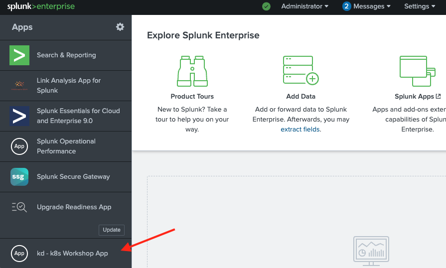

# Advanced Workshop #1 — Metrics and traces

**Duration:** ~2 hours · **Prerequisite:** [FW #2](../02-foundational-2/index.md) complete
(`./scripts/verify-fw2.sh` passes)

FW #2 gave you logs. This module adds the other two signals: **metrics** from the cluster
and the JVM, and **traces** from inside the application — then routes each to its own index.

By the end you will have:

- [x] Infrastructure and Collector metrics flowing into Splunk
- [x] The Splunk OpenTelemetry Java agent attached to PetClinic
- [x] JVM metrics and distributed traces arriving over OTLP
- [x] Each signal routed to a purpose-built index
- [x] Metrics charted in Analytics Workspace, traces on a dashboard

Background reading: [Why observability](../concepts/observability.md)

## Session variables

Every command below uses these. Load them into **each** terminal you use — including the
second one you'll open for load testing:

```bash
source ~/.workshop-env
echo "$WS_USER on $LOCAL_IP ($PUB_DNS)"
```

??? info "Missing, or starting from a fresh shell?"
    The file is created during [host setup](../00-setup/index.md). If it isn't there:

    ```bash
    cat > ~/.workshop-env <<'EOF'
    export WS_USER=<your-username>
    export LOCAL_IP=$(ec2metadata --local-ipv4)
    export PUB_DNS=$(ec2metadata --public-hostname)
    export CHART_VERSION=0.158.0
    export JAVA_HOME=/usr/lib/jvm/java-21-openjdk-amd64
    EOF
    chmod 600 ~/.workshop-env
    source ~/.workshop-env
    ```

    Values added by later modules:

    | Variable | Set in | Used for |
    |---|---|---|
    | `HEC_TOKEN` | FW #2 step 3 | Collector → Splunk Enterprise |
    | `O11Y_REALM` | AW #2 step 1 | Observability Cloud realm, e.g. `us1` |

    Tokens themselves stay in files (`~/.o11y-token`, `~/.rum-token`) rather than in here,
    so they're never echoed to a terminal.


!!! note "`${WS_USER}` in YAML you edit by hand"
    Shell commands expand `${WS_USER}` for you. A **text editor does not** — typing it into
    a YAML file leaves the literal characters. Every "Full command sequence" below therefore
    includes a `sed` line that resolves it after you save:

    ```bash
    sed -i "s|\${WS_USER}|$WS_USER|g" <the-file>
    ```

    Run it, or just type your username directly instead of the placeholder. Either is fine —
    what matters is that no `${WS_USER}` survives into the deployed config.


---

## 1. Start the load generator first

Metrics and traces are only interesting against sustained traffic. A chart of an idle
service is a flat line, and a service map with no requests has nothing to draw. So start
load **before** turning anything on, and leave it running for the whole module.

In a **second terminal**, as the `splunk` user:

```bash
export WS_USER=<your-username>
cd ~/k8s_workshop/jmeter

./apache-jmeter-5.6.3/bin/jmeter -n \
  -t petclinic_test_plan.jmx \
  -JPETCLINIC_HOST=minikube \
  -JPETCLINIC_PORT=30000 \
  -Jloops=500 \
  -l results.jtl
```

That's the same plan you set up in
[FW #2, step 6](../02-foundational-2/index.md#6-set-up-the-load-generator). `-Jloops=500`
makes it run long enough to outlast the module — roughly 50 minutes. Restart it whenever it
finishes.

!!! tip "Use `tmux` if your session times out"
    ```bash
    tmux new -s load        # detach: Ctrl-b then d
    ```
    On hardened hosts an idle prompt logs you out after ~15 minutes, which would kill the
    run halfway through the module.

!!! note "Expect roughly 6.7% errors — they're deliberate"
    One sampler in thirteen calls `/oups`. That error rate is the thing you'll go looking
    for in APM later, so don't try to make it zero.

`curl` still has its place for a quick "is it up?" check:

```bash
curl -s -o /dev/null -w '%{http_code}\n' http://minikube:30000/
```

But anything you intend to read on a chart needs JMeter behind it — a handful of curls
produces a spike, not a signal.

---

## 2. Turn on metrics and traces

The indexes already exist from [host setup](../00-setup/index.md). The Collector just isn't
sending to them yet — FW #2 explicitly disabled both signals.

Edit `~/k8s_workshop/k8s_otel/values-workshop.yaml`:

```yaml
splunkPlatform:
  endpoint: "http://${LOCAL_IP}:8088/services/collector"
  token: "${HEC_TOKEN}"
  index: "k8s_ws_logs"
  metricsIndex: "k8s_ws_metrics"        # add
  tracesIndex: "k8s_ws_traces"          # add
  logsEnabled: true
  metricsEnabled: true                  # was false
  tracesEnabled: true                   # was false
```

??? example "What your values file should look like around here"
    `metricsIndex` and `tracesIndex` are new; the `*Enabled` flags flip from `false`.

    ```yaml

    # [FW2] Splunk Enterprise via HEC.  [AW1] adds metricsIndex / tracesIndex.
    splunkPlatform:
      endpoint: "http://${LOCAL_IP}:8088/services/collector"
      token: "${HEC_TOKEN}"
      index: "k8s_ws_logs"
      metricsIndex: "k8s_ws_metrics"
      tracesIndex: "k8s_ws_traces"
      logsEnabled: true
      metricsEnabled: true
      tracesEnabled: true

    # [FW2] Container log collection, plus multiline recombine.
    ```

??? abstract "Full command sequence — collector change"
    ```bash
    cd ~/k8s_workshop/k8s_otel
    ne values-workshop.yaml          # or: vi values-workshop.yaml

    # A text editor writes ${WS_USER} literally. Resolve it to your username:
    sed -i "s|\${WS_USER}|$WS_USER|g" values-workshop.yaml
    grep -n "$WS_USER" values-workshop.yaml | head    # confirm

    # Validate first. The chart schema is the only check in this workshop that
    # fails loudly instead of silently doing nothing.
    helm upgrade ${WS_USER}-k8s-ws splunk-otel-collector-chart/splunk-otel-collector \
      --version 0.158.0 -f values-workshop.yaml --dry-run=client

    # Apply
    helm upgrade ${WS_USER}-k8s-ws splunk-otel-collector-chart/splunk-otel-collector \
      --version 0.158.0 -f values-workshop.yaml

    kubectl rollout status daemonset/${WS_USER}-k8s-ws-splunk-otel-collector-agent --timeout=300s

    # Confirm the change actually reached the running config
    kubectl get cm ${WS_USER}-k8s-ws-splunk-otel-collector-otel-agent \
      -o go-template='{{index .data "relay"}}' | grep -A5 'transform/'
    ```

```bash
cd ~/k8s_workshop/k8s_otel
helm upgrade ${WS_USER}-k8s-ws splunk-otel-collector-chart/splunk-otel-collector \
  --version 0.158.0 -f values-workshop.yaml
kubectl rollout status daemonset/${WS_USER}-k8s-ws-splunk-otel-collector-agent
```

### ✅ Checkpoint

```
| mcatalog values(metric_name) WHERE index=k8s_ws_metrics
| rename values(metric_name) as m | mvexpand m
| eval family=mvindex(split(m,"."),0)
| stats count by family | sort -count
```

<details>
<summary>Expected families</summary>

```
system      22     ← host CPU, memory, disk, network
k8s         17     ← pods, containers, nodes
otelcol      5     ← the Collector's own health
```

`jvm` and `db` don't appear yet — that's what the Java agent adds next.
</details>

---

## 3. Attach the Java agent

!!! abstract "Learning moment — auto-instrumentation"
    You're about to get detailed traces and JVM metrics out of PetClinic **without changing
    a line of its code**.

    The Splunk OpenTelemetry Java agent attaches through the JVM's `-javaagent` mechanism
    and rewrites bytecode as classes load, wrapping known frameworks — Spring MVC, JDBC,
    HikariCP — with instrumentation. Because it recognises the framework rather than your
    code, you get spans for HTTP requests and database calls for free.

    That's why it's the usual starting point: broad coverage immediately, with manual
    instrumentation added later only where you need business-specific detail.

```bash
cd ~/k8s_workshop/petclinic/spring-petclinic/target
mkdir -p splunk
curl -fsSL -o splunk/splunk-otel-javaagent.jar \
  https://github.com/signalfx/splunk-otel-java/releases/download/v2.30.2/splunk-otel-javaagent.jar
ls -lh splunk/
```

Rewrite the `Dockerfile`:

```bash
JAR=$(ls -1 *.jar | grep -v 'sources\|javadoc\|original\|otel-javaagent' | head -1)

cat > Dockerfile <<EOF
# syntax=docker/dockerfile:1
FROM eclipse-temurin:21-jre-noble
WORKDIR /app
COPY ${JAR} ./app.jar
COPY ./splunk/splunk-otel-javaagent.jar ./

ENV OTEL_SERVICE_NAME="${WS_USER}-k8s-petclinic-service"
ENV OTEL_RESOURCE_ATTRIBUTES="deployment.environment=${WS_USER}-k8s-petclinic-env"
ENV OTEL_EXPORTER_OTLP_PROTOCOL="grpc"
ENV OTEL_METRICS_EXPORTER="otlp"
ENV OTEL_TRACES_EXPORTER="otlp"
ENV OTEL_LOGS_EXPORTER="none"

CMD ["java", "-javaagent:./splunk-otel-javaagent.jar", "-jar", "app.jar"]
EOF
cat Dockerfile
```

!!! danger "The old `splunk.metrics` flags no longer exist"
    Earlier revisions of this workshop passed:
    ```
    -Dsplunk.metrics.enabled=true -Dsplunk.metrics.endpoint=http://minikube:9943
    ```
    **Port 9943 appears nowhere in splunk-otel-java 2.x.** That SignalFx metrics exporter
    was removed; metrics now travel over OTLP alongside traces.

    The JVM ignores unrecognised `-D` properties **without complaint**, so this fails in the
    worst possible way: the application starts, traces work, and metrics silently never
    arrive. If you're adapting an older copy of this guide, delete those flags.

Rebuild. Delete the old image first — you're reusing the `v1` tag:

```bash
eval $(minikube -p minikube docker-env)
docker rmi -f ${WS_USER}/petclinic-otel:v1
docker build --tag ${WS_USER}/petclinic-otel:v1 .
docker images | grep petclinic
```

!!! tip "Why delete first"
    Rebuilding onto an existing tag leaves the previous image untagged and orphaned —
    it shows as `<none>` in `docker images` and keeps consuming disk. In a lab that means
    wasted space; in a cluster it means ambiguity about what's actually running.

---

## 4. Point the agent at the Collector

The agent needs to know where to send telemetry. The Collector agent runs as a
**DaemonSet** — one pod per node — so the right target is the node your pod happens to be
on.

Add to the container spec in your manifest:

```yaml
        env:
        - name: SPLUNK_OTEL_AGENT
          valueFrom:
            fieldRef:
              fieldPath: status.hostIP
        - name: OTEL_EXPORTER_OTLP_ENDPOINT
          value: "http://$(SPLUNK_OTEL_AGENT):4317"
```

??? example "What your manifest should look like around here"
    `env:` is a sibling of `ports:` inside the container definition — not nested under it.

    ```yaml
          containers:
          - name: ${WS_USER}-petclinic-otel-container01
            image: gerry/petclinic-otel:v1
            imagePullPolicy: Never
            ports:
            - containerPort: 8080
            env:
            # --- AW1: where to send telemetry -------------------------------------
            # The collector agent is a DaemonSet, so the right target is whichever
            # node this pod landed on. A pod cannot resolve the `minikube` hosts
            # entry — that exists only on the host.
            - name: SPLUNK_OTEL_AGENT
              valueFrom:
                fieldRef:
                  fieldPath: status.hostIP
            - name: OTEL_EXPORTER_OTLP_ENDPOINT
              value: "http://$(SPLUNK_OTEL_AGENT):4317"
    ```

??? abstract "Full command sequence — manifest change (no image rebuild)"
    ```bash
    cd ~/k8s_workshop/petclinic/k8s_deploy
    ne ${WS_USER}-petclinic-k8s-manifest.yml     # or: vi

    # A text editor writes ${WS_USER} literally. Resolve it to your username:
    sed -i "s|\${WS_USER}|$WS_USER|g" ${WS_USER}-petclinic-k8s-manifest.yml

    kubectl apply -f ${WS_USER}-petclinic-k8s-manifest.yml
    kubectl rollout status deployment/${WS_USER}-petclinic-otel-deployment --timeout=300s

    # Confirm the pod picked it up
    kubectl exec deploy/${WS_USER}-petclinic-otel-deployment -- env | grep -E '^OTEL|^SPLUNK|^SERVER|^LOGGING'
    ```

    Environment and annotation changes do **not** need a new image — they live in the
    Deployment. Only changes inside the jar require a rebuild.

!!! danger "Don't hardcode `http://minikube:4317`"
    `minikube` is an entry in the **host's** `/etc/hosts`. Cluster DNS knows nothing about
    it, so a pod cannot resolve that name — the agent fails to export and you get no
    telemetry with no obvious cause.

    The downward API asks Kubernetes for the IP of the node the pod is scheduled on. It's
    Splunk's documented pattern, and unlike a hardcoded address it still works when the
    cluster has more than one node.

```bash
kubectl delete -f ~/k8s_workshop/petclinic/k8s_deploy/${WS_USER}-petclinic-k8s-manifest.yml
kubectl apply  -f ~/k8s_workshop/petclinic/k8s_deploy/${WS_USER}-petclinic-k8s-manifest.yml
kubectl rollout status deployment/${WS_USER}-petclinic-otel-deployment --timeout=300s
```

### ✅ Checkpoint — is the agent attached and aimed correctly?

```bash
kubectl exec deploy/${WS_USER}-petclinic-otel-deployment -- env | grep -E '^OTEL|^SPLUNK' | sort
kubectl logs deploy/${WS_USER}-petclinic-otel-deployment | grep -i VersionLogger
```

<details>
<summary>Expected output</summary>

```
OTEL_EXPORTER_OTLP_ENDPOINT=http://192.168.49.2:4317
OTEL_EXPORTER_OTLP_PROTOCOL=grpc
OTEL_METRICS_EXPORTER=otlp
OTEL_SERVICE_NAME=<you>-k8s-petclinic-service
OTEL_TRACES_EXPORTER=otlp
SPLUNK_OTEL_AGENT=192.168.49.2

[otel.javaagent] INFO ... VersionLogger - opentelemetry-javaagent - version: splunk-2.30.2-otel-2.30.0
```

`SPLUNK_OTEL_AGENT` resolved to the node IP — that's the downward API working.
</details>

Check your load generator from step 1 is still running — the next checkpoint needs live
traffic. If it has finished, start it again.

### ✅ Checkpoint — JVM metrics

```
| mcatalog values(metric_name) WHERE index=k8s_ws_metrics
| rename values(metric_name) as m | mvexpand m | search m="jvm*"
```

<details>
<summary>Expected — 14 JVM metrics</summary>

```
jvm.class.count            jvm.gc.duration
jvm.class.loaded           jvm.memory.committed
jvm.cpu.count              jvm.memory.limit
jvm.cpu.recent_utilization jvm.memory.used
jvm.cpu.time               jvm.thread.count
```

Plus `db.client.connections.*` from HikariCP — the agent instrumented the connection pool
without being told about it.
</details>

!!! warning "Searching for `runtime.jvm.threads.states` returns nothing"
    That was the metric name under the old SignalFx exporter. Agent 2.x emits
    OpenTelemetry semantic-convention names, all prefixed `jvm.`. If you're following an
    older guide, this is why its verification query looks like a failure.

---

## 5. Route each signal to its own index

Right now application telemetry is mixed in with infrastructure telemetry. Separating it
matters for the same reason it did in FW #2 — retention and access control differ.

!!! danger "Read this before you debug — the annotation captures traces too"
    You set `splunkPlatform.tracesIndex: k8s_ws_traces` in step 1. Check where traces
    actually landed:

    ```
    | tstats count where index=* by index
    ```

    `k8s_ws_traces` will be **empty**, and your spans will be in `k8s_ws_petclinic_logs`.

    The `splunk.com/index` annotation you added in FW #2 sets a per-record resource
    attribute that **overrides the exporter's configured index for every signal**, not just
    logs. There is no `splunk.com/tracesIndex` annotation — the chart supports only
    `splunk.com/index` (logs) and `splunk.com/metricsIndex` (metrics).

    Nothing errors. The Collector will happily report tens of thousands of spans exported
    while the index you configured stays empty.

`splunk.com/metricsIndex` doesn't solve it either. Tested, it moves only three
cluster-receiver metrics — `k8s.container.ready`, `k8s.container.restarts`,
`k8s.pod.phase` — and leaves every OTLP metric from the application behind.

So route both signals in the Collector, with the same OTTL mechanism you used in FW #2.
Add to `values-workshop.yaml`:

```yaml
agent:
  config:
    processors:
      # Application metrics -> their own index, keyed on the service name
      # the Java agent reports.
      transform/app_metrics_index:
        metric_statements:
          - set(resource.attributes["com.splunk.index"], "k8s_ws_petclinic_metrics")
              where resource.attributes["service.name"] == "${WS_USER}-k8s-petclinic-service"
      # Traces inherit splunk.com/index from the pod. Override it.
      transform/traces_index:
        trace_statements:
          - set(resource.attributes["com.splunk.index"], "k8s_ws_traces")
    service:
      pipelines:
        metrics:
          processors:
            - memory_limiter
            - k8s_attributes
            - transform/app_metrics_index
            - batch
            - resource_detection
            - resource
        traces:
          processors:
            - memory_limiter
            - k8s_attributes
            - transform/traces_index
            - batch
            - resource_detection
            - resource
```

??? abstract "Full command sequence — collector change"
    ```bash
    cd ~/k8s_workshop/k8s_otel
    ne values-workshop.yaml          # or: vi values-workshop.yaml

    # A text editor writes ${WS_USER} literally. Resolve it to your username:
    sed -i "s|\${WS_USER}|$WS_USER|g" values-workshop.yaml
    grep -n "$WS_USER" values-workshop.yaml | head    # confirm

    # Validate first. The chart schema is the only check in this workshop that
    # fails loudly instead of silently doing nothing.
    helm upgrade ${WS_USER}-k8s-ws splunk-otel-collector-chart/splunk-otel-collector \
      --version 0.158.0 -f values-workshop.yaml --dry-run=client

    # Apply
    helm upgrade ${WS_USER}-k8s-ws splunk-otel-collector-chart/splunk-otel-collector \
      --version 0.158.0 -f values-workshop.yaml

    kubectl rollout status daemonset/${WS_USER}-k8s-ws-splunk-otel-collector-agent --timeout=300s

    # Confirm the change actually reached the running config
    kubectl get cm ${WS_USER}-k8s-ws-splunk-otel-collector-otel-agent \
      -o go-template='{{index .data "relay"}}' | grep -A5 'transform/'
    ```

```bash
helm upgrade ${WS_USER}-k8s-ws splunk-otel-collector-chart/splunk-otel-collector \
  --version 0.158.0 -f values-workshop.yaml
kubectl rollout status daemonset/${WS_USER}-k8s-ws-splunk-otel-collector-agent
```

With the load test still running, wait a minute for data to arrive, then:

### ✅ Checkpoint — five indexes, five purposes

```
| tstats count where index=* by index
```

```
| mcatalog values(metric_name) WHERE index=k8s_ws_petclinic_metrics
| rename values(metric_name) as m | mvexpand m | search m="jvm*" | stats count
```

<details>
<summary>Expected end state</summary>

| Index | Contents |
|---|---|
| `k8s_ws_logs` | cluster and audit logs |
| `k8s_ws_petclinic_logs` | application logs only |
| `k8s_ws_traces` | spans |
| `k8s_ws_metrics` | ~124 infrastructure metrics |
| `k8s_ws_petclinic_metrics` | ~40 app metrics, **including all 14 `jvm.*`** |

</details>

!!! tip "Why this is done in the Collector, not in Splunk"
    Index-time routing with `props.conf` and `transforms.conf` in a Splunk app would also
    work, and earlier versions of this workshop did exactly that. Doing it in the Collector
    is better for three reasons: it's one mechanism instead of two, it applies before the
    data leaves the cluster, and it follows the data to *any* backend — which matters in
    Advanced Workshop #2 when Observability Cloud becomes a second destination.

---

## 6. Look at a trace

```
index=k8s_ws_traces | head 1
```

<details>
<summary>What a span looks like</summary>

```json
{
  "trace_id": "492cb7e438e75c8e6af61681a3ae3e3d",
  "span_id": "7a2f89de924b5cdb",
  "parent_span_id": "",
  "name": "GET /actuator/health",
  "attributes": {
    "http.request.method": "GET",
    "http.response.status_code": 200,
    "http.route": "/actuator/health",
    "client.address": "10.244.0.1"
  }
}
```

`parent_span_id` is empty, so this is a **root span** — the entry point of a request.
Spans sharing a `trace_id` form one request's journey; `parent_span_id` links them into a
tree.
</details>

Find the slowest endpoints:

```
index=k8s_ws_traces
| spath name | spath attributes.http.route as route | spath duration as duration
| where isnotnull(route)
| stats count, avg(duration) as avg_ms, max(duration) as max_ms by route
| sort -avg_ms
```

---

## 7. Chart metrics in Analytics Workspace

!!! abstract "Learning moment — why metric indexes are different"
    Metrics go to a **metric index**, not an event index, and are queried with `mstats`
    rather than `search`. The storage is purpose-built for numeric time series: far smaller
    on disk, and far faster to aggregate over long windows.

    That's why `k8s_ws_metrics` was created with `-datatype metric` during host setup.

In Splunk Web, open **Analytics Workspace** and chart JVM heap usage:

1. Select index `k8s_ws_petclinic_metrics`
2. Choose metric `jvm.memory.used`
3. Split by `jvm.memory.type` to separate heap from non-heap
4. Set the window to the last 30 minutes


<!-- STATUS: pending-recapture · 2023 · Analytics Workspace UI has changed -->

The equivalent as SPL, if you'd rather stay on the command line:

```
| mstats avg(jvm.memory.used) WHERE index=k8s_ws_petclinic_metrics span=10s BY jvm.memory.type
| timechart avg(jvm.memory.used) span=10s BY jvm.memory.type
```

Generate load while watching, and you'll see heap sawtooth as garbage collection runs.

---

## 8. Install the trace dashboard

A prebuilt dashboard visualises the trace data you're now collecting.

```bash
curl -fsSLO https://raw.githubusercontent.com/gdcosta/splunk-apm-dashboard/main/apm_traces_4.0.0.xml
```

In Splunk Web: **Search & Reporting → Dashboards → Create New Dashboard → Classic Dashboards**,
then paste the XML into the source editor.


<!-- STATUS: pending-recapture · 2023 -->

!!! note "This dashboard needs the Link Analysis visualization"
    Service-dependency panels use the **Link Analysis App for Splunk** from Splunkbase.
    Without it those panels render empty; the rest of the dashboard still works.

---

---

## Reference — complete files at the end of this module

If something isn't behaving, compare your files against these rather than re-reading the
steps. They're the exact files this module was tested with.


??? example "values-workshop.yaml (collector overlay)"
    Placeholders are rendered with `envsubst`; substitute your own values by hand if you prefer.
    ```yaml
    # Splunk OTel Collector — final workshop overlay (FW2 + AW1 + AW2).
    # TESTED end to end on 2026-08-19 against chart 0.158.0.
    #
    # Render:  WS_USER=<you> LOCAL_IP=$(ec2metadata --local-ipv4) \
    #          HEC_TOKEN=<hec> O11Y_TOKEN=<ingest> O11Y_REALM=us1 \
    #          envsubst < values-final.yaml > my-values.yaml
    # Install: helm upgrade <you>-k8s-ws splunk-otel-collector-chart/splunk-otel-collector \
    #            --version 0.158.0 -f my-values.yaml
    #
    # Validate first — the chart schema is the only check that fails loudly:
    #          helm upgrade ... --dry-run=client
    # [FW2] Identifies this cluster on every metric, trace and log.
    clusterName: ${WS_USER}-minikube-cluster

    # [AW2] Second destination. Added without changing how anything is collected.
    splunkObservability:
      realm: "us1"
      accessToken: "${O11Y_TOKEN}"
      metricsEnabled: true
      tracesEnabled: true
      profilingEnabled: true     # enabled later in this module

    # [FW2] Splunk Enterprise via HEC.  [AW1] adds metricsIndex / tracesIndex.
    splunkPlatform:
      endpoint: "http://${LOCAL_IP}:8088/services/collector"
      token: "${HEC_TOKEN}"
      index: "k8s_ws_logs"
      metricsIndex: "k8s_ws_metrics"
      tracesIndex: "k8s_ws_traces"
      logsEnabled: true
      metricsEnabled: true
      tracesEnabled: true

    # [FW2] Container log collection, plus multiline recombine.
    logsCollection:
      containers:
        excludeAgentLogs: false
        # FW2: recombine Java stack traces into a single event.
        # A new event starts at a line beginning with a non-whitespace char.
        multilineConfigs:
          - namespaceName:
              value: default
            podName:
              value: ${WS_USER}-petclinic-.*
              useRegexp: true
            containerName:
              value: ${WS_USER}-petclinic-otel-container01
            firstEntryRegex: ^[^\s].*

    # FW2: promote pod annotations to event attributes.
    # tag_name gives a clean field name directly — no regex prefix-stripping needed.
    # [FW2] Promote pod annotations onto events.
    extraAttributes:
      fromAnnotations:
        - key: docker_image_author
          from: pod
          tag_name: docker_image_author

    # [FW2] Cluster-level objects and events.
    clusterReceiver:
      eventsEnabled: true
      k8sObjects:
        - name: pods
          mode: pull
          interval: 60s
        - name: events
          mode: watch

    # FW2: OTTL transform.
    # NOTE: modern OTTL requires context-prefixed paths (log.* / resource.*).
    # sourcetype and k8s.* are RESOURCE attributes, not log-record attributes.
    # [FW2] OTTL transforms.  [AW1] metric/trace index routing.
    # [AW2] service.name + deployment.environment for Related Content.
    agent:
      config:
        processors:
          # There is no splunk.com/tracesIndex annotation, so traces inherit
          # splunk.com/index from the pod. Override it for traces only.
          # Route this application's metrics to their own index, keyed on the
          # service name the Java agent reports. Same mechanism as traces.
          transform/app_metrics_index:
            metric_statements:
              - set(resource.attributes["com.splunk.index"], "k8s_ws_petclinic_metrics")
                  where resource.attributes["service.name"] == "${WS_USER}-k8s-petclinic-service"
          transform/traces_index:
            trace_statements:
              - set(resource.attributes["com.splunk.index"], "k8s_ws_traces")
          transform/petclinic_logs:
            log_statements:
              - set(resource.attributes["com.splunk.sourcetype"], "petclinic:app:log")
                  where resource.attributes["k8s.container.name"] == "${WS_USER}-petclinic-otel-container01"

              # Related Content correlates on host.name, service.name and trace_id.
              # host.name arrives from resource detection; trace_id is printed by the
              # app and auto-extracted by Splunk. service.name has to be set here.
              - set(resource.attributes["service.name"], "${WS_USER}-k8s-petclinic-service")
                  where resource.attributes["k8s.container.name"] == "${WS_USER}-petclinic-otel-container01"
              - set(resource.attributes["deployment.environment"], "${WS_USER}-k8s-petclinic-env")
                  where resource.attributes["k8s.container.name"] == "${WS_USER}-petclinic-otel-container01"

              - merge_maps(log.attributes,
                  ExtractPatterns(log.body, "(?P<log_level>INFO|WARN|ERROR|DEBUG|TRACE)"),
                  "upsert")
                  where resource.attributes["k8s.container.name"] == "${WS_USER}-petclinic-otel-container01"

              # Log Observer's Severity column reads the record's severity_text, NOT a
              # custom attribute. An attribute named "severity" leaves it UNKNOWN.
              - set(log.severity_text, log.attributes["log_level"])
                  where log.attributes["log_level"] != nil
              - set(log.severity_number, SEVERITY_NUMBER_ERROR) where log.attributes["log_level"] == "ERROR"
              - set(log.severity_number, SEVERITY_NUMBER_WARN)  where log.attributes["log_level"] == "WARN"
              - set(log.severity_number, SEVERITY_NUMBER_INFO)  where log.attributes["log_level"] == "INFO"
              - set(log.severity_number, SEVERITY_NUMBER_DEBUG) where log.attributes["log_level"] == "DEBUG"

              # A recombined stack trace starts with the exception class and carries no
              # level token, so classify it explicitly.
              - set(log.severity_text, "ERROR")
                  where log.attributes["log_level"] == nil and IsMatch(log.body, "Exception")
              - set(log.severity_number, SEVERITY_NUMBER_ERROR) where log.severity_text == "ERROR"

              # Tomcat access logs carry no level token. Parse them, then derive a
              # severity from the HTTP status — 5xx is an error even though the line
              # never says so.
              - merge_maps(log.attributes,
                  ExtractPatterns(log.body,
                    "^\\S+ \\S+ \\S+ \\[[^\\]]+\\] \"(?P<http_method>[A-Z]+) (?P<http_path>\\S+)[^\"]*\" (?P<http_status>\\d{3}) (?P<http_bytes>\\S+) (?P<http_duration_us>\\d+)"),
                  "upsert")
                  where resource.attributes["k8s.container.name"] == "${WS_USER}-petclinic-otel-container01"
              - set(log.severity_text, "INFO")  where log.attributes["http_status"] != nil
              - set(log.severity_text, "WARN")  where IsMatch(log.attributes["http_status"], "^4")
              - set(log.severity_text, "ERROR") where IsMatch(log.attributes["http_status"], "^5")
              - set(log.severity_number, SEVERITY_NUMBER_INFO)  where log.severity_text == "INFO"
              - set(log.severity_number, SEVERITY_NUMBER_WARN)  where log.severity_text == "WARN"

              # Mirror to an attribute so the value is searchable as a field too.
              - set(log.attributes["severity"], log.severity_text) where log.severity_text != nil
        service:
          pipelines:
            metrics:
              processors:
                - memory_limiter
                - k8s_attributes
                - transform/app_metrics_index
                - batch
                - resource_detection
                - resource
            traces:
              processors:
                - memory_limiter
                - k8s_attributes
                - transform/traces_index
                - batch
                - resource_detection
                - resource
            logs:
              processors:
                - memory_limiter
                - k8s_attributes
                - filter/logs
                - transform/petclinic_logs
                - batch
                - resource_detection
                - resource
                - resource/logs
    ```

??? example "petclinic manifest"
    
    ```yaml
    # PetClinic Deployment + NodePort Service — final workshop state.
    # TESTED 2026-08-19. Render with: WS_USER=<you> envsubst < petclinic-final.yml
    apiVersion: v1
    kind: Service
    metadata:
      name: ${WS_USER}-petclinic-srv
    spec:
      type: NodePort
      selector:
        app: ${WS_USER}-petclinic-otel-app
      ports:
      - protocol: TCP
        port: 8080
        targetPort: 8080
        nodePort: 30000
    ---
    apiVersion: apps/v1
    kind: Deployment
    metadata:
      name: ${WS_USER}-petclinic-otel-deployment
      labels:
        app: ${WS_USER}-petclinic-otel-app
    spec:
      selector:
        matchLabels:
          app: ${WS_USER}-petclinic-otel-app
      template:
        metadata:
          labels:
            app: ${WS_USER}-petclinic-otel-app
          annotations:
            docker_image_author: "gerry"
            splunk.com/index: "k8s_ws_petclinic_logs"
        spec:
          containers:
          - name: ${WS_USER}-petclinic-otel-container01
            image: gerry/petclinic-otel:v1
            imagePullPolicy: Never
            ports:
            - containerPort: 8080
            env:
            - name: SPLUNK_OTEL_AGENT
              valueFrom:
                fieldRef:
                  fieldPath: status.hostIP
            - name: OTEL_EXPORTER_OTLP_ENDPOINT
              value: "http://$(SPLUNK_OTEL_AGENT):4317"
            # AlwaysOn Profiling
            - name: SPLUNK_PROFILER_ENABLED
              value: "true"
            - name: SPLUNK_PROFILER_MEMORY_ENABLED
              value: "true"
            # The profiler defaults to http/protobuf on :4318. Our endpoint is gRPC
            # on :4317, so the protocol must be matched or profiling silently fails.
            - name: SPLUNK_PROFILER_OTLP_PROTOCOL
              value: "grpc"
            # Print the trace context the agent puts into the MDC. Without this the
            # log line has no trace_id and APM<->Logs correlation cannot work.
            # PetClinic logs nothing for successful requests — only startup and
            # exceptions. Tomcat access logging gives one line per request, which is
            # what makes the log exercises worth doing.
            # directory=/dev + prefix=stdout with empty suffix writes to /dev/stdout.
            - name: SERVER_TOMCAT_ACCESSLOG_ENABLED
              value: "true"
            - name: SERVER_TOMCAT_ACCESSLOG_DIRECTORY
              value: "/dev"
            - name: SERVER_TOMCAT_ACCESSLOG_PREFIX
              value: "stdout"
            - name: SERVER_TOMCAT_ACCESSLOG_SUFFIX
              value: ""
            - name: SERVER_TOMCAT_ACCESSLOG_FILE_DATE_FORMAT
              value: ""
            - name: SERVER_TOMCAT_ACCESSLOG_BUFFERED
              value: "false"
            - name: SERVER_TOMCAT_ACCESSLOG_PATTERN
              value: '%h %l %u %t "%r" %s %b %D'
            - name: LOGGING_PATTERN_LEVEL
              value: "%5p [trace_id=%X{trace_id:-} span_id=%X{span_id:-}]"
            readinessProbe:
              httpGet:
                path: /actuator/health
                port: 8080
              initialDelaySeconds: 10
              periodSeconds: 5
              failureThreshold: 30
    ```

!!! tip "Diff instead of re-reading"
    ```bash
    curl -fsSL -o /tmp/reference.yaml \
      https://raw.githubusercontent.com/gdcosta/k8s-otel-workshop-2026/main/labs/collector/values-final.yaml
    diff <(sed 's/[[:space:]]*$//' ~/k8s_workshop/k8s_otel/values-workshop.yaml) \
         <(sed 's/[[:space:]]*$//' /tmp/reference.yaml)
    ```
    The reference is the **final** state after AW #2. Each top-level section is tagged
    `[FW2]`, `[AW1]` or `[AW2]` with the module that introduces it, so ignore anything
    tagged for a module you haven't reached yet.

## ✅ Module checkpoint

```bash
~/k8s-otel-workshop/scripts/verify-aw1.sh
```

---

## Troubleshooting

??? failure "No `jvm.*` metrics anywhere"
    Work outward. Is the agent attached?
    ```bash
    kubectl logs deploy/${WS_USER}-petclinic-otel-deployment | grep -i VersionLogger
    ```
    Is it aimed at a reachable endpoint?
    ```bash
    kubectl exec deploy/${WS_USER}-petclinic-otel-deployment -- env | grep OTLP
    ```
    `OTEL_EXPORTER_OTLP_ENDPOINT` must be an **IP**, not `minikube`. If you see a hostname,
    the downward API env block from step 4 isn't applied.

??? failure "Traces exported but `k8s_ws_traces` is empty"
    The `splunk.com/index` annotation is overriding the index — see the warning in step 5.
    Confirm the Collector really is sending spans:
    ```
    | mstats sum(otelcol_exporter_sent_spans) WHERE index=k8s_ws_metrics by exporter
    ```
    A large number there with an empty index means routing, not collection, is the problem.

??? failure "App metrics still in `k8s_ws_metrics`"
    The OTTL condition isn't matching. Confirm the service name the agent actually reports:
    ```bash
    kubectl exec deploy/${WS_USER}-petclinic-otel-deployment -- env | grep OTEL_SERVICE_NAME
    ```
    It must match the `where` clause exactly. Then confirm the transform reached the
    running config:
    ```bash
    kubectl get cm ${WS_USER}-k8s-ws-splunk-otel-collector-otel-agent \
      -o go-template='{{index .data "relay"}}' | grep -A5 app_metrics_index
    ```

??? failure "`mcatalog` returns nothing but data exists"
    `mcatalog` and `mstats` only work against **metric** indexes. If the index was created
    without `-datatype metric`, metrics sent to it are rejected. Check with
    `| rest /services/data/indexes | table title, datatype`.

---

**Next:** [Advanced Workshop #2 — Splunk Observability Cloud](../04-advanced-2/index.md)
