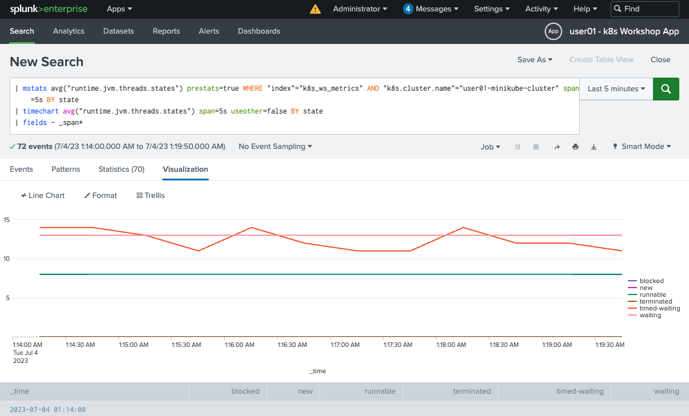
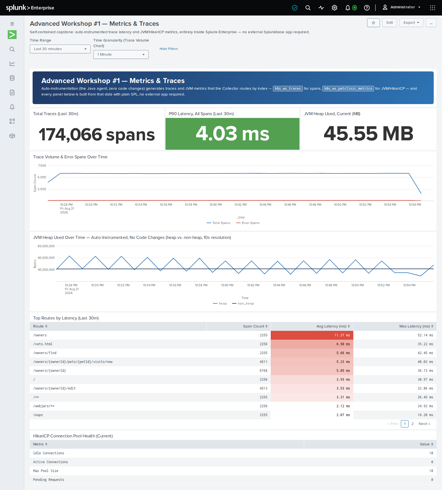
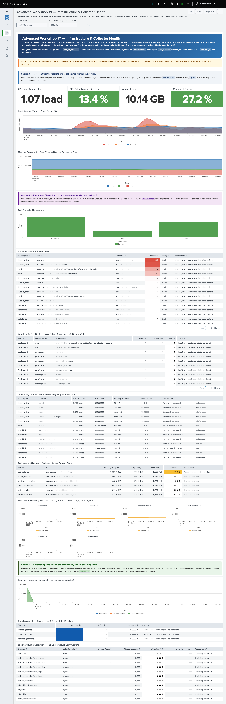
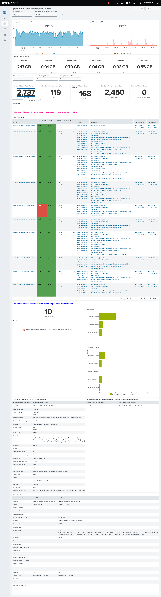

# Advanced Workshop #1 — Metrics and traces

**Duration:** ~2 hours · **Prerequisite:** [FW #2](../02-foundational-2/index.md) complete
(`./scripts/verify-fw2.sh` passes)

FW #2 gave you logs. This module adds the other two signals: **metrics** from the cluster
and the JVM, and **traces** from inside the application — then routes each to its own index.

By the end you will have:

- [x] Infrastructure and Collector metrics flowing into Splunk
- [x] The Splunk OpenTelemetry Java agent attached to PetClinic
- [x] JVM metrics and distributed traces arriving over OTLP
- [x] Each signal routed to a purpose-built index
- [x] Metrics charted in Analytics Workspace, traces on a dashboard

Background reading: [Why observability](../concepts/observability.md)

## Session variables

Every command below uses these. Load them into **each** terminal you use — including the
second one you'll open for load testing:

```bash
source ~/.workshop-env
echo "$WS_USER on $LOCAL_IP ($PUB_DNS)"
```

??? info "Missing, or starting from a fresh shell?"
    The file is created during [host setup](../00-setup/index.md). If it isn't there:

    ```bash
    cat > ~/.workshop-env <<'EOF'
    export WS_USER=<the username you were assigned, e.g. wsuser01>
    export LOCAL_IP=$(ec2metadata --local-ipv4)
    export PUB_DNS=$(ec2metadata --public-hostname)
    export CHART_VERSION=0.158.0
    export JAVA_HOME=/usr/lib/jvm/java-21-openjdk-amd64
    EOF
    chmod 600 ~/.workshop-env
    source ~/.workshop-env
    ```

    Values added by later modules:

    | Variable | Set in | Used for |
    |---|---|---|
    | `HEC_TOKEN` | FW #2 step 3 | Collector → Splunk Enterprise |
    | `O11Y_REALM` | AW #2 step 1 | Observability Cloud realm, e.g. `us1` |

    Tokens themselves stay in files (`~/.o11y-token`, `~/.rum-token`) rather than in here,
    so they're never echoed to a terminal.


!!! note "`${WS_USER}` in YAML you edit by hand"
    Shell commands expand `${WS_USER}` for you. A **text editor does not** — typing it into
    a YAML file leaves the literal characters. Every "Full command sequence" below therefore
    includes a `sed` line that resolves it after you save:

    ```bash
    sed -i "s|\${WS_USER}|$WS_USER|g" <the-file>
    ```

    Run it, or just type your username directly instead of the placeholder. Either is fine —
    what matters is that no `${WS_USER}` survives into the deployed config.


---

## 1. Start the load generator first

Metrics and traces are only interesting against sustained traffic. A chart of an idle
service is a flat line, and a service map with no requests has nothing to draw. So start
load **before** turning anything on, and leave it running for the whole module.

In a **second terminal**, as the `splunk` user:

```bash
source ~/.workshop-env
cd ~/k8s_workshop/jmeter

./apache-jmeter-5.6.3/bin/jmeter -n \
  -t petclinic_test_plan.jmx \
  -JPETCLINIC_HOST=minikube \
  -JPETCLINIC_PORT=30000 \
  -Jloops=1500 \
  -Jduration=7200 \
  -l results.jtl
```

That's the same plan you set up in
[FW #2, step 7](../02-foundational-2/index.md#7-set-up-the-load-generator).

!!! note "Why both `-Jloops` and `-Jduration`"
    The thread group has **two independent ceilings** and stops at whichever is reached
    first: the loop count running out, or `-Jduration` elapsing. The duration is measured
    from test start, not per thread, so it caps the whole run. Raise both together or
    neither, so one flag doesn't silently become a no-op.

    | Flag | Default | Sets |
    |---|---|---|
    | `-JPETCLINIC_HOST` | `minikube` | target host |
    | `-JPETCLINIC_PORT` | `30000` | target port |
    | `-Jloops` | `50` | iterations per thread |
    | `-Jthreads` | `5` | concurrent users |
    | `-Jramp` | `10` | ramp-up seconds |
    | `-Jduration` | `3600` | hard cap, seconds |

    On a smaller instance, drop `-Jthreads` to 2 or 3. What the charts need is *sustained*
    traffic, not volume.

!!! danger "If load stops, the rest of this module looks like broken telemetry"
    When JMeter finishes, the only traffic left is kube-probe hitting `/actuator/health`
    every five seconds. Step 6's endpoint query then returns a single `/actuator/health`
    row, step 7's charts flatten, and **nothing reports an error anywhere** — it is
    indistinguishable from a Collector that isn't collecting. This happened during testing
    and cost real time.

    Before you debug any empty or thin result in this module, look at the load terminal
    first.

!!! tip "Use `tmux` if your session times out"
    ```bash
    tmux new -s load        # detach: Ctrl-b then d
    ```
    On hardened hosts an idle prompt logs you out after ~15 minutes, which would kill the
    run halfway through the module.

!!! note "This plan has no built-in errors — that's deliberate, and different from earlier revisions"
    Earlier revisions of this workshop hit a single monolith's `/oups` endpoint on purpose,
    for a steady 1-in-13 error rate. The current plan targets [FW #2's seven REST
    samplers](../02-foundational-2/index.md#7-set-up-the-load-generator) across the real
    microservice API — list/detail/edit/visit flows — and a clean run against a healthy
    cluster is expected to complete at or near **0% errors**. There is no equivalent of
    `/oups` baked into this plan.

    If you want the failure case AW #2's closing exercise needs — a real error rate to chase
    through APM, logs, and JMeter's own console, and to watch three tools disagree on the
    exact percentage for legitimate reasons — see [FW #2 §8, "Cause a real failure, and find
    it in Splunk"](../02-foundational-2/index.md#8-cause-a-real-failure-and-find-it-in-splunk):
    scaling `visits-service` to zero replicas produces a real, reproducible ~28% failure
    rate from Spring Cloud LoadBalancer's own fast-fail path, with the discrepancy between
    JMeter's, api-gateway's, and Splunk's counts already walked through there. Re-run that
    scale-to-zero here if you want AW1's traces and dashboards to show the same failure
    mode this module's screenshots do.

`curl` still has its place for a quick "is it up?" check:

```bash
curl -s -o /dev/null -w '%{http_code}\n' http://minikube:30000/
```

But anything you intend to read on a chart needs JMeter behind it — a handful of curls
produces a spike, not a signal.

!!! tip "Watch the application in a browser while load runs"
    PetClinic is a NodePort on minikube's internal IP, so it isn't reachable from your
    laptop directly. Use the tunnel from [host setup](../00-setup/index.md):

    ```bash
    ssh -i <your-key.pem> -L 8080:192.168.49.2:30000 splunk@<your-instance>
    # then open http://localhost:8080
    ```

    `kubectl port-forward svc/${WS_USER}-petclinic-srv 8080:8080` on the instance plus
    `ssh -L 8080:localhost:8080` works too. Clicking through the app yourself makes steps 6
    and 7 far easier to read — the page you just opened shows up as a span with its own
    route.

---

## 2. Turn on metrics and traces

All five indexes already exist — you created them in
[FW #2, step 2](../02-foundational-2/index.md#2-create-the-indexes). The Collector just
isn't sending to them yet: FW #2 explicitly disabled both signals.

Edit `~/k8s_workshop/k8s_otel/values-workshop.yaml`:

```yaml
splunkPlatform:
  endpoint: "http://${LOCAL_IP}:8088/services/collector"
  token: "${HEC_TOKEN}"
  index: "k8s_ws_logs"
  metricsIndex: "k8s_ws_metrics"        # add
  tracesIndex: "k8s_ws_traces"          # add
  logsEnabled: true
  metricsEnabled: true                  # was false
  tracesEnabled: true                   # was false
```

??? example "What your values file should look like around here"
    `metricsIndex` and `tracesIndex` are new; the `*Enabled` flags flip from `false`.

    ```yaml

    # [FW2] Splunk Enterprise via HEC.  [AW1] adds metricsIndex / tracesIndex.
    splunkPlatform:
      endpoint: "http://${LOCAL_IP}:8088/services/collector"
      token: "${HEC_TOKEN}"
      index: "k8s_ws_logs"
      metricsIndex: "k8s_ws_metrics"
      tracesIndex: "k8s_ws_traces"
      logsEnabled: true
      metricsEnabled: true
      tracesEnabled: true

    # [FW2] Container log collection, plus multiline recombine.
    ```

??? abstract "Full command sequence — collector change"
    ```bash
    cd ~/k8s_workshop/k8s_otel
    ne values-workshop.yaml          # or: vi values-workshop.yaml

    # A text editor writes ${WS_USER} literally. Resolve it to your username:
    sed -i "s|\${WS_USER}|$WS_USER|g" values-workshop.yaml
    grep -n "$WS_USER" values-workshop.yaml | head    # confirm

    # Validate first. The chart schema is the only check in this workshop that
    # fails loudly instead of silently doing nothing.
    helm upgrade ${WS_USER}-k8s-ws splunk-otel-collector-chart/splunk-otel-collector \
      --version 0.158.0 -f values-workshop.yaml --dry-run=client

    # Apply
    helm upgrade ${WS_USER}-k8s-ws splunk-otel-collector-chart/splunk-otel-collector \
      --version 0.158.0 -f values-workshop.yaml

    kubectl rollout status daemonset/${WS_USER}-k8s-ws-splunk-otel-collector-agent --timeout=300s

    # Confirm the change actually reached the running config
    kubectl get cm ${WS_USER}-k8s-ws-splunk-otel-collector-otel-agent \
      -o go-template='{{index .data "relay"}}' | grep -A5 'transform/'
    ```

```bash
cd ~/k8s_workshop/k8s_otel
helm upgrade ${WS_USER}-k8s-ws splunk-otel-collector-chart/splunk-otel-collector \
  --version 0.158.0 -f values-workshop.yaml
kubectl rollout status daemonset/${WS_USER}-k8s-ws-splunk-otel-collector-agent
```

### ✅ Checkpoint

```
| mcatalog values(metric_name) WHERE index=k8s_ws_metrics
| rename values(metric_name) as m | mvexpand m
| eval family=mvindex(split(m,"."),0)
| stats count by family | sort -count
| where count > 1
```

<details>
<summary>Expected families</summary>

```
system      22     ← host CPU, memory, disk, network
k8s         17     ← pods, containers, nodes
otelcol      5     ← the Collector's own health
```

`jvm` and `db` don't appear yet — that's what the Java agent adds next.
</details>

!!! note "Why the query ends with `| where count > 1`"
    Without it you get about **thirty** rows, not three. The query builds a family name by
    splitting on `.`, but the Collector's own internal metrics are underscore-separated —
    `otelcol_exporter_sent_log_records`, `otelcol_process_cpu_seconds` — so each one
    becomes a family of exactly one member:

    ```
    otelcol_exporter_in_flight_requests   1
    otelcol_exporter_queue_capacity       1
    otelcol_process_cpu_seconds           1
    ... and ~22 more
    ```

    They're there because FW #2 set `excludeAgentLogs: false`, which is deliberate. The
    filter just keeps the checkpoint readable; drop it if you want to see them.

---

## 3. Attach the Java agent — without touching a Dockerfile

!!! abstract "Learning moment — auto-instrumentation, and why *this* mechanism"
    You're about to get detailed traces and JVM metrics out of all six PetClinic services
    **without changing a line of code, and without rebuilding a single image**.

    Earlier revisions of this workshop downloaded `splunk-otel-javaagent.jar` by hand and
    baked a `-javaagent` flag into a `Dockerfile`. That worked for a single hand-built
    monolith image. It cannot work here: `customers-service` is the only one of the six
    PetClinic services built from source in this workshop — `vets-service`,
    `visits-service`, `api-gateway`, `discovery-server` and `config-server` are pulled
    prebuilt images (see [FW #1](../01-foundational-1/index.md)), and there is no
    Dockerfile to edit for any of them.

    Instead this module uses the **OpenTelemetry Operator**, built into the same
    `splunk-otel-collector` chart you already installed. It runs as a small controller with
    an admission webhook: when a pod is *created*, the webhook checks for one annotation and,
    if present, rewrites the pod on the fly — adding an init container that drops the Java
    agent jar into the pod, and setting `JAVA_TOOL_OPTIONS` plus a full set of `OTEL_*`
    environment variables before the container ever starts. The agent still attaches through
    the same JVM `-javaagent` mechanism and instruments the same frameworks — Spring MVC,
    JDBC, HikariCP — for the same reason: it recognises the framework rather than your code,
    so spans for HTTP requests and database calls come for free. What's different is *how it
    gets there*: a one-line annotation on a Deployment, applied identically whether that
    Deployment's image was built here or pulled from a registry.

### Turn the operator on

Add these blocks to `values-workshop.yaml`:

```yaml
# Required once operator.enabled + tracesEnabled + agent.enabled are all true — the
# chart refuses to render without it. Becomes the deployment.environment.name
# resource attribute.
environment: "${WS_USER}-k8s-petclinic-env"

# CRDs go through this separate key, not operator.crds.create — the chart's own
# values.yaml warns that flipping operator.crds.create races Helm's own resource
# ordering.
operatorcrds:
  install: true

operator:
  enabled: true

instrumentation:
  enabled: true
  spec:
    java:
      env:
        # This list REPLACES the chart's own default env list — it does not
        # merge. Omit these two and the agent silently runs without them, no
        # error, no warning. Keep them here verbatim alongside every addition
        # this workshop makes, in AW #1 and AW #2 alike.
        - name: OTEL_RESOURCE_DISABLED_KEYS
          value: "process.executable.path,process.command_args"
        - name: OTEL_JAVA_ENABLED_RESOURCE_PROVIDERS
          value: "io.opentelemetry.instrumentation.resources.ContainerResourceProvider,io.opentelemetry.sdk.autoconfigure.EnvironmentResourceProvider,io.opentelemetry.instrumentation.resources.ProcessResourceProvider"
        - name: SPRING_AUTOCONFIGURE_EXCLUDE
          value: "org.springframework.boot.actuate.autoconfigure.tracing.zipkin.ZipkinAutoConfiguration"
        - name: CONFIG_SERVER_URL
          value: "http://config-server:8888/"
```

!!! danger "Two more lines that each silence a real, separate source of noise — worth understanding before you move on"
    Every PetClinic service also runs Spring Boot Actuator's *own* bundled Zipkin
    auto-export (Micrometer Tracing) — a completely different mechanism from the Splunk
    Java agent this module attaches, and one nobody ever disabled. Left running, every
    instrumented service continuously tries and fails to reach a Zipkin collector at
    `localhost:9411` that doesn't exist: confirmed live, **17,294** failing
    `SPAN_KIND_CLIENT` spans in a 12-hour window, `STATUS_CODE_ERROR`,
    `HttpHostConnectException: Connection refused`. It costs nothing functionally, but it
    clutters every trace search with spans that mean nothing, and Observability Cloud's
    service-map inference (AW #2 §3) draws a meaningless **"localhost" node** from it —
    real, and confusing, unless you know what it is.

    Two properties that look like the obvious fix were tried live and confirmed **not**
    to work, worth knowing so you don't re-guess them:

    - `MANAGEMENT_ZIPKIN_TRACING_EXPORT_ENABLED=false` — that property doesn't exist in
      this app's Spring Boot version at all.
    - `MANAGEMENT_TRACING_ENABLED=false` — present in the environment, confirmed via
      `/actuator/env`, and made no difference whatsoever; the Zipkin sender bean isn't
      gated by this flag here.

    `SPRING_AUTOCONFIGURE_EXCLUDE`, naming the autoconfiguration class outright, is the
    one confirmed live to actually work — **0** `localhost:9411` spans in repeated
    checks afterward, with real HTTP/DB spans and `jvm.*` metrics unaffected on the same
    pods. Bonus finding along the way: the app's own bundled ConfigMap already sets
    `management.tracing.export.zipkin.endpoint` pointing at a real host
    (`http://tracing-server:9411`) — but that's an older, pre-Micrometer property path
    for this Spring Boot version, so it silently never applies. That's a latent bug in
    the upstream sample app's own config, not something this workshop needs to fix; it's
    also *why* the noise heads to `localhost` specifically rather than some other
    address.

    **`CONFIG_SERVER_URL` fixes a second, unrelated one.** Every service briefly calls
    `http://localhost:8888/<app>/<profile>` at startup and fails — `Connection refused`,
    right in the app's own logs — before a second, successful call to the real
    `config-server`. The cause is in the upstream sample app itself, confirmed by reading
    its actual source (every service's `application.yml`, identical across all six): the
    default Spring profile imports config via
    `spring.config.import: optional:configserver:${CONFIG_SERVER_URL:http://localhost:8888/}`,
    while the `docker` profile's own import is already hardcoded correctly to
    `config-server:8888`. Spring merges `spring.config.import` entries across every
    active profile rather than letting one replace the other, so **both** fire on every
    restart — one succeeds, one fails.

    `SPRING_CLOUD_CONFIG_URI` looks like the obvious fix and was tried live first — it
    does **nothing** here, confirmed by the same `Connection refused` line still firing
    in the app's own logs with it set. `CONFIG_SERVER_URL` is the literal name of the
    placeholder the app's own YAML reads — not a general Spring Cloud Config property, so
    don't reach for the usual relaxed-binding name. With it set: **0** `localhost:8888`
    spans afterward, and config genuinely still loads correctly on every service — not
    just "no error," the app's real configuration values are present, confirmed on both
    a hand-built (`customers-service`) and pulled (`visits-service`) image.

    This module leaves one more `localhost` source alone, deliberately: `discovery-server`
    also calls itself, continuously, on `localhost:8761` — that one is real, meaningful
    Eureka behavior, not noise, and AW #2 §3 explains it rather than silencing it.

??? abstract "Full command sequence — collector change"
    ```bash
    cd ~/k8s_workshop/k8s_otel
    ne values-workshop.yaml          # or: vi values-workshop.yaml
    sed -i "s|\${WS_USER}|$WS_USER|g" values-workshop.yaml

    # Validate first. The chart schema is the only check in this workshop that
    # fails loudly instead of silently doing nothing — this is where a missing
    # `environment:` key gets caught, before it becomes a confusing runtime gap.
    helm upgrade ${WS_USER}-k8s-ws splunk-otel-collector-chart/splunk-otel-collector \
      --version 0.158.0 -f values-workshop.yaml --dry-run=client

    helm upgrade ${WS_USER}-k8s-ws splunk-otel-collector-chart/splunk-otel-collector \
      --version 0.158.0 -f values-workshop.yaml

    # The operator's admission webhook must be serving before anything gets
    # patched to use it — a fresh install can lose this race by a few seconds.
    kubectl wait --for=condition=ready pod \
      -l app.kubernetes.io/name=operator -n default --timeout=120s
    ```

!!! danger "A brand-new install can hit the webhook before it's ready"
    On the very first `helm upgrade --install` with the operator enabled, you may see:
    ```
    Error: unable to build kubernetes objects from release manifest: ...
    failed calling webhook "minstrumentation.kb.io": ... connection refused
    ```
    This is Helm applying the `Instrumentation` custom resource — which itself must pass
    through the operator's admission webhook — before that webhook's pod has finished
    starting. It is a one-time race on first install, not a config error. Wait for the
    operator pod to report Ready (the `kubectl wait` above) and re-run the same
    `helm upgrade` command; it is safe to repeat.

### Tell the operator which services to instrument

The operator only touches a pod that carries a specific annotation, naming which
`Instrumentation` resource to use. Nothing is instrumented automatically — you opt each
service in. All six PetClinic services get the same annotation:

??? note "Quick reminder — which service is which ([full description in FW #1](../01-foundational-1/index.md#the-six-services))"
    | Service | Role |
    |---|---|
    | `customers-service` | Owners and pets — the one built from source |
    | `vets-service` | Vet list |
    | `visits-service` | Visit records |
    | `api-gateway` | Routes requests, serves the SPA |
    | `discovery-server` | Eureka service registry |
    | `config-server` | Serves configuration at startup |

```bash
for svc in customers-service vets-service visits-service api-gateway discovery-server config-server; do
  kubectl patch deployment "$svc" -n petclinic -p \
    '{"spec":{"template":{"metadata":{"annotations":
      {"instrumentation.opentelemetry.io/inject-java":
       "default/${WS_USER}-k8s-ws-splunk-otel-collector"}}}}}'
  kubectl rollout status deployment/"$svc" -n petclinic --timeout=120s
done
```

The annotation's value is `<namespace>/<release-name>-splunk-otel-collector` — the
`Instrumentation` resource lives in the `default` namespace alongside the Collector itself,
not in `petclinic` alongside the app. Patching a Deployment's pod template changes the pods
it produces, so this triggers a real rollout — Kubernetes replaces the running pod with one
that carries the new annotation, and *that* creation event is what the webhook intercepts.

!!! warning "One service at a time, waiting for each rollout — not all six at once"
    The loop above patches and waits for each Deployment in turn on purpose. Restarting
    all six simultaneously (`kubectl rollout restart deployment -n petclinic --all`, or six
    parallel `kubectl patch` calls with no wait between them) was tried live on this
    instance size and transiently overloaded the control plane — even a plain `kubectl get
    pods` timed out for a few seconds before it recovered on its own. It's the same
    concurrent-cold-start pressure [FW #1](../01-foundational-1/index.md) found with the
    original six-pod deploy, showing up again here for the same reason: six JVMs starting
    at once, now each also loading a Java agent. Staging them costs a few extra seconds
    total and avoids it entirely.

    Every one of the five pulled images instruments identically to `customers-service`
    (the one hand-built image) — same init container, same env wiring, confirmed live
    across all six, including the two infrastructure services (`discovery-server`,
    `config-server`) that don't handle PetClinic's own business traffic. Nothing about the
    mechanism changes per service; the loop above is the whole difference from patching
    just one.

### ✅ Checkpoint — is the agent attached, across a hand-built image, five pulled ones, and two infrastructure services?

```bash
for svc in customers-service vets-service visits-service api-gateway discovery-server config-server; do
  echo "--- $svc ---"
  POD=$(kubectl get pod -n petclinic -l app.kubernetes.io/name=$svc -o jsonpath='{.items[0].metadata.name}')
  kubectl get pod -n petclinic "$POD" -o jsonpath='{.spec.initContainers[*].name}'; echo
  kubectl get pod -n petclinic "$POD" -o jsonpath='{range .spec.containers[0].env[*]}{.name}={.value}{"\n"}{end}' \
    | grep -E '^JAVA_TOOL_OPTIONS|^OTEL_SERVICE_NAME|^OTEL_EXPORTER_OTLP_ENDPOINT'
done
```

<details>
<summary>Expected output — same shape for all six (two shown; the rest are identical but for the service name)</summary>

```
--- customers-service ---
wait-for-config-server opentelemetry-auto-instrumentation-java
JAVA_TOOL_OPTIONS= -javaagent:/otel-auto-instrumentation-java-customers-service/javaagent.jar
OTEL_SERVICE_NAME=customers-service
OTEL_EXPORTER_OTLP_ENDPOINT=http://${WS_USER}-k8s-ws-splunk-otel-collector-agent.default.svc.cluster.local:4318

--- vets-service ---
wait-for-config-server opentelemetry-auto-instrumentation-java
JAVA_TOOL_OPTIONS= -javaagent:/otel-auto-instrumentation-java-vets-service/javaagent.jar
OTEL_SERVICE_NAME=vets-service
OTEL_EXPORTER_OTLP_ENDPOINT=http://${WS_USER}-k8s-ws-splunk-otel-collector-agent.default.svc.cluster.local:4318
```

`opentelemetry-auto-instrumentation-java` is a **second** init container, added by the
webhook alongside FW #1's own `wait-for-config-server` — the operator did not replace
anything, it inserted itself. `OTEL_SERVICE_NAME` and the OTLP endpoint were derived and
set automatically; nothing in the Deployment manifest names either value. This is the
webhook doing exactly what a hand-written Dockerfile did before, generated per-service
instead of typed once per image. `config-server` is the one exception worth expecting, not
worrying about: it has no `wait-for-config-server` init container, because it doesn't wait
on itself.
</details>

There is no more `SPLUNK_OTEL_AGENT` downward-API dance to wire up by hand — the operator's
default `Instrumentation` exporter endpoint already resolves to the Collector agent's
in-cluster Service DNS name, which every pod on every node can reach the same way,
regardless of which node it lands on. That removes an entire failure mode earlier revisions
of this module had to troubleshoot around.

Check your load generator from step 1 is still running — the next checkpoint needs live
traffic. If it has finished, start it again.

### ✅ Checkpoint — JVM metrics

```
| mcatalog values(metric_name) WHERE index=k8s_ws_metrics
| rename values(metric_name) as m | mvexpand m | search m="jvm*"
```

<details>
<summary>Expected — 14 JVM metrics, from every one of the six services</summary>

```
jvm.class.count             jvm.gc.duration_sum
jvm.class.loaded            jvm.memory.committed
jvm.class.unloaded          jvm.memory.limit
jvm.cpu.count               jvm.memory.used
jvm.cpu.recent_utilization  jvm.memory.used_after_last_gc
jvm.cpu.time                jvm.thread.count
jvm.gc.duration_bucket
jvm.gc.duration_count
```

This is a catalog of distinct metric *names*, not a per-service count — `mcatalog` shows
you these 14 names once, however many of the six services are emitting them underneath.
Split by `service.name` if you want to confirm all six are actually reporting rather than
just one:

```
| mstats count(jvm.memory.used) WHERE index=k8s_ws_petclinic_metrics BY service.name span=1m
| stats count by service.name
```

Plus `db.client.connections.*` from HikariCP on services that hold their own connection
pool (`customers-service`, `visits-service`); `vets-service` reads read-only reference data
through Spring Data JPA rather than HikariCP directly, so its connection-pool series may
differ slightly. The `jvm.*` family is the one to expect identically from every
instrumented service, business logic or infrastructure alike.
</details>

!!! warning "There is no metric called `jvm.gc.duration`"
    GC duration is a **histogram**, and Splunk stores a histogram as three separate series:
    `jvm.gc.duration_bucket`, `_count` and `_sum`. Searching for the bare name
    `jvm.gc.duration` returns nothing at all, which looks like the agent failed to emit it.

    `_count` gives you how many collections ran, `_sum` the total time spent in them —
    divide one by the other for mean pause time. The `_bucket` series carries the
    distribution. Any OTLP metric of type histogram behaves this way, so expect it again in
    AW #2.

!!! warning "Searching for `runtime.jvm.threads.states` returns nothing"
    That was the metric name under the old SignalFx exporter. The agent this operator
    injects emits OpenTelemetry semantic-convention names, all prefixed `jvm.`. If you're
    adapting an older guide, this is why its verification query looks like a failure.

---

## 5. Route each signal to its own index

Right now application telemetry is mixed in with infrastructure telemetry. Separating it
matters for the same reason it did in FW #2 — retention and access control differ.

!!! danger "Read this before you debug — the annotation captures traces too"
    You set `splunkPlatform.tracesIndex: k8s_ws_traces` in step 2. Check where traces
    actually landed:

    ```
    | tstats count where index=* by index
    ```

    `k8s_ws_traces` will be **empty**, and your spans will be in `k8s_ws_petclinic_logs`.

    The `splunk.com/index` annotation you added in FW #2 sets a per-record resource
    attribute that **overrides the exporter's configured index for every signal**, not just
    logs. There is no `splunk.com/tracesIndex` annotation — the chart supports only
    `splunk.com/index` (logs) and `splunk.com/metricsIndex` (metrics).

    Nothing errors. The Collector will happily report tens of thousands of spans exported
    while the index you configured stays empty.

`splunk.com/metricsIndex` doesn't solve it either. Tested, it moves only three
cluster-receiver metrics — `k8s.container.ready`, `k8s.container.restarts`,
`k8s.pod.phase` — and leaves every OTLP metric from the application behind.

So route both signals in the Collector, with the same OTTL mechanism you used in FW #2.
Add to `values-workshop.yaml`:

```yaml
agent:
  config:
    processors:
      # Application metrics -> their own index. Namespace, not service.name —
      # six services now report six different names (FW #2's label promotion
      # gives each its own), so namespace membership is the single predicate
      # that still catches all of them, instrumented or not.
      transform/app_metrics_index:
        metric_statements:
          - set(resource.attributes["com.splunk.index"], "k8s_ws_petclinic_metrics")
              where resource.attributes["k8s.namespace.name"] == "petclinic"
      # Traces inherit splunk.com/index from the pod. Override it.
      transform/traces_index:
        trace_statements:
          - set(resource.attributes["com.splunk.index"], "k8s_ws_traces")
    service:
      pipelines:
        metrics:
          processors:
            - memory_limiter
            - k8s_attributes
            - transform/app_metrics_index
            - batch
            - resource_detection
            - resource
        traces:
          processors:
            - memory_limiter
            - k8s_attributes
            - transform/traces_index
            - batch
            - resource_detection
            - resource
```

??? abstract "Full command sequence — collector change"
    ```bash
    cd ~/k8s_workshop/k8s_otel
    ne values-workshop.yaml          # or: vi values-workshop.yaml

    # A text editor writes ${WS_USER} literally. Resolve it to your username:
    sed -i "s|\${WS_USER}|$WS_USER|g" values-workshop.yaml
    grep -n "$WS_USER" values-workshop.yaml | head    # confirm

    # Validate first. The chart schema is the only check in this workshop that
    # fails loudly instead of silently doing nothing.
    helm upgrade ${WS_USER}-k8s-ws splunk-otel-collector-chart/splunk-otel-collector \
      --version 0.158.0 -f values-workshop.yaml --dry-run=client

    # Apply
    helm upgrade ${WS_USER}-k8s-ws splunk-otel-collector-chart/splunk-otel-collector \
      --version 0.158.0 -f values-workshop.yaml

    kubectl rollout status daemonset/${WS_USER}-k8s-ws-splunk-otel-collector-agent --timeout=300s

    # Confirm the change actually reached the running config
    kubectl get cm ${WS_USER}-k8s-ws-splunk-otel-collector-otel-agent \
      -o go-template='{{index .data "relay"}}' | grep -A5 'transform/'
    ```

```bash
helm upgrade ${WS_USER}-k8s-ws splunk-otel-collector-chart/splunk-otel-collector \
  --version 0.158.0 -f values-workshop.yaml
kubectl rollout status daemonset/${WS_USER}-k8s-ws-splunk-otel-collector-agent
```

With the load test still running, wait a minute for data to arrive, then:

### ✅ Checkpoint — five indexes, five purposes

```
| tstats count where index=* by index
```

```
| mcatalog values(metric_name) WHERE index=k8s_ws_petclinic_metrics
| rename values(metric_name) as m | mvexpand m | search m="jvm*" | stats count
```

<details>
<summary>Expected end state</summary>

| Index | Contents |
|---|---|
| `k8s_ws_logs` | cluster and audit logs |
| `k8s_ws_petclinic_logs` | application logs only |
| `k8s_ws_traces` | spans |
| `k8s_ws_metrics` | ~124 infrastructure metrics |
| `k8s_ws_petclinic_metrics` | ~40 app metrics, **including all 14 `jvm.*`** |

</details>

!!! tip "Why this is done in the Collector, not in Splunk"
    Index-time routing with `props.conf` and `transforms.conf` in a Splunk app would also
    work, and earlier versions of this workshop did exactly that. Doing it in the Collector
    is better for three reasons: it's one mechanism instead of two, it applies before the
    data leaves the cluster, and it follows the data to *any* backend — which matters in
    Advanced Workshop #2 when Observability Cloud becomes a second destination.

---

## 6. Look at a trace

```
index=k8s_ws_traces | head 1
```

<details>
<summary>What a span looks like (abridged, captured live from `vets-service`)</summary>

A real span carries far more than this — `start_time`, `end_time`, resource attributes for
the pod and cluster, and a dozen more `attributes.*` keys. The fields below are the ones
that matter for reading a trace:

```json
{
  "trace_id": "49e76ed705113ee14bc8076fbdc9bf99",
  "span_id": "d93be5d9d83b2e15",
  "parent_span_id": "",
  "name": "GET /actuator/health",
  "attributes": {
    "http.request.method": "GET",
    "http.response.status_code": 200,
    "http.route": "/actuator/health",
    "server.address": "10.244.0.61",
    "server.port": 8083
  }
}
```

`parent_span_id` is empty, so this is a **root span** — the entry point of a request.
Spans sharing a `trace_id` form one request's journey; `parent_span_id` links them into a
tree. This one happens to be a `kube-probe` health check rather than user traffic — with six
independently-probed services now in the cluster, expect a much larger share of root spans
to be `/actuator/health` than a single-pod deployment ever produced.

One more span shape you'll see once you look past the first few: `SPAN_KIND_CLIENT` spans
named after the HTTP verb (`PUT`, `POST`) for every outbound call the agent didn't
recognise a route for — Eureka's own heartbeat (`PUT /eureka/apps/<SERVICE>/<instance>`)
being the most frequent, now from all six services registering and renewing their leases.

If you skipped §3's `SPRING_AUTOCONFIGURE_EXCLUDE` step, you'll also see a
`STATUS_CODE_ERROR` client span aimed at `localhost:9411` on every service — Spring Boot's
own bundled Zipkin auto-export, a completely separate mechanism from the Splunk agent,
continuously failing to reach a Zipkin collector that doesn't exist. §3 disables it; if
you're seeing it here, that step didn't reach the running pods yet.

The same applies to a `STATUS_CODE_ERROR` client span aimed at `localhost:8888` right after
any service restarts — that's the config-client noise §3's `CONFIG_SERVER_URL` fixes, and
it should be gone after that step lands. A continuous, ongoing client span aimed at
`localhost:8761`, by contrast, is `discovery-server`'s own Eureka self-registration — real,
expected, and deliberately not silenced; see AW #2 §3 for why.
</details>

`service.name`, `k8s.deployment.name`, `k8s.namespace.name` and the rest of the resource
attributes arrive as their own top-level indexed fields, separate from the span body's own
`attributes.*` — no `spath` or manual flattening needed to filter by service:

Find the slowest endpoints for one service:

```
index=k8s_ws_traces "service.name"="customers-service"
| rename "attributes.http.route" as route
| where isnotnull(route)
| eval ms=(end_time-start_time)/1000000
| stats count, avg(ms) as avg_ms, max(ms) as max_ms by route
| eval avg_ms=round(avg_ms,2), max_ms=round(max_ms,2)
| sort -avg_ms
```

Or across every instrumented service at once, to compare them side by side:

```
index=k8s_ws_traces
| rename "attributes.http.route" as route
| where isnotnull(route)
| eval ms=(end_time-start_time)/1000000
| stats count, avg(ms) as avg_ms, max(ms) as max_ms by "service.name", route
| eval avg_ms=round(avg_ms,2), max_ms=round(max_ms,2)
| sort -avg_ms
```

<details>
<summary>Real output, captured early with just two services instrumented — shown for the query shape, not as today's expected scope</summary>

```
  service.name         route       count avg_ms max_ms
----------------- ---------------- ----- ------ ------
customers-service /owners             15  22.38  26.73
vets-service      /vets               15  18.22  24.15
vets-service      /actuator/health    99   5.03  24.41
customers-service /actuator/health    99   4.77  18.89
```

`/owners`, not `/api/customer/owners` — the route the agent reports is the Spring MVC
mapping **inside** `customers-service` itself, after api-gateway's `StripPrefix=2` has
already removed the `/api/customer` prefix ([FW #1](../01-foundational-1/index.md)
covers the gateway's routing rules). Routes are also **templated** —
`/owners/{ownerId}`, not `/owners/7` — because the agent reads the mapping annotation
rather than the raw URL, which is what makes them aggregatable across every request to
the same endpoint regardless of which owner the request happened to be about.

`/actuator/health` dominates the count here because kube-probe hits it every five seconds
on every pod, all the time — that's expected, not a sign load isn't reaching the app; look
for the routes JMeter actually drives (`/owners`, `/vets`, and so on) to judge real traffic.
</details>

!!! note "Six rows of service.name now, not two"
    Step 3 instruments all six services by default, so the cross-service query above will
    return every one of them once load has reached each — `service.name` is exactly the
    `OTEL_SERVICE_NAME` each reports, and this query needs no per-service edit as services
    are added or removed from the annotation. `discovery-server` and `config-server` will
    show mostly Eureka/`PUT` and `/actuator/health` traffic rather than user-facing routes
    — that's expected; they're infrastructure services, not ones JMeter's own samplers
    target directly.

!!! warning "If the only row is `/actuator/health`, your load generator has stopped"
    kube-probe hits `/actuator/health` every five seconds, so that one route keeps arriving
    forever. A result with nothing but `/actuator/health` means no *user* traffic is
    reaching the app — go back to step 1 and restart JMeter, then wait a minute.

    This is worth knowing because it looks exactly like broken trace collection, in the one
    step whose whole purpose is proving trace collection works. It is the failure that
    actually happened when this module was tested.

!!! note "No `spath`, and no `duration` field"
    Splunk auto-extracts the span JSON, so `attributes.http.route`, `start_time` and
    `end_time` are already fields — `spath` isn't needed, and it has no `as` clause anyway.
    There is also **no `duration` field on a span**: the exporter writes `start_time` and
    `end_time` as epoch nanoseconds, which is why the `eval` divides by 1,000,000 to get
    milliseconds.

---

## 7. Chart metrics in Analytics Workspace

!!! abstract "Learning moment — why metric indexes are different"
    Metrics go to a **metric index**, not an event index, and are queried with `mstats`
    rather than `search`. The storage is purpose-built for numeric time series: far smaller
    on disk, and far faster to aggregate over long windows.

    That's why `k8s_ws_metrics` was created with `-datatype metric` back in
    [FW #2, step 2](../02-foundational-2/index.md#2-create-the-indexes).

In Splunk Web, open **Analytics Workspace** and chart JVM heap usage:

1. Select index `k8s_ws_petclinic_metrics`
2. Choose metric `jvm.memory.used`
3. Split by `jvm.memory.type` to separate heap from non-heap
4. Set the window to the last 30 minutes


<!-- STATUS: pending-recapture · 2023 · Analytics Workspace UI has changed -->

The equivalent as SPL, if you'd rather stay on the command line:

```
| mstats avg(jvm.memory.used) WHERE index=k8s_ws_petclinic_metrics span=10s BY jvm.memory.type
| xyseries _time jvm.memory.type avg(jvm.memory.used)
```

!!! danger "Not `timechart` here — it silently returns nothing"
    The obvious second line is `| timechart avg(jvm.memory.used) span=10s BY jvm.memory.type`.
    It runs, reports no error, and returns **zero rows** — the exact "looks like broken
    telemetry but isn't" trap this module keeps warning about. `mstats` already emits its
    aggregate as a column named `avg(jvm.memory.used)`, one row per `(_time,
    jvm.memory.type)` pair; `timechart` then tries to re-aggregate a field of that same
    name that no longer means what it expects, and produces nothing.

    `xyseries` is the right tool for this shape: pivot the long-format rows `mstats`
    already produced into one wide row per timestamp, with a column per `jvm.memory.type`
    value — which is exactly what a time chart needs and what `mstats` alone cannot give
    you directly.

Generate load while watching, and you'll see heap sawtooth as garbage collection runs.

---

## 8. The capstone dashboards

Nothing to download here. You installed the workshop app in
[FW #2 §12](../02-foundational-2/index.md#12-install-the-workshop-dashboard-app), and the
three dashboards below have been sitting there empty, waiting for the data this module just
produced. Open them from **Search & Reporting → Dashboards**, or from the **K8s + OTel
Workshop** app.

??? question "Skipped FW #2, or starting fresh here?"
    Install the app now — one command, no restart:

    ```bash
    cd ~/k8s_workshop
    curl -fsSLO https://raw.githubusercontent.com/gdcosta/k8s-otel-workshop-2026/main/labs/dashboards/dist/k8s-ws-dashboards-1.0.1.tgz
    sudo -i -u splunk /opt/splunk/bin/splunk install app \
      "$PWD/k8s-ws-dashboards-1.0.1.tgz" -auth admin:Workshop2026!
    ```

### Metrics & traces

Open **Advanced Workshop #1 — Metrics & Traces**. Thirteen panels, self-contained, no
Splunkbase app required.



The first half is the module's own output: Total Traces, P90 Latency, current JVM Heap
Used, a trace-volume-and-errors timechart (span-adjustable), the JVM heap sawtooth from
step 7 — the same `mstats`/`xyseries` query, now a permanent chart instead of a one-off
search — top routes by latency, and a HikariCP connection-pool snapshot.

The second half is where tracing starts earning its keep. Everything above that line is
built from **SERVER** spans — one per HTTP request, which is roughly what an access log
already tells you. But the Java agent also emits **CLIENT** spans (every database
round-trip, with the SQL text attached) and **INTERNAL** spans (individual application
methods). Six panels read those instead, and they surface a textbook **N+1 query pattern**:
a single page view fires **four separate database round-trips**.

No log line and no metric contains that fact. The SQL-count-per-request only exists once
spans are correlated by `trace_id` — which is the entire reason distributed tracing exists.
The panels break it down by route, rank the top SQL statements by volume and by latency,
split request time into database-versus-application time, list the slowest INTERNAL
methods, and show error rate by route.

!!! tip "Read the DB-time split carefully"
    Database time comes out at only a few percent of request time here, which looks like it
    contradicts the N+1 finding. It doesn't — PetClinic runs H2 **in memory**, so each
    round-trip is almost free. Point the same application at a real network database and
    those four round-trips per page become four network latencies per page. The count is
    the finding; the timing is an artefact of the lab.

!!! note "Earlier revisions of this dashboard needed a Splunkbase app"
    A previous version pulled from a different repo and needed the Link Analysis App for
    Splunk for its service-dependency panels, which rendered blank without it. This one is
    self-contained — every panel here works out of the box, with nothing extra to install.

### Infrastructure & Collector health

Open **Advanced Workshop #1 — Infrastructure & Collector Health**. The companion capstone:
when the application looks wrong, the next question is whether the platform underneath it is
at fault — and the last question is whether you can trust the telemetry telling you any of
this.



Everything on it comes from the single `k8s_ws_metrics` index, fed by three sources inside
the one Collector deployment you already have — the `hostmetrics` receiver, the `k8s_cluster`
receiver, and the Collector's own `otelcol_*` self-telemetry. Three sections:

**Host health** — CPU load, saturation against core count, and memory composition over time.
Kubernetes schedules against *requests*, not against what is actually happening on the node,
so it will happily place pods on a box that is already saturated. These panels show the truth
the scheduler cannot see.

**Kubernetes object state** — pod phase by namespace, container restarts and readiness,
workload drift (desired versus available), and the scheduling contract (CPU and memory
requests versus limits). Kubernetes is declarative, so nearly every outage is a gap between
what you declared and what you got; this section is built from those differences rather than
from absolute numbers. The limits table is worth a pause — most control-plane components run
with **no CPU or memory limit at all**, which means any one of them can starve the whole node.

**Collector pipeline health** — throughput by signal type, a data-loss audit (accepted versus
refused at the receiver), and exporter queue utilisation. A Collector that is silently
dropping spans produces a dashboard that looks *calmer* during an incident, not noisier,
which is the most dangerous failure mode an observability stack has. Prove the pipeline is
intact before you trust anything above it.

### Application Trace Information v4.0.0

The third dashboard in the app is the one this workshop has carried the longest. Open
**Application Trace Information v4.0.0**, then set its two inputs at the top:

1. **Select your trace index** — choose `k8s_ws_traces`
2. **Please search traces by time period** — it defaults to the last 15 minutes

!!! warning "It looks broken before you pick an index — it isn't"
    On first load, every panel reads **"Search is waiting for input…"** and the service
    dropdown shows **"Could not create search."** That is the normal unpopulated-token
    state: the searches reference an index token that has no value yet. Choose your trace
    index and it all populates. Nothing is wrong.

It is a trace *explorer* rather than a capstone: pick a service, set your own latency
warning and poor thresholds, and drill from a trace list into a single trace's spans. Where
the two AW #1 dashboards above answer fixed questions about the whole system, this one lets
you chase one request.



Click a row in **Trace Information** to load that trace's spans underneath, then click a
span for its detail. The screenshot above is drilled all the way in — the bottom pane is the
PetClinic `/oups` `RuntimeException`, full stack trace, reached from a latency table.

!!! warning "One panel needs a Splunkbase app — the rest do not"
    The **Span Tree** panel renders with `link_analysis_app.link_analysis`, a custom
    visualisation from the [Link Analysis App for
    Splunk](https://splunkbase.splunk.com/app/3985). That app is not part of this workshop,
    so where the graph would draw you get a red box reading:

    ```
    No matching visualization found for type: link_analysis, in app: link_analysis_app
    ```

    That is the whole blast radius. The panel's *search* still completes, the "Number of
    Spans" value beside it still renders, and every other panel on the dashboard works —
    trace counts, latency percentiles, the trace table, span details and the stack trace
    above were all captured with Link Analysis absent.

    You do not need it. The **Correlation** dashboard in AW #2 renders a full parent/child
    span waterfall — kind, offset, duration and SQL text — in plain SPL with no add-on at
    all. Install Link Analysis only if you specifically want the graph visualisation.

---

## Reference — complete files at the end of this module

If something isn't behaving, compare your files against these rather than re-reading the
steps. They're the exact files this module was tested with.


The petclinic manifest itself is **unchanged** from FW #2 — the operator instruments pods
by intercepting their creation, not by adding anything to the Deployment spec, so there is
no new manifest reference here. See [FW #2's own reference
section](../02-foundational-2/index.md#reference-complete-files-at-the-end-of-this-module)
for that file; the six-service topology and the `splunk.com/index` annotation on the
`petclinic` namespace's pods are exactly as this module found them.

??? example "values-aw1.yaml (collector overlay, end of this module)"
    Placeholders are rendered with `envsubst`; substitute your own values by hand if you prefer.
    ```yaml
    # Splunk OTel Collector — Advanced Workshop #1 overlay (logs + metrics + traces).
    # Snapshot of values-workshop.yaml as it stands at the END of AW #1.
    # Observability Cloud arrives in AW #2.
    #
    # Render:  WS_USER=<you> LOCAL_IP=$(ec2metadata --local-ipv4) HEC_TOKEN=<hec> \
    #          envsubst < values-aw1.yaml > my-values.yaml
    # Install: helm upgrade <you>-k8s-ws splunk-otel-collector-chart/splunk-otel-collector \
    #            --version 0.158.0 -f my-values.yaml
    #
    # Validate first — the chart schema is the only check that fails loudly:
    #          helm upgrade ... --dry-run=client

    # [FW2] Identifies this cluster on every metric, trace and log.
    clusterName: ${WS_USER}-minikube-cluster

    # [AW1] Required once operator.enabled=true + tracesEnabled=true + agent.enabled=true —
    # the chart's schema refuses to render without it (a real dry-run error, not a
    # guess). Sets the newer deployment.environment.name resource attribute.
    # NOTE this is a DIFFERENT attribute from the deployment.environment (no
    # ".name") the transform/petclinic_logs block below sets by hand on logs —
    # that one predates this key and still runs, so logs and traces currently
    # carry the environment under two different attribute names. Left as-is for
    # AW1; worth reconciling onto one name if Related Content correlation across
    # signals turns out to need it.
    environment: "${WS_USER}-k8s-petclinic-env"

    # [AW1] Auto-instrumentation via the OpenTelemetry Operator's admission
    # webhook, instead of a hand-built -javaagent + Dockerfile. Chosen because
    # only customers-service is built from source here — the other five are
    # pulled prebuilt images with no Dockerfile to edit. The operator injects the
    # Java agent at pod-creation time regardless of where the image came from;
    # verified live 2026-08-29 on both customers-service (hand-built) and
    # vets-service (pulled) — identical init container, identical env wiring.
    # operator.crds.create must stay false (chart default) — CRD install goes
    # through the separate operatorcrds.install key below instead, to avoid a
    # race with Helm's own resource ordering (the chart's own values.yaml docs
    # this explicitly).
    operatorcrds:
      install: true

    operator:
      enabled: true

    # [AW1] instrumentation.spec.java.env REPLACES the chart's own default env
    # list — it does not merge. Verified live 2026-08-29 (see values-aw2.yaml,
    # where this was first found) and confirmed again here 2026-08-30: every
    # entry below is explicit, the chart's own two defaults verbatim, PLUS
    # AW1's own additions.
    #
    # SPRING_AUTOCONFIGURE_EXCLUDE disables PetClinic's own bundled Zipkin
    # auto-export (Spring Boot Actuator's ZipkinAutoConfiguration/Micrometer
    # Tracing — a completely separate mechanism from the OTel Java agent this
    # module attaches). Left enabled, every instrumented service continuously
    # tries and fails to reach a Zipkin collector at localhost:9411 that was
    # never disabled and doesn't exist — confirmed live: 17,294 failing
    # SPAN_KIND_CLIENT spans in a 12h window, STATUS_CODE_ERROR,
    # HttpHostConnectException: Connection refused. Two plausible-looking fixes
    # were tried and confirmed NOT to work before this one, live, via
    # /actuator/env — worth knowing if you're ever tempted to re-guess this:
    #   MANAGEMENT_ZIPKIN_TRACING_EXPORT_ENABLED=false  -- that property doesn't
    #     exist in this app; /actuator/env/management.zipkin.tracing.endpoint
    #     returns nothing at all, and the ConfigMap's own
    #     management.tracing.export.zipkin.endpoint override (an older,
    #     Sleuth-era property path) is what actually resolves — a separate,
    #     latent bug in the upstream sample app's own config, not something
    #     this workshop needs to fix.
    #   MANAGEMENT_TRACING_ENABLED=false  -- confirmed present in
    #     systemEnvironment via /actuator/env, and made no difference at all;
    #     the Zipkin sender bean isn't gated by this flag in this app's Spring
    #     Boot version.
    # SPRING_AUTOCONFIGURE_EXCLUDE, naming the autoconfiguration class outright,
    # is the one confirmed live to actually work: 0 localhost:9411 spans in
    # repeated post-fix checks, while real HTTP/DB spans and jvm.* metrics kept
    # flowing normally on the same pods.
    #
    # CONFIG_SERVER_URL fixes a second, unrelated localhost source: every service
    # briefly calls http://localhost:8888/<app>/<profile> at startup and fails —
    # confirmed live, STATUS_CODE_ERROR, "Connection refused" in the app's own
    # logs, before a second, successful call to the real config-server. Root
    # cause, confirmed by reading the upstream source (spring-petclinic-
    # microservices v3.2.0, every service's application.yml): the default
    # profile imports config via
    #   spring.config.import: optional:configserver:${CONFIG_SERVER_URL:http://localhost:8888/}
    # — a real Spring property, not something this workshop's config broke. The
    # docker profile's own import is already hardcoded correctly to
    # http://config-server:8888, and Spring merges spring.config.import entries
    # across active profiles rather than letting the later one replace the
    # earlier one — so both fire, one succeeds and one fails, every restart.
    # First guess here was wrong and worth recording: SPRING_CLOUD_CONFIG_URI
    # does nothing — that's not the property this YAML placeholder reads, and
    # setting it left the localhost attempt completely unaffected, confirmed via
    # the app's own DEBUG-level "Exception on Url - http://localhost:8888/"
    # logging still firing. CONFIG_SERVER_URL is the literal env var name the
    # ${...} placeholder itself reads. Confirmed live on customers-service
    # (hand-built) and visits-service (pulled): 0 localhost:8888 spans after the
    # fix, config still loads correctly (real values reach the app, not just "no
    # error" — /actuator/health stays UP throughout).
    instrumentation:
      enabled: true
      spec:
        java:
          env:
            # --- chart defaults (would silently vanish if omitted — see above) ---
            - name: OTEL_RESOURCE_DISABLED_KEYS
              value: "process.executable.path,process.command_args"
            - name: OTEL_JAVA_ENABLED_RESOURCE_PROVIDERS
              value: "io.opentelemetry.instrumentation.resources.ContainerResourceProvider,io.opentelemetry.sdk.autoconfigure.EnvironmentResourceProvider,io.opentelemetry.instrumentation.resources.ProcessResourceProvider"
            - name: SPRING_AUTOCONFIGURE_EXCLUDE
              value: "org.springframework.boot.actuate.autoconfigure.tracing.zipkin.ZipkinAutoConfiguration"
            - name: CONFIG_SERVER_URL
              value: "http://config-server:8888/"

    # [FW2] Splunk Enterprise via HEC.  [AW1] adds metricsIndex / tracesIndex.
    splunkPlatform:
      endpoint: "http://${LOCAL_IP}:8088/services/collector"
      token: "${HEC_TOKEN}"
      index: "k8s_ws_logs"
      metricsIndex: "k8s_ws_metrics"
      tracesIndex: "k8s_ws_traces"
      logsEnabled: true
      metricsEnabled: true
      tracesEnabled: true

    # [FW2] Container log collection, plus multiline recombine.
    logsCollection:
      containers:
        excludeAgentLogs: false
        # FW2: recombine Java stack traces into a single event.
        # A new event starts at a line beginning with a non-whitespace char.
        # Scoped to the petclinic namespace only, not a single container — six
        # services now share this namespace and all of them are Spring Boot, so one
        # broad rule recombines stack traces from any of them without narrowing by
        # pod or container name. Nothing else lives in this namespace.
        multilineConfigs:
          - namespaceName:
              value: petclinic
            podName:
              value: .*
              useRegexp: true
            firstEntryRegex: ^[^\s].*

    # [FW2] Promote pod annotations onto events.
    # tag_name gives a clean field name directly — no regex prefix-stripping needed.
    extraAttributes:
      # Promotes each pod's app.kubernetes.io/name label to service.name. Scraped
      # container logs carry no service.name of their own, so this gives each of
      # the six services a distinct name — customers-service, api-gateway, and so
      # on — automatically, with no per-service OTTL statement. It does NOT
      # overwrite service.name on traces: k8sattributes only sets an attribute
      # that isn't already present, and the Java agent already supplies traces'
      # service.name. Verified live 2026-08-29.
      fromLabels:
        - key: app.kubernetes.io/name
          from: pod
          tag_name: service.name
      fromAnnotations:
        - key: docker_image_author
          from: pod
          tag_name: docker_image_author

    # [FW2] Cluster-level objects and events.
    clusterReceiver:
      eventsEnabled: true
      k8sObjects:
        - name: pods
          mode: pull
          interval: 60s
        - name: events
          mode: watch

    # [FW2] OTTL transforms.  [AW1] metric/trace index routing.
    # NOTE: modern OTTL requires context-prefixed paths (log.* / resource.*).
    # sourcetype and k8s.* are RESOURCE attributes, not log-record attributes.
    agent:
      config:
        processors:
          # [AW1] App metrics -> their own index. Namespace, not service.name — six
          # services now report six different names (see extraAttributes.fromLabels
          # below), so namespace membership is the simpler, single predicate that
          # still catches all of them. The splunk.com/metricsIndex annotation does
          # NOT cover OTLP metrics from the app — it only moves cluster-receiver
          # metrics (k8s.container.*, k8s.pod.phase).
          # k8s.namespace.name comes from the same k8s_attributes processor
          # regardless of signal type.
          transform/app_metrics_index:
            metric_statements:
              - set(resource.attributes["com.splunk.index"], "k8s_ws_petclinic_metrics")
                  where resource.attributes["k8s.namespace.name"] == "petclinic"

          # [AW1] There is no splunk.com/tracesIndex annotation, so traces inherit
          # splunk.com/index from the pod, which overrides splunkPlatform.tracesIndex.
          # Override it for traces only. Verified live 2026-08-29 on the operator
          # spike: without this override, every span from the auto-instrumented
          # Java agent landed silently in k8s_ws_petclinic_logs instead — same
          # com.splunk.index resource attribute, same k8s_attributes processor,
          # shared across all three signal pipelines. No exporter error either
          # way; the only tell was an empty k8s_ws_traces despite the collector's
          # own otelcol_exporter_sent_spans counter climbing normally.
          transform/traces_index:
            trace_statements:
              - set(resource.attributes["com.splunk.index"], "k8s_ws_traces")

          transform/petclinic_logs:
            log_statements:
              - set(resource.attributes["com.splunk.sourcetype"], "petclinic:app:log")
                  where resource.attributes["k8s.namespace.name"] == "petclinic"

              - merge_maps(log.attributes,
                  ExtractPatterns(log.body, "(?P<log_level>INFO|WARN|ERROR|DEBUG|TRACE)"),
                  "upsert")
                  where resource.attributes["k8s.namespace.name"] == "petclinic"

              # Log Observer's Severity column reads the record's severity_text, NOT a
              # custom attribute. An attribute named "severity" leaves it UNKNOWN.
              - set(log.severity_text, log.attributes["log_level"])
                  where log.attributes["log_level"] != nil
              - set(log.severity_number, SEVERITY_NUMBER_ERROR) where log.attributes["log_level"] == "ERROR"
              - set(log.severity_number, SEVERITY_NUMBER_WARN)  where log.attributes["log_level"] == "WARN"
              - set(log.severity_number, SEVERITY_NUMBER_INFO)  where log.attributes["log_level"] == "INFO"
              - set(log.severity_number, SEVERITY_NUMBER_DEBUG) where log.attributes["log_level"] == "DEBUG"

              # A recombined stack trace starts with the exception class and carries no
              # level token, so classify it explicitly.
              - set(log.severity_text, "ERROR")
                  where log.attributes["log_level"] == nil and IsMatch(log.body, "Exception")
              - set(log.severity_number, SEVERITY_NUMBER_ERROR) where log.severity_text == "ERROR"

              # Tomcat access logs carry no level token. Parse them, then derive a
              # severity from the HTTP status — 5xx is an error even though the line
              # never says so.
              - merge_maps(log.attributes,
                  ExtractPatterns(log.body,
                    "^\\S+ \\S+ \\S+ \\[[^\\]]+\\] \"(?P<http_method>[A-Z]+) (?P<http_path>\\S+)[^\"]*\" (?P<http_status>\\d{3}) (?P<http_bytes>\\S+) (?P<http_duration_us>\\d+)"),
                  "upsert")
                  where resource.attributes["k8s.namespace.name"] == "petclinic"
              - set(log.severity_text, "INFO")  where log.attributes["http_status"] != nil
              - set(log.severity_text, "WARN")  where IsMatch(log.attributes["http_status"], "^4")
              - set(log.severity_text, "ERROR") where IsMatch(log.attributes["http_status"], "^5")
              - set(log.severity_number, SEVERITY_NUMBER_INFO)  where log.severity_text == "INFO"
              - set(log.severity_number, SEVERITY_NUMBER_WARN)  where log.severity_text == "WARN"

              # Mirror to an attribute so the value is searchable as a field too.
              - set(log.attributes["severity"], log.severity_text) where log.severity_text != nil
        service:
          pipelines:
            metrics:
              processors:
                - memory_limiter
                - k8s_attributes
                - transform/app_metrics_index
                - batch
                - resource_detection
                - resource
            traces:
              processors:
                - memory_limiter
                - k8s_attributes
                - transform/traces_index
                - batch
                - resource_detection
                - resource
            logs:
              processors:
                - memory_limiter
                - k8s_attributes
                - filter/logs
                - transform/petclinic_logs
                - batch
                - resource_detection
                - resource
                - resource/logs
    ```

!!! tip "Diff instead of re-reading"
    ```bash
    curl -fsSL -o /tmp/reference.yaml \
      https://raw.githubusercontent.com/gdcosta/k8s-otel-workshop-2026/main/labs/collector/values-aw1.yaml
    diff <(sed 's/[[:space:]]*$//' ~/k8s_workshop/k8s_otel/values-workshop.yaml) \
         <(sed 's/[[:space:]]*$//' /tmp/reference.yaml)
    ```
    Each top-level section is tagged
    `[FW2]`, `[AW1]` or `[AW2]` with the module that introduces it, so ignore anything
    tagged for a module you haven't reached yet.

## ✅ Module checkpoint

```bash
~/k8s-otel-workshop/scripts/verify-aw1.sh
```

---

## Troubleshooting

??? failure "`helm upgrade` fails with `environment must be a non-empty string`"
    ```
    Error: execution error at (splunk-otel-collector/templates/operator/instrumentation.yaml:2:4):
    When operator.enabled=true, (splunkPlatform.tracesEnabled=true ...), (agent.enabled=true ...),
    then environment must be a non-empty string
    ```
    The top-level `environment:` key from step 3 is missing or empty. Add it — this is a real
    chart-schema guard, not something you can work around another way.

??? failure "`helm upgrade` fails with `no matches for kind Instrumentation` or a webhook connection refused"
    Two different first-install races, both one-time:
    - `no matches for kind "Instrumentation"` means the CRDs aren't installed yet — check
      `operatorcrds.install: true` is set (not `operator.crds.create`, which must stay
      `false`).
    - `failed calling webhook "minstrumentation.kb.io": ... connection refused` means Helm
      applied the `Instrumentation` resource before the operator pod's webhook was ready.
      `kubectl wait --for=condition=ready pod -l app.kubernetes.io/name=operator -n default
      --timeout=120s`, then re-run the same `helm upgrade` command.

??? failure "A patched Deployment's pods show no `opentelemetry-auto-instrumentation-java` init container"
    Confirm the annotation actually landed and the pod actually rolled:
    ```bash
    kubectl get deployment <service> -n petclinic \
      -o jsonpath='{.spec.template.metadata.annotations}'
    kubectl get pods -n petclinic -l app.kubernetes.io/name=<service>
    ```
    The annotation value must be `<namespace>/<release-name>-splunk-otel-collector` — the
    `Instrumentation` resource lives in `default` next to the Collector itself, not in
    `petclinic`. A typo there (or the release name, if you didn't install with
    `${WS_USER}-k8s-ws`) fails silently: the pod rolls, but the webhook finds no matching
    resource to inject and leaves the pod alone.

??? failure "A meaningless `localhost` node keeps showing up wherever services are drawn (this module's trace search, or AW #2's service map)"
    Two different fixes, depending on the port — check which one before assuming it's the
    same bug twice.

    `localhost:9411` is PetClinic's own bundled Zipkin auto-export, not the OTel agent —
    see §3's danger box. Confirm the exclude reached the running pods:
    ```
    index=k8s_ws_traces earliest=-5m "attributes.server.address"=localhost "attributes.server.port"=9411 | stats count
    ```
    A large, steady count means `SPRING_AUTOCONFIGURE_EXCLUDE` either isn't in
    `instrumentation.spec.java.env`, or the change hasn't reached pods that were already
    running before you added it — `instrumentation.spec.java.env` changes don't roll
    running pods automatically; `kubectl rollout restart deployment -n petclinic <service>`
    to pick it up (one at a time — see the staged-rollout warning in §3).

    `localhost:8888` is the config-client noise §3's `CONFIG_SERVER_URL` fixes — restart-only,
    not continuous, so check over a longer window:
    ```
    index=k8s_ws_traces earliest=-60m "attributes.server.address"=localhost "attributes.server.port"=8888 | stats count
    ```
    Any count above zero here means `CONFIG_SERVER_URL` hasn't reached the running pods yet
    — same rollout-restart fix as above.

    `localhost:8761`, by contrast, is **not a bug** — that's `discovery-server`'s own real
    Eureka self-registration, deliberately left as-is. See AW #2 §3.

??? failure "`kubectl get pods` (or any kubectl command) hangs or times out while patching all six services"
    A real, transient control-plane overload on this instance size, not a sign anything is
    broken — the same concurrent-cold-start pressure FW #1 found with the original six-pod
    deploy. It recovers on its own within seconds. If you hit this, you likely restarted or
    patched all six Deployments at once instead of one at a time — see §3's warning; the
    loop given there staggers them for exactly this reason.

??? failure "No `jvm.*` metrics anywhere"
    Work outward. Is the agent attached to this pod at all?
    ```bash
    kubectl get pod -n petclinic <pod-name> -o jsonpath='{.spec.initContainers[*].name}'
    ```
    Look for `opentelemetry-auto-instrumentation-java` in the list. If it's missing, see the
    annotation failure above. If it's present, check the endpoint it was given:
    ```bash
    kubectl get pod -n petclinic <pod-name> \
      -o jsonpath='{range .spec.containers[0].env[*]}{.name}={.value}{"\n"}{end}' \
      | grep OTEL_EXPORTER_OTLP_ENDPOINT
    ```
    It should resolve to the Collector agent's in-cluster Service DNS name — no downward-API
    IP substitution to check here, unlike the old Dockerfile approach.

??? failure "Traces exported but `k8s_ws_traces` is empty"
    The `splunk.com/index` annotation is overriding the index — see the warning in step 5.
    Confirm the Collector really is sending spans:
    ```
    | mstats sum(otelcol_exporter_sent_spans) WHERE index=k8s_ws_metrics by exporter
    ```
    A large number there with an empty index means routing, not collection, is the problem.
    This is exactly the failure mode this module's own `transform/traces_index` override
    exists to prevent — confirm it's actually in your values file and reached the running
    config (next item).

??? failure "App metrics still landing outside `k8s_ws_petclinic_metrics`"
    Confirm the transform reached the running config:
    ```bash
    kubectl get cm ${WS_USER}-k8s-ws-splunk-otel-collector-otel-agent \
      -o go-template='{{index .data "relay"}}' | grep -A5 app_metrics_index
    ```
    If it's there but not matching, confirm the namespace the metric actually carries — the
    predicate is `k8s.namespace.name == "petclinic"`, not a per-service name:
    ```
    | mcatalog values(k8s.namespace.name) WHERE index=k8s_ws_metrics metric_name=jvm.memory.used
    ```

??? failure "`mcatalog` returns nothing but data exists"
    `mcatalog` and `mstats` only work against **metric** indexes. If the index was created
    without `-datatype metric`, metrics sent to it are rejected. Check with
    `| rest /services/data/indexes | table title, datatype`.

---

**Next:** [Advanced Workshop #2 — Splunk Observability Cloud](../04-advanced-2/index.md)
