# Advanced Workshop #2 — Splunk Observability Cloud

**Duration:** ~2 hours · **Prerequisite:** [AW #1](../03-advanced-1/index.md) complete
(`./scripts/verify-aw1.sh` passes)

Everything so far has gone to Splunk Enterprise. This module adds Splunk Observability
Cloud as a **second destination** — without changing how anything is collected — and then
uses it to follow a problem from a service, to the infrastructure under it, to the log line
that explains it.

By the end you will have:

- [x] Infrastructure and APM data in Observability Cloud
- [x] Log Observer Connect querying your Splunk Enterprise indexes
- [x] AlwaysOn Profiling showing where the JVM spends its time
- [x] Real User Monitoring capturing actual browser sessions
- [x] Walked APM → Infrastructure → Logs on a single problem

Background: [Why observability](../concepts/observability.md)

## Session variables

Every command below uses these. Load them into **each** terminal you use — including the
second one you'll open for load testing:

```bash
source ~/.workshop-env
echo "$WS_USER on $LOCAL_IP ($PUB_DNS)"
```

??? info "Missing, or starting from a fresh shell?"
    The file is created during [host setup](../00-setup/index.md). If it isn't there:

    ```bash
    cat > ~/.workshop-env <<'EOF'
    export WS_USER=<the username you were assigned, e.g. wsuser01>
    export LOCAL_IP=$(ec2metadata --local-ipv4)
    export PUB_DNS=$(ec2metadata --public-hostname)
    export CHART_VERSION=0.158.0
    export JAVA_HOME=/usr/lib/jvm/java-21-openjdk-amd64
    EOF
    chmod 600 ~/.workshop-env
    source ~/.workshop-env
    ```

    Values added by later modules:

    | Variable | Set in | Used for |
    |---|---|---|
    | `HEC_TOKEN` | FW #2 step 3 | Collector → Splunk Enterprise |
    | `O11Y_REALM` | AW #2 step 1 | Observability Cloud realm, e.g. `us1` |

    Tokens themselves stay in files (`~/.o11y-token`, `~/.rum-token`) rather than in here,
    so they're never echoed to a terminal.


!!! note "`${WS_USER}` in YAML you edit by hand"
    Shell commands expand `${WS_USER}` for you. A **text editor does not** — typing it into
    a YAML file leaves the literal characters. Every "Full command sequence" below therefore
    includes a `sed` line that resolves it after you save:

    ```bash
    sed -i "s|\${WS_USER}|$WS_USER|g" <the-file>
    ```

    Run it, or just type your username directly instead of the placeholder. Either is fine —
    what matters is that no `${WS_USER}` survives into the deployed config.


---

## 1. Get an access token

You need an Observability Cloud organisation. A 14-day trial is enough for the whole
module.

In Observability Cloud: **Settings → Access Tokens → New Token**, scope **INGEST**.
Note your **realm** too — it's in the URL (`app.us1.signalfx.com` → realm `us1`).

!!! warning "Treat this as a credential"
    An ingest token can write data into your organisation. Don't paste it into a shared
    document or commit it. For the workshop, keep it in a file outside any Git repository:

    ```bash
    umask 077
    printf '%s' '<YOUR_TOKEN>' > ~/.o11y-token
    ```

    `printf` rather than `echo` — a trailing newline in a token causes authentication
    failures that are genuinely unpleasant to diagnose.

Confirm the token works before configuring anything:

```bash
echo 'export O11Y_REALM=us1' >> ~/.workshop-env      # your realm
source ~/.workshop-env

curl -s -o /dev/null -w '%{http_code}\n' \
  -H "X-SF-Token: $(cat ~/.o11y-token)" -H 'Content-Type: application/json' \
  -d '[{"gauge":[{"metric":"workshop.preflight","value":1}]}]' \
  "https://ingest.${O11Y_REALM}.signalfx.com/v2/datapoint"
```

`200` means the token and realm are both right. `401` means one of them isn't.

---

## 2. Add Observability Cloud to the Collector

!!! abstract "Learning moment — one collector, two destinations"
    This is the payoff for using OpenTelemetry. You are about to send metrics and traces to
    an entirely different platform **without touching the application, the instrumentation,
    or how anything is collected.** You add a destination.

    That is the vendor-neutrality argument in practice rather than in principle.

Add to `~/k8s_workshop/k8s_otel/values-workshop.yaml`, above `splunkPlatform`:

```yaml
splunkObservability:
  realm: "us1"          # must match $O11Y_REALM
  metricsEnabled: true
  tracesEnabled: true
  profilingEnabled: false      # switched on in step 6
```

!!! tip "No `accessToken` in the file — pass it at install time"
    Step 1 went to some trouble to keep the token out of your shell history and outside any
    Git repository. Pasting it into `values-workshop.yaml` would undo that: this is the one
    file the module repeatedly asks you to compare, diff and share, and the "Reference —
    complete files" section at the end publishes it verbatim.

    So leave the key out entirely and supply it on the command line, reading straight from
    the file:

    ```bash
    helm upgrade ${WS_USER}-k8s-ws splunk-otel-collector-chart/splunk-otel-collector \
      --version 0.158.0 -f values-workshop.yaml \
      --set splunkObservability.accessToken="$(cat ~/.o11y-token)"
    ```

    Every `helm upgrade` from here on carries that `--set`. Drop it on a later upgrade and
    the token disappears from the release, exports start failing auth, and nothing in the
    Collector log says so plainly.

??? example "What your values file should look like around here"
    `splunkObservability` is a new top-level key, a sibling of `splunkPlatform`. Both
    destinations coexist — you are adding, not replacing. AW #1's `environment:` /
    `operatorcrds:` / `operator:` / `instrumentation:` block is already there from the
    previous module — this snippet doesn't repeat it, but it doesn't go anywhere either.

    ```yaml
    clusterName: ${WS_USER}-minikube-cluster

    # ...environment: / operatorcrds: / operator: / instrumentation: from AW #1,
    # unchanged here — see docs/03-advanced-1 §3 if you need to re-check them...

    # [AW2] Second destination. Added without changing how anything is collected.
    # accessToken is deliberately absent — it is passed with --set at install time.
    splunkObservability:
      realm: "us1"          # must match $O11Y_REALM
      metricsEnabled: true
      tracesEnabled: true
      profilingEnabled: false      # switched on in step 6

    # [FW2] Splunk Enterprise via HEC.  [AW1] adds metricsIndex / tracesIndex.
    splunkPlatform:
      endpoint: "http://${LOCAL_IP}:8088/services/collector"
      token: "${HEC_TOKEN}"
      index: "k8s_ws_logs"
      metricsIndex: "k8s_ws_metrics"
      tracesIndex: "k8s_ws_traces"
      logsEnabled: true
      metricsEnabled: true
      tracesEnabled: true

    # [FW2] Container log collection, plus multiline recombine.
    ```

??? abstract "Full command sequence — collector change"
    ```bash
    cd ~/k8s_workshop/k8s_otel
    ne values-workshop.yaml          # or: vi values-workshop.yaml

    # A text editor writes ${WS_USER} literally. Resolve it to your username:
    sed -i "s|\${WS_USER}|$WS_USER|g" values-workshop.yaml
    grep -n "$WS_USER" values-workshop.yaml | head    # confirm

    # Validate first. The chart schema is the only check in this workshop that
    # fails loudly instead of silently doing nothing.
    helm upgrade ${WS_USER}-k8s-ws splunk-otel-collector-chart/splunk-otel-collector \
      --version 0.158.0 -f values-workshop.yaml --dry-run=client \
      --set splunkObservability.accessToken="$(cat ~/.o11y-token)"

    # Apply
    helm upgrade ${WS_USER}-k8s-ws splunk-otel-collector-chart/splunk-otel-collector \
      --version 0.158.0 -f values-workshop.yaml \
      --set splunkObservability.accessToken="$(cat ~/.o11y-token)"

    kubectl rollout status daemonset/${WS_USER}-k8s-ws-splunk-otel-collector-agent --timeout=300s

    # Confirm the change actually reached the running config
    kubectl get cm ${WS_USER}-k8s-ws-splunk-otel-collector-otel-agent \
      -o go-template='{{index .data "relay"}}' | grep -A5 'transform/'
    ```

!!! danger "There is no `logsEnabled` here"
    Adding it fails the install:
    ```
    Error: UPGRADE FAILED: values don't meet the specifications of the schema(s)
      at '/splunkObservability': additional properties 'logsEnabled' not allowed
    ```
    Logs reach Observability Cloud through **Log Observer Connect** (step 4), which queries
    Splunk Enterprise directly rather than ingesting a second copy. So there's no toggle.

!!! tip "Validate before you install — this is the one check that fails loudly"
    The chart ships a `values.schema.json`, and it will reject unknown keys. That makes it
    the only validation in this entire workshop that catches a mistake *before* it silently
    does nothing:

    ```bash
    helm upgrade ${WS_USER}-k8s-ws splunk-otel-collector-chart/splunk-otel-collector \
      --version 0.158.0 -f values-workshop.yaml --dry-run=client \
      --set splunkObservability.accessToken="$(cat ~/.o11y-token)"
    ```

    Get into the habit. Almost every other misconfiguration in this workshop deploys
    cleanly and produces nothing.

```bash
cd ~/k8s_workshop/k8s_otel
helm upgrade ${WS_USER}-k8s-ws splunk-otel-collector-chart/splunk-otel-collector \
  --version 0.158.0 -f values-workshop.yaml \
  --set splunkObservability.accessToken="$(cat ~/.o11y-token)"
kubectl rollout status daemonset/${WS_USER}-k8s-ws-splunk-otel-collector-agent
```

Confirm the `signalfx` exporters now exist in the running configuration:

```bash
kubectl get cm ${WS_USER}-k8s-ws-splunk-otel-collector-otel-agent \
  -o go-template='{{index .data "relay"}}' | grep -E '^\s+signalfx'
```

Start the load test in your second terminal — the rest of this module needs traffic:

```bash
cd ~/k8s_workshop/jmeter
./apache-jmeter-5.6.3/bin/jmeter -n -t petclinic_test_plan.jmx \
  -JPETCLINIC_HOST=minikube -JPETCLINIC_PORT=30000 -Jloops=500 -l results.jtl
```

---

## 3. Find your data in Observability Cloud

### Infrastructure

**Infrastructure → Kubernetes → K8s workloads.** Filter to your cluster,
`${WS_USER}-minikube-cluster`. Nodes, pods and containers appear within a minute or two.

### APM

**APM**, then filter to environment `${WS_USER}-k8s-petclinic-env`.

### ✅ Checkpoint

You should see one service **per Deployment you patched with the injection annotation** in
AW #1 §3 — all six PetClinic services, if you followed that module's default flow.

!!! abstract "Learning moment — the map assembles itself from what's actually happening"
    Nobody drew this map. Every edge between the six nodes exists because a real `CLIENT`
    span was captured somewhere — a JDBC call, an HTTP call through the gateway, Eureka's
    own heartbeat (`PUT /eureka/apps/<SERVICE>/<instance>`) from every service registering
    and renewing its lease every few seconds. Observability Cloud draws the topology purely
    from that traffic. Scale a service down, stop sending it traffic, or add a seventh
    service tomorrow, and the map changes on its own — the alternative, a diagram someone
    drew once, goes stale the moment anything about the architecture does.

    If you don't see this level of detail — say, only two or three nodes, or a node called
    **`localhost`** that isn't a real PetClinic service — one of two things happened: either
    fewer than all six Deployments were patched in AW #1 §3, or that module's
    `SPRING_AUTOCONFIGURE_EXCLUDE` step (silencing PetClinic's own bundled Zipkin
    auto-export) hasn't reached the running pods yet. `localhost` specifically is that
    Zipkin noise, not a real dependency — see AW #1 §3's danger box for what it is and how
    to confirm the fix landed.

With no fault injected, expect the error rate to sit near **0%** — Phase 3 of this
workshop's own migration removed the old `/oups` endpoint that used to guarantee a steady
error rate here, and nothing has replaced it as a *default*. If you want a real, nonzero
error rate to look at, trigger [FW #2 §8's fault](../02-foundational-2/index.md#8-cause-a-real-failure-and-find-it-in-splunk):
`kubectl scale deployment/visits-service -n petclinic --replicas=0` while load is running.
§8 of this module picks that same fault back up for the closing cross-tool reconciliation
exercise.

---

## 4. Connect logs with Log Observer Connect

!!! abstract "Learning moment — query, don't duplicate"
    Log Observer Connect does **not** ingest your logs a second time. It queries the Splunk
    Enterprise indexes you already populated in FW #2, from within the Observability Cloud
    UI.

    So you keep one copy of the data, with Splunk's retention and access control, while
    still being able to jump from a trace to the logs that explain it.

### Network access

Observability Cloud connects *inbound* to your Splunk instance. Open **port 8089** to the
IPs for your realm — for `us1`:

```
44.230.152.35    44.231.27.66    44.225.234.52    44.230.82.104
```

Other realms are listed in
[Splunk's documentation](https://help.splunk.com/en/splunk-observability-cloud/manage-data/view-splunk-platform-logs/set-up-log-observer-connect-for-splunk-enterprise).

!!! warning "Port 8089 is opened deliberately. Port 8000 should not be."
    8089 has to be reachable from those four realm IPs and nothing else — that is the whole
    point of scoping the rule rather than opening it to `0.0.0.0/0`.

    **Splunk Web on 8000 is a different matter.** These credentials are published workshop
    constants, and the instance has a predictable public hostname, so anyone who finds it
    can sign in as `admin`. Restrict 8000 to **your own IP** in the security group. If you
    would rather not open it at all, leave it closed and tunnel:

    ```bash
    ssh -i <your-key.pem> -L 8000:localhost:8000 splunk@<your-instance>
    ```

    Then use `http://localhost:8000` wherever this module says `$PUB_DNS:8000`.
    [Host setup](../00-setup/index.md) covers this in full — it is repeated here only
    because this is the step that first opens a port to the internet.

### Create the service account role

```bash
sudo -i -u splunk
cat > /opt/splunk/etc/system/local/authorize.conf <<'EOF'
[role_loc_service]
search = enabled
edit_tokens_own = enabled
indexes_list_all = disabled
srchIndexesAllowed = k8s_ws_logs;k8s_ws_petclinic_logs
srchIndexesDefault = k8s_ws_petclinic_logs
srchJobsQuota = 40
srchDiskQuota = 1000
srchTimeWin = 2592000
srchTimeEarliest = 7776000
EOF
```

!!! danger "Four things to get right in that one file"
    **1. `indexes_list_all` must be `disabled`.** Earlier versions of this workshop
    *enabled* it. Current Splunk guidance is the opposite.

    **2. There is deliberately no `importRoles`.** Splunk **unions** `srchIndexesAllowed`
    across inherited roles, so `importRoles = user` silently grants `main`, `summary`,
    `history` and every other index that role can reach — while the config still *looks*
    restrictive. Without it, the account gets exactly the two indexes listed.

    **3. `edit_tokens_own` is required.** Log Observer Connect mints its own token when it
    connects. Without this capability the connection fails in a way that looks like bad
    credentials.

    **4. Exactly two indexes, and both of them are log indexes.** Which two, and why the
    trace index is not among them, is the next box.

!!! abstract "Learning moment — why `k8s_ws_traces` is *not* in that list"
    AW #1 spent a whole section routing traces into `k8s_ws_traces`, so leaving it out here
    looks like an oversight. It isn't.

    `k8s_ws_traces` holds **spans**, not logs — one JSON span record per event, with no
    severity and no message body. Grant it to `loc_svc` and Log Observer will happily
    display 99,000+ span records as if they were log lines, every one of them Severity
    **UNKNOWN**. On a measured run that single index was **56% of every UNKNOWN event Log
    Observer could see**, and the reason the Severity column looks broken after step 5. It
    is not an OTTL problem, and nothing in step 5 will fix it.

    The reason the trace index exists at all is a **Splunk Enterprise** story: it shows that
    teams who cannot adopt Observability Cloud can still store and visualise traces in
    Splunk — that is what AW #1 §5's routing and §8's trace dashboard are for. On the
    Observability Cloud side those same spans are already present natively through **APM**.
    Querying them a second time through Log Observer is redundant, and actively degrades
    the logs experience.

    **The two indexes that *are* mapped are two halves of one stream.** In FW #2 §4
    everything the Collector sent landed in `k8s_ws_logs` together; FW #2 §10's
    `splunk.com/index` pod annotation then routed PetClinic out into its own index.
    Watching one stream become two was the point of that step, and by now both halves are
    needed:

    | Index | Contents | Backs the pivot |
    |---|---|---|
    | `k8s_ws_logs` | everything not routed elsewhere — cluster and Kubernetes audit logs | Infrastructure → node/pod → **Logs** |
    | `k8s_ws_petclinic_logs` | application logs, split out by the FW #2 §10 annotation | APM → service → **Logs** |

    Drop either mapping and the corresponding pivot goes empty. Both hold data
    Observability Cloud has no other copy of — which is exactly the asymmetry with traces.

!!! note "`k8s_ws_logs` carries some UNKNOWN severity, and that is correct"
    Around 13% of `k8s_ws_logs` has no severity, essentially all of it Kubernetes audit
    records — structured JSON about API calls, not levelled log output. There is no
    severity in them to extract. Don't reach for another OTTL statement.

**Restart Splunk before creating the user** — roles are only read at startup:

```bash
/opt/splunk/bin/splunk restart
/opt/splunk/bin/splunk add user loc_svc -password 'LogObserver2026!' \
  -role loc_service -auth "admin:Workshop2026!"
```

Skip the restart and you get `Could not find role`, which reads like a typo rather than a
timing problem.

!!! note "These are fixed workshop credentials, and they go on the command line"
    `admin` / `Workshop2026!` and `loc_svc` / `LogObserver2026!` are published constants so
    that every step in the workshop is copy-pasteable and a facilitator can help a stuck
    participant without guessing a generated password.

    Be aware of what that command does, because it is the one place the workshop puts
    secrets inline: both passwords land in `~/.bash_history` and are briefly visible in
    `ps`. That is acceptable *only* because these are throwaway lab credentials on a
    disposable instance. Never carry this pattern — or these passwords — to anything real.
    Elsewhere the workshop keeps credentials in files (`umask 077`, `printf`, outside any
    repository) for exactly this reason.

    `loc_svc`'s password has to be typed into a browser form in a moment, so it cannot stay
    purely in a file anyway.

### Generate a certificate for the management port

```bash
mkdir -p /opt/splunk/etc/auth/loccerts && cd /opt/splunk/etc/auth/loccerts

/opt/splunk/bin/splunk cmd openssl req -x509 -newkey rsa:2048 -nodes -days 825 \
  -keyout locKey.pem -out locCert.pem \
  -subj "/C=CA/ST=BC/L=Vancouver/O=Workshop/CN=${PUB_DNS}" \
  -addext "subjectAltName=DNS:${PUB_DNS}"

cat locCert.pem locKey.pem > locServer.pem
```

Point the management port at it, in `/opt/splunk/etc/system/local/server.conf`:

```ini
[sslConfig]
serverCert = /opt/splunk/etc/auth/loccerts/locServer.pem
```

```bash
/opt/splunk/bin/splunk restart
echo | openssl s_client -connect 127.0.0.1:8089 2>/dev/null | openssl x509 -noout -subject
```

!!! note "One certificate, not a chain"
    Earlier versions of this workshop built a root CA and then a server certificate signed
    by it — around fifteen steps. Current documentation only needs the certificate the
    management port presents, so a single self-signed certificate is enough.

Print the certificate now, before you move to the browser — the next step asks you to paste
it into a form, and you will not want to come back for it:

```bash
sudo cat /opt/splunk/etc/auth/loccerts/locCert.pem
```

!!! warning "Two different `.pem` files, and only one of them gets pasted"
    This certificate was generated on the instance a moment ago. It has nothing to do with
    the SSH key — [host setup](../00-setup/index.md) calls that `<your-key.pem>`, and the
    collision genuinely catches people out.

    `locCert.pem` is the public certificate and is meant to be shared. **`locKey.pem` is
    the private key and must never be pasted anywhere** — not into the form, not into a
    ticket, not into a chat.

### Run the guided setup

**Logs → Logs connections**

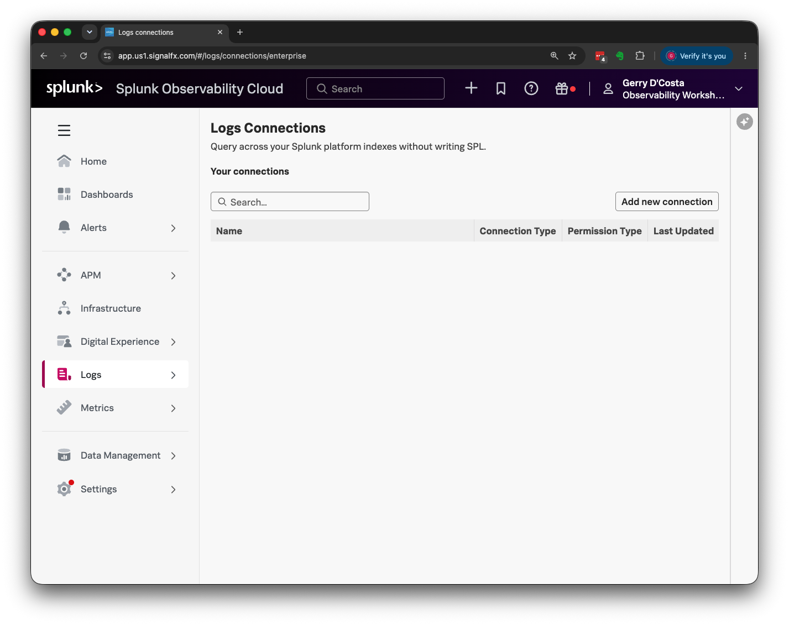

**Add new connection → Splunk Enterprise**

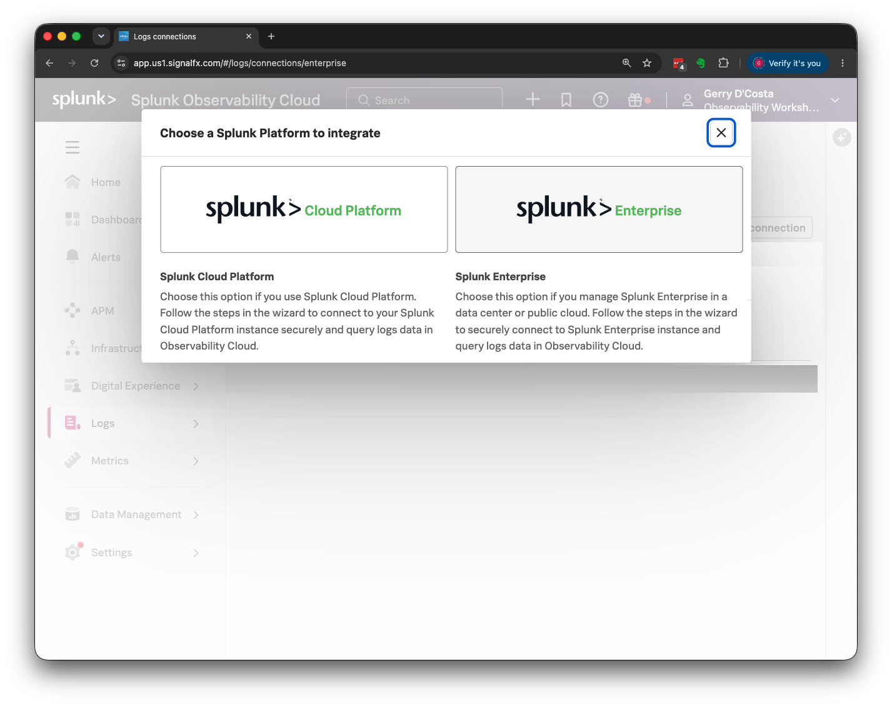

Fill in the service account details. The certificate is the contents of `locCert.pem` —
paste from `-----BEGIN CERTIFICATE-----` to `-----END CERTIFICATE-----` inclusive:

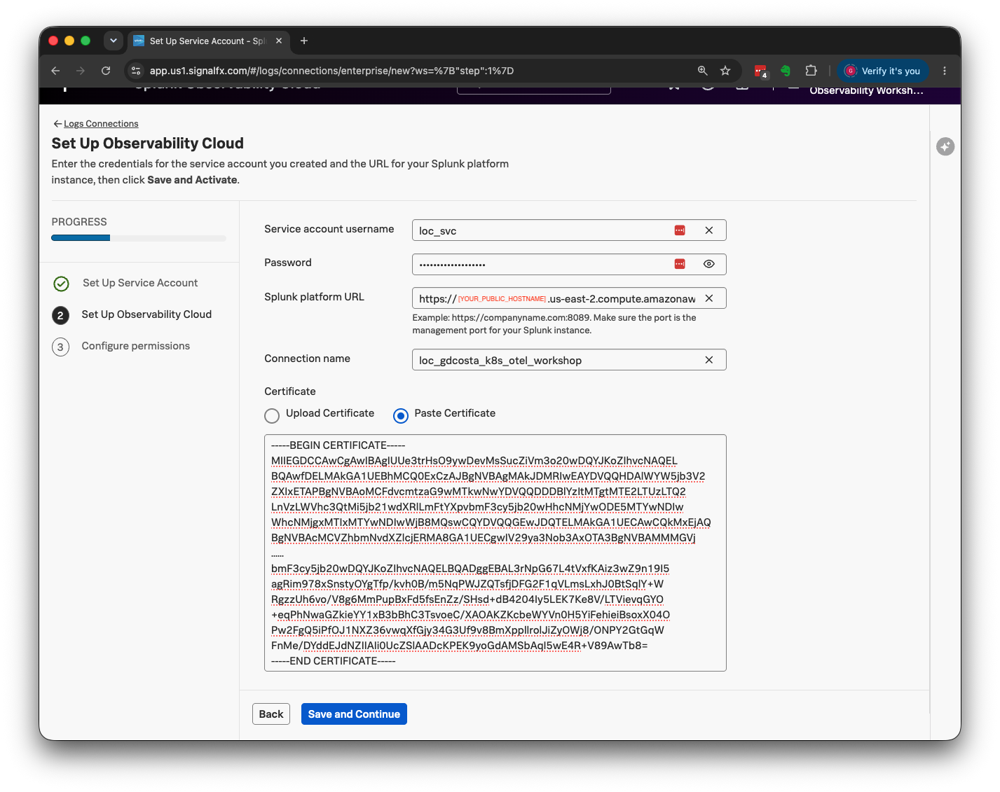

| Field | Value |
|---|---|
| Service account username | `loc_svc` |
| Password | `LogObserver2026!` |
| Splunk platform URL | `https://$PUB_DNS:8089` — run `echo "https://$PUB_DNS:8089"` |
| Connection name | e.g. `loc_${WS_USER}_k8s_otel_workshop` |
| Certificate | output of `sudo cat /opt/splunk/etc/auth/loccerts/locCert.pem` |

Then choose who may use the connection:

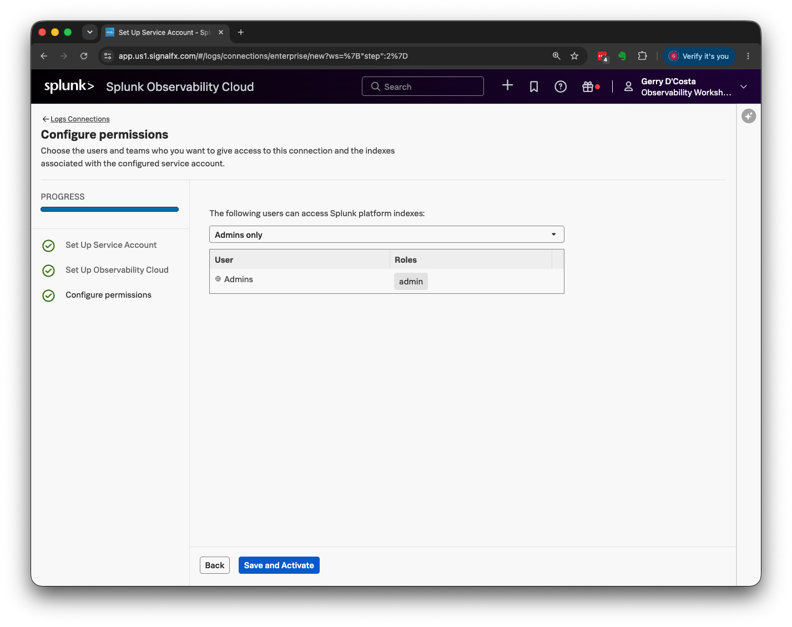

### Generate the index mappings

**Creating the connection does not create the mappings.** Straight after the guided setup
your connection shows **0/7** indexes with mappings, and it stays there until you run a
separate action that the guided setup never mentions.

1. **Logs → Logs connections**, then the kebab menu (**⋮**) on your connection row →
   **Generate mappings**. The same menu offers Update Connection, Delete Connection, View
   mappings and Make Default.

    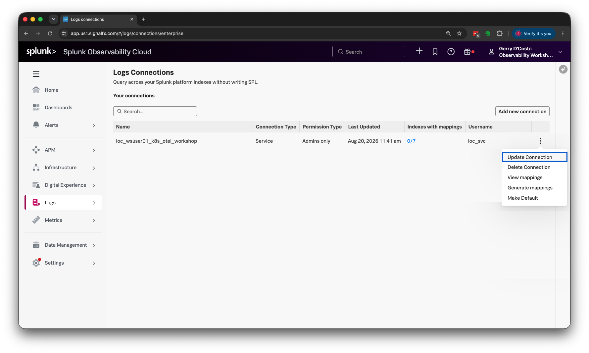
    <!-- STATUS: pending-recapture · menu contents are correct; the row behind it predates the two-index role -->

2. You land on the **Mapping generation** tab. **Turn Global Index Search off** first —
   see the note below for why — then tick the two workshop log indexes, `k8s_ws_logs` and
   `k8s_ws_petclinic_logs`. The header should read *"Selected 2 indexes"*. Then
   **Generate**.

    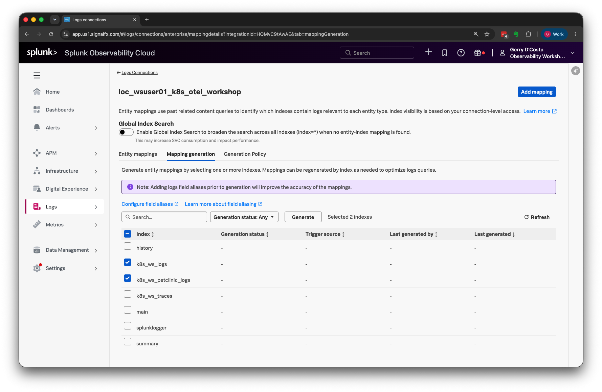

3. Generation status shows **Accepted**, trigger source **Manual**.

    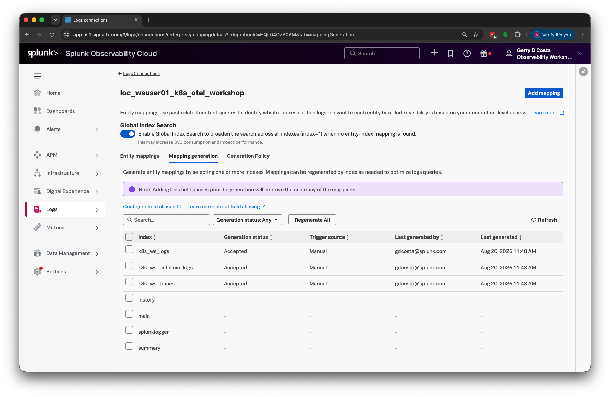

4. Hit **Refresh**. The indexes move through **In Progress**...

    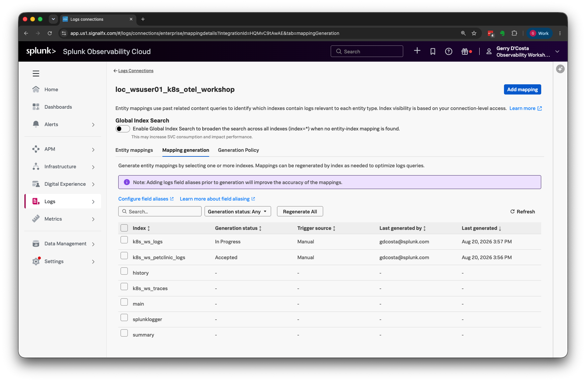

5. ...and land on **Completed**, one at a time. Keep refreshing until both read
   **Completed** — they finish independently, so one can be done while the other is still
   running.

    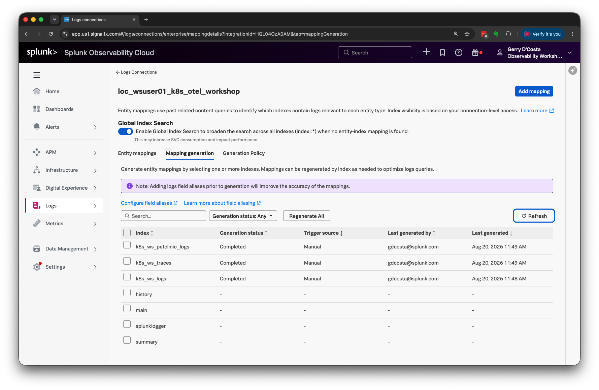

!!! danger "Accepted is not done"
    The status is asynchronous and moves **Accepted → In Progress → Completed**.
    *Accepted* means the request was queued, not that mappings exist. Refresh until **both**
    indexes read *Completed* — they progress independently, so it is normal to see one
    Completed while the other is still Accepted or In Progress. Participants who move on at
    Accepted continue with mappings half-built and then debug step 5 for the rest of the
    module.

!!! warning "Turn Global Index Search off"
    It ships **on**, and the setting reads: *"Enable Global Index Search to broaden the
    search across all indexes (`index=*`) when no entity-index mapping is found. This may
    increase SVC consumption and impact performance."*

    Switch it off for this workshop, for two reasons. It **masks a broken mapping** — logs
    still appear through the `index=*` fallback, so a misconfiguration looks like a working
    setup, and you learn nothing about whether your mappings are right. And it carries a
    stated cost and performance warning that matters the moment you apply any of this
    outside a lab.

    Turning it off does not reduce what the service account can reach: `index=*` is scoped
    to the role's `srchIndexesAllowed` either way. Verified — running that query as
    `loc_svc` returns only `k8s_ws_logs` and `k8s_ws_petclinic_logs`, while the same query
    as `admin` also returns `k8s_ws_traces`. The setting changes *breadth of search*, not
    *permission*.

### ✅ Checkpoint

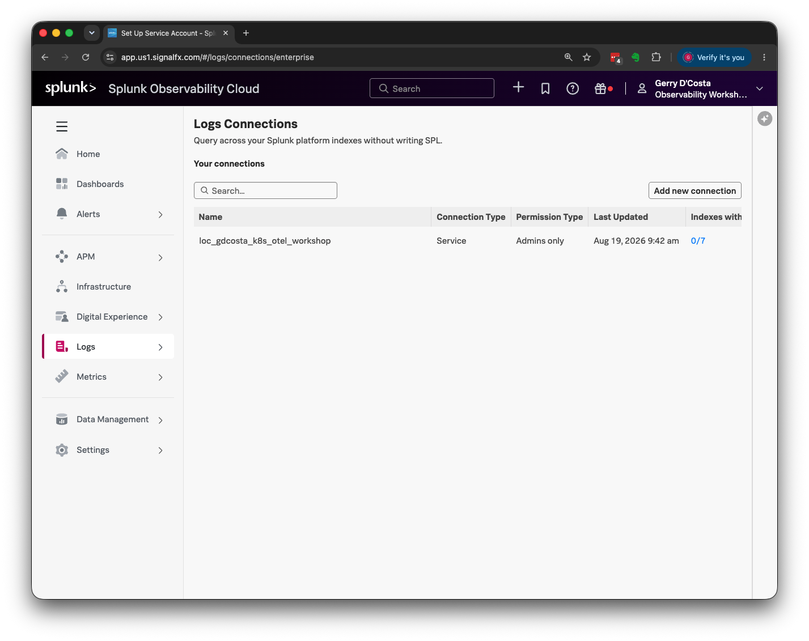
<!-- STATUS: pending-recapture · the mapping count in this shot is a snapshot; see the note below -->

**Do not use the "Indexes with mappings" count as your checkpoint.** Right after generating
you will see something like `2/7`, but that number drifts upward on its own — Observability
Cloud also maps indexes on a **global schedule that is outside your control and outside
this connection's settings**. Given time you may well see `7/7`, with every index in the
list mapped.

!!! warning "`7/7` does not mean your role is wrong — and `2/7` does not mean it is right"
    An earlier revision of this guide claimed a high number was the signature of a
    misconfigured role. That was wrong, and worth correcting explicitly because it sends
    you chasing a problem you do not have.

    A mapping is only a statement that Log Observer has *catalogued* an index. It is not a
    grant of access. The scheduler will happily map indexes the service account cannot read
    a single event from — those mappings simply never return anything.

**What to actually verify — the role.** This is the part you control, and it is the part
that matters. Two checks, both deterministic:

```bash
# 1. What the role grants. Exactly two indexes, and no importRoles.
curl -sk -u admin:'Workshop2026!' \
  "https://localhost:8089/services/authorization/roles/loc_service?output_mode=json" \
  | python3 -c 'import sys,json; c=json.load(sys.stdin)["entry"][0]["content"]; \
      print("allowed :", c["srchIndexesAllowed"]); print("imported:", c["imported_roles"])'

# 2. What the account can actually read — this is the query Global Index Search runs.
/opt/splunk/bin/splunk search '| tstats count where index=* by index' \
  -earliest_time -24h -auth loc_svc:'LogObserver2026!'
```

<details>
<summary>Expected</summary>

```
allowed : ['k8s_ws_logs', 'k8s_ws_petclinic_logs']
imported: []

        index         count
--------------------- ------
k8s_ws_logs           633768
k8s_ws_petclinic_logs  51139
```

The second check is the meaningful one. `index=*` is the broadest query available, and as
`loc_svc` it returns **only the two allowed indexes** — no `k8s_ws_traces`, no `main`, no
`summary`, no `_internal`. Run the same query as `admin` and `k8s_ws_traces` appears,
confirming the difference is the role and not an absence of data.

That is your access boundary, and it holds no matter how many indexes the scheduler
eventually catalogues.

</details>

!!! note "Why other indexes appear in the picker at all"
    `main`, `summary`, `history` and `splunklogger` are already **inaccessible** —
    `srchIndexesAllowed` is a whitelist, so anything absent is denied. They appear because
    Log Observer enumerates candidates through `/services/data/indexes`, a REST endpoint
    that **ignores search ACLs**. The search path (`eventcount`, `dbinspect`) correctly
    returns only the two allowed indexes.

    Adding `srchIndexesDisallowed` was tested and changed the enumeration not at all, so
    there is nothing to fix here. Deleting and recreating the connection under a new name
    does not change it either. Tick only the two log indexes and ignore the rest.

!!! warning "Mappings never reached **Completed**?"
    Distinct from the count drifting. If generation sits at *Accepted* or *In Progress*
    indefinitely, or the **Entity mappings** tab stays empty, check in this order:

    1. **Is the service account locked out?** Changing the Splunk-side password after the
       connection exists makes Observability Cloud retry with a stale credential until
       Splunk locks the account. Log Observer then returns nothing, with no error
       explaining why. Clear it with:
       ```bash
       curl -sk -u admin:'Workshop2026!' -X POST \
         https://localhost:8089/services/authentication/users/loc_svc -d "locked-out=0"
       ```
       and update the password stored in the connection, or it re-locks within minutes.
    2. **Is load running?** Generation reads *past related content queries*. With JMeter
       stopped, the only traffic is kube-probe health checks, which produce access-log
       lines with no `trace_id` and nothing to correlate an APM service against.
    3. **Have you actually pivoted from APM to Logs?** That pivot is what creates the
       related-content query the generator learns from.

Now try it: **Logs**, and search `index=k8s_ws_petclinic_logs`. Those are the events from
FW #2, queried live from Splunk Enterprise.

!!! tip "One thing improves these mappings, and it lives in step 5"
    The Mapping generation screen notes: *"Adding logs field aliases prior to generation
    will improve the accuracy of the mappings."* Field aliasing is set up in step 5, one
    section from here — so step 5 ends by sending you back to **Regenerate All**. Nothing
    to do yet; just know why you'll be returning.

---

## 5. Make logs correlate with APM

At this point Log Observer can query your logs and APM can show your traces — but the two
don't know about each other. Open **APM → Service Map**, click your service, and look at
the bottom of the panel:

```
Infrastructure (0)          Logs (0)
```

Both zero. Everything is collected correctly; nothing is *linked*.

!!! abstract "Learning moment — correlation is a data contract, not a feature"
    Observability Cloud joins logs to services by matching field values. It correlates on
    **`host.name`**, **`service.name`** and **`trace_id`** — and because APM identifies a
    service as *(service name, environment)*, **`deployment.environment`** has to match too.

    Your traces carry all of these, because the Java agent sets them. Your **logs** are
    just container stdout — the Collector knows which pod produced them, but nothing about
    which *service* that is, and the log line has no trace context in it at all.

    So this step is about putting the same four values on both sides.

### Three of the four fields are already true — check, don't add

AW #1 and FW #2 already put three of the four correlation fields on every log and span,
for reasons that had nothing to do with this module:

- **`service.name`** — FW #2's `extraAttributes.fromLabels` promotes each pod's
  `app.kubernetes.io/name` label onto its logs, and the Java agent already sets it on
  spans. Same string, two independent sources — that's *why* it matches, not a
  coincidence to configure.
- **`deployment.environment`** — `values-aw2.yaml`'s `transform/petclinic_logs`,
  `transform/traces_index` and `transform/app_metrics_index` all set the same literal
  value, reconciled onto one attribute name across all three signals (see the comment on
  the top-level `environment:` key in that file for why two names existed separately
  until this module).
- **`host.name`** — handled by field aliasing below, same as before.

Confirm rather than assume — pick one instrumented service and check both sides:

```bash
pod=$(kubectl get pod -n petclinic -l app.kubernetes.io/name=customers-service \
        -o jsonpath='{.items[0].metadata.name}')
kubectl get pod -n petclinic "$pod" \
  -o jsonpath='{range .spec.containers[0].env[*]}{.name}={.value}{"\n"}{end}' \
  | grep OTEL_SERVICE_NAME
```

then, in Splunk:

```
index=k8s_ws_petclinic_logs "service.name"=customers-service | head 1 | table "service.name"
```

The two should read identically — no per-service edit made either of them true, and none
is needed here.

### The one field that's genuinely new: `trace_id` in the log line

The Java agent already places `trace_id` and `span_id` into the logging MDC. Spring Boot's
default pattern simply never prints them, and unlike the three fields above, nothing
upstream of this module ever had a reason to fix that. This is the one real addition AW #2
makes.

The mechanism is the same one AW #1 introduced for AlwaysOn Profiling in the next step —
`instrumentation.spec.java.env`, not a hand-edited manifest. Add it in `values-aw2.yaml`:

```yaml
instrumentation:
  spec:
    java:
      env:
        # ...chart defaults, and AW #1's SPRING_AUTOCONFIGURE_EXCLUDE, must
        # stay listed — this list replaces, not merges. See step 6 for the
        # profiler vars this module adds alongside this one...
        - name: LOGGING_PATTERN_LEVEL
          value: "%5p [trace_id=%X{trace_id:-} span_id=%X{span_id:-}]"
```

??? abstract "Full command sequence — collector change"
    ```bash
    cd ~/k8s_workshop/k8s_otel
    ne values-workshop.yaml          # or: vi values-workshop.yaml
    sed -i "s|\${WS_USER}|$WS_USER|g" values-workshop.yaml

    helm upgrade ${WS_USER}-k8s-ws splunk-otel-collector-chart/splunk-otel-collector \
      --version 0.158.0 -f values-workshop.yaml --dry-run=client \
      --set splunkObservability.accessToken="$(cat ~/.o11y-token)"

    helm upgrade ${WS_USER}-k8s-ws splunk-otel-collector-chart/splunk-otel-collector \
      --version 0.158.0 -f values-workshop.yaml \
      --set splunkObservability.accessToken="$(cat ~/.o11y-token)"

    # instrumentation.spec.java.env changes don't roll running pods automatically —
    # restart to pick it up. One service at a time, waiting for each — restarting
    # all six simultaneously was tried live and transiently overloaded the control
    # plane on this instance size (see AW #1 §3's staged-rollout warning):
    for svc in customers-service vets-service visits-service api-gateway discovery-server config-server; do
      kubectl rollout restart deployment/"$svc" -n petclinic
      kubectl rollout status  deployment/"$svc" -n petclinic --timeout=120s
    done

    # Confirm a real log line now carries real IDs:
    kubectl logs -n petclinic deploy/customers-service --tail=50 | grep -o 'trace_id=[0-9a-f]*'
    ```

Log lines then carry the trace context:

```
2026-08-29T22:51:11.704Z INFO [trace_id=7820ac2fac93e572d074c76b33c86ec5 span_id=b64efdf9a4a1d17c] …
```

!!! tip "Splunk extracts these for free"
    Because the pattern emits `key=value` pairs, Splunk's automatic field extraction turns
    them into `trace_id` and `span_id` fields with no further configuration. Emitting them
    in that shape is deliberate.

!!! danger "`instrumentation.spec.java.env` REPLACES the chart's own defaults — it does not merge"
    Set this list with only your own additions and the chart's own defaults
    (`OTEL_RESOURCE_DISABLED_KEYS`, `OTEL_JAVA_ENABLED_RESOURCE_PROVIDERS`) silently
    disappear — no error, no warning, the agent just runs without them. `values-aw2.yaml`
    lists both chart defaults explicitly alongside every AW #2 addition for exactly this
    reason; step 6 covers the same gotcha again, because it bites the profiler vars the
    same way. Confirm what the chart actually ships by default before trusting this list
    has stayed current:
    ```bash
    kubectl get instrumentation -n default \
      ${WS_USER}-k8s-ws-splunk-otel-collector -o jsonpath='{.spec.java.env}'
    ```

### `host.name` — handled by field aliasing

The fourth field can't be fixed in the Collector. The `splunk_hec` exporter maps the
resource's `host.name` onto Splunk's canonical **`host`** field, so a separate `host.name`
never exists in the index.

**Logs → Configuration → Field aliasing** exists for exactly this. It maps Splunk field
names onto the standard names Observability Cloud expects, and ships with automatic
mappings already enabled — `host`, `hostname`, `event_host` and others all alias to
`host.name`.

!!! tip "Check before you change anything"
    Aliases for `host.name` and `deployment.environment` are usually active by default. If
    correlation isn't working, confirm there rather than assuming — but the cause is more
    often a missing field on the log side than a missing alias.

### ✅ Checkpoint

With the load test running, confirm all four fields on one event — per service, since
`service.name` genuinely differs now:

```
index=k8s_ws_petclinic_logs "service.name"=customers-service trace_id=*
| rename "service.name" as svc, "deployment.environment" as env
| table trace_id, severity, svc, env, host
```

<details>
<summary>Expected</summary>

```
trace_id                          severity  svc                 env                      host
7820ac2fac93e572d074c76b33c86ec5  INFO      customers-service   <you>-k8s-petclinic-env  minikube
```

Then prove the join actually resolves — take a `trace_id` from a log and find it in the
trace index. Run this one in **Splunk Web as `admin`**, not in Log Observer: `loc_svc`
deliberately has no access to `k8s_ws_traces` (step 4 explains why).

```
index=k8s_ws_traces "7820ac2fac93e572d074c76b33c86ec5" | stats count
```
</details>

Now reload **APM → Service Map**, click your service, and the panel should show non-zero
**Logs**. Clicking through opens Log Observer already filtered to that service.

!!! note "Only some logs carry `trace_id` — that's expected"
    Application logs go through logback, so they pick up trace context from the MDC.
    **Tomcat access logs bypass logback entirely** — the access valve writes straight out —
    so they have no MDC and no `trace_id`.

    You'll typically see a small fraction of events with `trace_id` and the rest without.
    Access logs still give you volume, status codes and response times; application logs
    give you the trace linkage. Both matter, for different questions.

!!! warning "Looking at an old time window?"
    Correlation only applies to logs written *after* these fields were configured. If the
    service map still shows zero, narrow the time picker to the last 15 minutes before
    concluding something is wrong.

!!! warning "Severity works the same way — and this is where people give up"
    Severity is written **at ingest**, exactly like the correlation fields. Any log indexed
    before FW #2 §11's transform was complete stays UNKNOWN **permanently**. Re-running
    `helm upgrade`, re-reading the OTTL and re-checking `severity_text` will change nothing,
    because nothing about the current configuration is wrong — those events simply predate
    the fix.

    On a measured run that was 9,101 UNKNOWN out of 48,777 events, essentially all of them
    from the hour before the transform was finished. Widen the time picker and you see a
    wall of UNKNOWN and conclude the transform is broken.

    **Narrow to the last 15 minutes when verifying.** To tell "config is wrong" from "data
    is old" in one query:

    ```
    index=k8s_ws_petclinic_logs
    | eval s=if(isnull(severity),"UNKNOWN","classified")
    | timechart span=1h count by s
    ```

    A clean split — UNKNOWN in the early buckets, classified from a point onward — means the
    transform is working and you are looking at history. UNKNOWN across *every* bucket
    including the most recent means the configuration really is wrong.

### Regenerate the mappings

Now that field aliasing is confirmed, go back and rebuild the Log Observer index mappings.
The Mapping generation screen says so itself:

> Note: Adding logs field aliases prior to generation will improve the accuracy of the
> mappings.

The mappings you generated in step 4 were built before you had verified the aliases, so
refresh them: **Logs → Logs connections → ⋮ → Generate mappings**, then **Regenerate All**.
Wait for **Completed** as before.


<!-- Captured on the two-index run; the Regenerate All button is top-left of the index table. -->

!!! tip "Worth remembering outside the workshop"
    Aliases and mappings are generated once and then cached. Anyone who adds or corrects a
    field alias later gets stale mappings and nothing tells them — the mappings simply stay
    as they were. Regenerating after an alias change is the habit to build.

---

## 6. AlwaysOn Profiling

!!! abstract "Learning moment — beyond which service is slow"
    A trace tells you *which service* spent the time. A profile tells you *which code*. The
    agent samples JVM call stacks continuously and links them to the spans that were active
    — so you can go from a slow endpoint to the exact method underneath it.

Enable it on the Collector:

```yaml
splunkObservability:
  profilingEnabled: true      # was false
```

??? example "What your values file should look like around here"
    `profilingEnabled` flips from `false` to `true`; everything else is unchanged.

    ```yaml

    # [AW2] Second destination. Added without changing how anything is collected.
    # accessToken stays out of the file — passed with --set on every upgrade.
    splunkObservability:
      realm: "us1"          # must match $O11Y_REALM
      metricsEnabled: true
      tracesEnabled: true
      profilingEnabled: true      # was false
    ```

??? abstract "Full command sequence — collector change"
    ```bash
    cd ~/k8s_workshop/k8s_otel
    ne values-workshop.yaml          # or: vi values-workshop.yaml

    # A text editor writes ${WS_USER} literally. Resolve it to your username:
    sed -i "s|\${WS_USER}|$WS_USER|g" values-workshop.yaml
    grep -n "$WS_USER" values-workshop.yaml | head    # confirm

    helm upgrade ${WS_USER}-k8s-ws splunk-otel-collector-chart/splunk-otel-collector \
      --version 0.158.0 -f values-workshop.yaml --dry-run=client \
      --set splunkObservability.accessToken="$(cat ~/.o11y-token)"

    helm upgrade ${WS_USER}-k8s-ws splunk-otel-collector-chart/splunk-otel-collector \
      --version 0.158.0 -f values-workshop.yaml \
      --set splunkObservability.accessToken="$(cat ~/.o11y-token)"

    kubectl rollout status daemonset/${WS_USER}-k8s-ws-splunk-otel-collector-agent --timeout=300s
    ```

And on the application — via `instrumentation.spec.java.env` in `values-aw2.yaml`, the same
mechanism step 5 just introduced for `LOGGING_PATTERN_LEVEL`, not a manifest edit:

```yaml
instrumentation:
  spec:
    java:
      env:
        # ...chart defaults must stay listed here too — see the danger box below...
        - name: SPLUNK_PROFILER_ENABLED
          value: "true"
        - name: SPLUNK_PROFILER_MEMORY_ENABLED
          value: "true"
        - name: SPLUNK_PROFILER_OTLP_PROTOCOL
          value: "http/protobuf"
```

!!! danger "`instrumentation.spec.java.env` REPLACES the chart's own defaults — it does not merge"
    Same gotcha as step 5, worth restating because this is where it was actually caught:
    installing with only the profiler vars listed (no chart defaults re-added) produced an
    `Instrumentation` CR silently missing `OTEL_RESOURCE_DISABLED_KEYS` and
    `OTEL_JAVA_ENABLED_RESOURCE_PROVIDERS` — no error, no warning, just an agent running
    without those two settings. `values-aw2.yaml` lists the chart's two defaults verbatim
    alongside every addition this module makes, for exactly this reason. Drop them only
    after confirming the chart's own default list hasn't changed:
    ```bash
    kubectl get instrumentation -n default \
      ${WS_USER}-k8s-ws-splunk-otel-collector -o jsonpath='{.spec.java.env}'
    ```

!!! danger "The protocol here is NOT what earlier revisions of this workshop set — check yours before copying an old value"
    The old manual approach hand-set `OTEL_EXPORTER_OTLP_ENDPOINT` to gRPC on port 4317, so
    that version of this workshop set `SPLUNK_PROFILER_OTLP_PROTOCOL=grpc` to match. The
    **operator's own default endpoint is different** — confirmed live as
    `http://<collector-agent-svc>:4318`, i.e. **HTTP**, not gRPC. Left as `grpc` here, it
    looks exactly as plausible as the correct value: the profiler starts, sends nothing, no
    error either side. This was caught by `verify-aw2.sh` failing outright, not by
    inspection — the wrong value doesn't announce itself.

    Confirm what your own endpoint actually is before trusting `http/protobuf` above stays
    correct on a future chart version:
    ```bash
    kubectl get pod -n petclinic <pod> \
      -o jsonpath='{range .spec.containers[0].env[*]}{.name}={.value}{"\n"}{end}' \
      | grep OTEL_EXPORTER_OTLP_ENDPOINT
    ```

??? abstract "Full command sequence — collector change, then restart the instrumented pods"
    ```bash
    cd ~/k8s_workshop/k8s_otel
    ne values-workshop.yaml          # or: vi values-workshop.yaml
    sed -i "s|\${WS_USER}|$WS_USER|g" values-workshop.yaml

    helm upgrade ${WS_USER}-k8s-ws splunk-otel-collector-chart/splunk-otel-collector \
      --version 0.158.0 -f values-workshop.yaml --dry-run=client \
      --set splunkObservability.accessToken="$(cat ~/.o11y-token)"

    helm upgrade ${WS_USER}-k8s-ws splunk-otel-collector-chart/splunk-otel-collector \
      --version 0.158.0 -f values-workshop.yaml \
      --set splunkObservability.accessToken="$(cat ~/.o11y-token)"

    # instrumentation.spec.java.env changes need a rollout to reach running pods.
    # One at a time — see AW #1 §3's staged-rollout warning:
    for svc in customers-service vets-service visits-service api-gateway discovery-server config-server; do
      kubectl rollout restart deployment/"$svc" -n petclinic
      kubectl rollout status  deployment/"$svc" -n petclinic --timeout=120s
    done
    ```

### ✅ Checkpoint

Per service, since profiling is now enabled uniformly rather than on one Deployment:

```bash
for svc in customers-service vets-service visits-service api-gateway discovery-server config-server; do
  echo "--- $svc ---"
  pod=$(kubectl get pod -n petclinic -l app.kubernetes.io/name=$svc -o jsonpath='{.items[0].metadata.name}')
  kubectl get pod -n petclinic "$pod" \
    -o jsonpath='{range .spec.containers[0].env[*]}{.name}={.value}{"\n"}{end}' \
    | grep -E 'SPLUNK_PROFILER|OTEL_EXPORTER_OTLP_ENDPOINT'
done
```

<details>
<summary>Expected — protocol and endpoint transport must agree, same shape on all six (two shown)</summary>

```
--- customers-service ---
SPLUNK_PROFILER_ENABLED=true
SPLUNK_PROFILER_MEMORY_ENABLED=true
SPLUNK_PROFILER_OTLP_PROTOCOL=http/protobuf
OTEL_EXPORTER_OTLP_ENDPOINT=http://wsuser01-k8s-ws-splunk-otel-collector-agent.default.svc.cluster.local:4318

--- vets-service ---
SPLUNK_PROFILER_ENABLED=true
SPLUNK_PROFILER_MEMORY_ENABLED=true
SPLUNK_PROFILER_OTLP_PROTOCOL=http/protobuf
OTEL_EXPORTER_OTLP_ENDPOINT=http://wsuser01-k8s-ws-splunk-otel-collector-agent.default.svc.cluster.local:4318
```

`http/protobuf` and a `:4318` endpoint — HTTP paired with HTTP. `grpc` here, against this
same `:4318` endpoint, is the silent-failure combination the danger box above warns about.
`discovery-server` and `config-server` show the same four lines as the four business
services — the mechanism doesn't distinguish infrastructure services from application
ones, since `instrumentation.spec.java.env` applies uniformly to anything the inject-java
annotation touches.
</details>

In Observability Cloud: **APM → your service → AlwaysOn Profiling**. With load running,
flame graphs appear within a few minutes.

---

## 7. Real User Monitoring

!!! abstract "Learning moment — the half you cannot see from the server"
    Everything so far measures the *server's* view. RUM measures the **browser's**: how
    long the page took to become usable, which resources were slow, what JavaScript errors
    real users hit.

    A request the server answered in 8 ms can still take 4 seconds to become interactive.
    Only the browser knows that.

### Create a RUM token

**Settings → Access Tokens → New Token**, scope **RUM**. This is separate from the ingest
token.

!!! note "This token is served to browsers, by design"
    The RUM token appears in your page's HTML because the browser needs it to send data.
    It's scoped to RUM ingest only and cannot read anything. Don't reuse your INGEST token
    here.

```bash
umask 077
printf '%s' '<YOUR_RUM_TOKEN>' > ~/.rum-token
```

### Add the snippet to the application

RUM is browser-side, so it goes in the page — and here the six-service topology forces a
real change from how earlier revisions of this workshop did it.

!!! abstract "Learning moment — the same constraint that reshaped AW #1, one more time"
    The old approach edited `src/main/resources/templates/fragments/layout.html` by hand
    and rebuilt the monolith's own image — that only worked because the monolith was built
    from source. The AngularJS SPA in this topology is served by `api-gateway`, and
    `api-gateway` is a **pulled image**, like five of the six PetClinic services (the same
    constraint AW #1 §3 hit with the Java agent). There is no Dockerfile to edit here
    either.

    `scripts/inject-rum-snippet.sh` solves it the way AW #1 solved its own version of this
    problem — without a rebuild. It pulls the page `api-gateway` is **actually serving
    right now**, inserts the snippet, and mounts the result back over the one file that
    matters via a `ConfigMap` + `subPath` volume mount. It re-extracts the live page every
    time it runs rather than keeping a static copy in this repo — a pulled image's content
    isn't something this repo owns, and a cached snapshot would silently drift the moment
    the image tag changes.

```bash
umask 077
printf '%s' '<YOUR_RUM_TOKEN>' > ~/.rum-token

cd ~/k8s_workshop
WS_USER=$WS_USER REALM=$O11Y_REALM RUM_TOKEN=$(cat ~/.rum-token) \
  ./scripts/inject-rum-snippet.sh
```

<details>
<summary>Expected output</summary>

```
→ pulling the page api-gateway is serving right now (http://minikube:30000/)
→ inserting the RUM snippet before </head>
→ creating/updating ConfigMap petclinic-rum-index in namespace petclinic
configmap/petclinic-rum-index created
→ mounting it over the served file on deployment/api-gateway
deployment.apps/api-gateway patched
→ waiting for the rollout
deployment "api-gateway" successfully rolled out
→ confirming the snippet is now served
✓ RUM snippet is live at http://minikube:30000/
```
</details>

`realm` (from `$O11Y_REALM`, set in step 1) and the RUM token are the only two values the
script needs beyond `$WS_USER` — everything else about the snippet's shape is fixed.

!!! danger "This is JavaScript, not YAML. `#` is not a comment here."
    Everywhere else in this workshop a `#` starts a comment, because everywhere else you are
    editing YAML. Inside the object literal the script inserts, `#` is a **SyntaxError**: the
    browser fails to parse the script, `SplunkRum.init` never runs, and no RUM data is
    collected at all.

    Nothing visible breaks. The page renders normally, the script tag is present in the
    served HTML, and the only evidence is an error in the browser console that nobody on an
    SSH session ever sees. The script's own snippet uses `//` throughout for exactly this
    reason — if you ever hand-edit the mounted `ConfigMap`, keep it that way.

!!! tip "Idempotent — re-run it freely, but roll the deployment yourself if you change the token"
    A second run detects the snippet is already present in the currently-served page and
    skips re-injecting it, and skips re-patching the Deployment if the volume mount is
    already there — a real bug in an earlier version of this script (checking "is the array
    non-empty" instead of "does *our* named entry already exist") appended a duplicate mount
    on a second run and the apiserver rejected it outright. If you change `$RUM_TOKEN` or
    `$REALM` and re-run, the script pulls whatever's currently mounted, not a fresh page — a
    plain `kubectl rollout restart deployment/api-gateway -n petclinic` first, or re-run
    against a freshly-deployed `api-gateway`, forces a truly fresh extraction.

### Did the snippet reach the page?

```bash
curl -s http://minikube:30000/ | grep -o 'o11y-gdi-rum\|SplunkRum.init'
```

Both strings must appear — the script's own last step already checked this for you, so a
failure here means something changed since it ran (a later `kubectl apply` that replaced
`api-gateway` wholesale, for instance, since a redeploy from the base manifest doesn't carry
the RUM mount forward — re-run the script if so).

!!! warning "This is not the checkpoint, and it cannot be"
    All that `grep` proves is that the **text** of the script is in the page. A snippet with
    a syntax error in it — the `#` above, a missing comma, an unclosed brace — matches this
    grep exactly as well as a working one, and returns a clean pass on a page whose RUM is
    dead.

    The real verification is that `SplunkRum` actually **initialised in a browser**, which
    only a browser can tell you. That's the next section: the Playwright script asserts
    `SplunkRum` is defined in the page context before it does anything else. Treat *that*
    assertion as the checkpoint for this step.

### Drive a real browser

RUM only produces data when a **real browser executes the JavaScript**. `curl` and JMeter
cannot do this; they never run the page.

Two of these commands need root, and the workshop `splunk` account deliberately has no
sudo — privileged work belongs to `ubuntu`. Open a **second session as `ubuntu`** and keep
your `splunk` session where it is; you'll alternate between them four times.

**Order matters as much as the account does.** `install-deps` reads a path *inside* the
virtualenv, so the venv must already exist when root runs it.

```bash
# 1. As ubuntu — python3-venv is not installed by default on Ubuntu 24.04.
#    ssh -i <your-key.pem> ubuntu@<your-instance>
sudo apt-get install -y python3-venv
```

```bash
# 2. As splunk — create the venv and install the Playwright package.
#    This is what puts a `playwright` binary at the path step 3 needs.
python3 -m venv ~/playwright-venv
~/playwright-venv/bin/pip install playwright
```

```bash
# 3. As ubuntu again — the browser's OS-level shared libraries.
sudo /home/splunk/playwright-venv/bin/playwright install-deps chromium
```

```bash
# 4. As splunk — the browser itself.
~/playwright-venv/bin/playwright install chromium    # 114.7 MiB download
```

!!! note "`sudo: a password is required`?"
    You're still on the `splunk` account. That is by design — `splunk` has no password and
    no sudo rights, and steps 1 and 3 above are the only commands in the entire workshop
    that need root.

    The 114.7 MiB in step 4 is the `chromium-headless-shell` download; the unpacked
    `~/.cache/ms-playwright` tree is somewhat larger.

!!! note "Why Playwright rather than JMeter's WebDriver plugin"
    Earlier versions of this workshop used a custom 111 MB JMeter build bundling the
    WebDriver Set plugin, Selenium, and a pinned `chromedriver` — all locked to one Chrome
    version. Every browser update broke it.

    Playwright installs the browser and its driver as a matched pair, so that whole class
    of version mismatch disappears.

```bash
cd ~/k8s_workshop
curl -fsSLO https://raw.githubusercontent.com/gdcosta/k8s-otel-workshop-2026/main/labs/rum/petclinic_browser_test.py
~/playwright-venv/bin/python petclinic_browser_test.py \
  --url http://minikube:30000 --iterations 6
```

<details>
<summary>Expected output</summary>

```
RUM browser test -> http://minikube:30000   (6 iterations)
  ✓ SplunkRum is initialised in the browser
  iteration 1/6 complete
  ...
Done in 65s. RUM data appears in Observability Cloud within a minute or two.
```

The script checks `SplunkRum` is defined in the page **before** running the journey. That
assertion — not the earlier `grep` — is what proves RUM is live: it fails immediately and
loudly if the snippet is missing *or* if it is present but didn't parse.
</details>

!!! failure "`SplunkRum is not defined`"
    The script found the page but no RUM object. The snippet is almost certainly *in* the
    HTML — the `grep` above would have told you so — and did not execute. Re-read it as
    JavaScript: a `#` where you meant `//`, a missing comma after `realm`, an unclosed
    brace. Load the page in a real browser and read the console; the parse error names the
    line.

### Run it long enough to actually explore the RUM UI

Six iterations proves the mechanism works — it is nowhere near enough to look around
**Digital Experience → RUM**. A session list with one entry, a page-load waterfall with one
data point, and JS-error grouping with nothing to group aren't worth clicking into. Run it
for real:

```bash
~/playwright-venv/bin/python petclinic_browser_test.py \
  --url http://minikube:30000 --duration 900     # ~15 minutes
```

Same "whichever comes first" rule as JMeter's `-Jloops`/`-Jduration` in FW #2: pass both
flags and the run stops at whichever limit it hits first; `--duration` alone runs until
time is up. Fifteen minutes is enough for a real session list and several page-load
waterfalls to look at — go longer if you want more. If you want failed sessions in the mix
too, trigger [FW #2 §8's fault](../02-foundational-2/index.md#8-cause-a-real-failure-and-find-it-in-splunk)
(`kubectl scale deployment/visits-service -n petclinic --replicas=0`) partway through the
run — the script's own visit-creation step will start timing out and logging it, the same
real failure the rest of this workshop uses.

This blocks the terminal it runs in, same as JMeter. Open a second terminal for it, exactly
as FW #2 §7 has you do for the load generator:

```bash
tmux new -s rum       # or a second SSH session — either works
```

Ctrl-C stops it early and closes the browser — it doesn't leave a headless Chromium process
running after you disconnect. It isn't necessarily instant: an interrupt that lands
mid-navigation finishes that one step first.

### Browse it yourself

Playwright gives you repeatable volume from one headless browser on a data-centre IP. It
does not give you what RUM is actually for.

PetClinic runs on a NodePort on minikube's internal address (`192.168.49.2:30000`), which
is not routable from your laptop no matter how open the security group is. SSH resolves the
target on the *remote* side, so a tunnel reaches it directly:

```bash
ssh -i <your-key.pem> -L 8080:192.168.49.2:30000 splunk@<your-instance>
```

Then open **http://localhost:8080** and use the application yourself: browse owners, look
at the vets, open an owner's detail page, edit their phone number, add a visit for one of
their pets — the same journey `petclinic_browser_test.py` scripts, now with a real person
driving it. There's no `/oups`-style menu item to click for a guaranteed error any more; if
you want one, trigger the `visits-service` fault from another terminal while you click
around and watch the visits page fail in front of you.

Now go to **Digital Experience → RUM** and find *your own session*. Your real browser, your
real geography, your real page-load timings, and (if you triggered the fault) a real failed
request produced by an actual click rather than a scripted one. Compare it with the
Playwright sessions sitting alongside it — same application, visibly different data.

!!! abstract "Learning moment — why this one needs a tunnel and Splunk Web doesn't"
    | | Runs on | Binds | From your laptop |
    |---|---|---|---|
    | Splunk Web `:8000` | the EC2 host | `0.0.0.0` | reachable directly |
    | PetClinic `:30000` | inside Kubernetes | NodePort on `192.168.49.2` | **not** reachable |

    That difference is entirely about where the process lives, and it is the same NodePort
    and cluster-networking behaviour FW #1 introduced — now with a practical consequence.

    `ssh -L` works natively in PowerShell and Windows Terminal, so no PuTTY-specific setup
    is needed.

### ✅ Checkpoint

**Digital Experience → RUM**, filtered to your application. You should see page views,
load times, and both kinds of session — the Playwright runs and your own. If you triggered
the `visits-service` fault while browsing, that session should also show the failed
request.

---

## 8. Follow one problem across all four

This is what the whole series has been building toward.

!!! abstract "Learning moment — the pivot"
    You now have four views of the same running system: browser sessions, service traces,
    infrastructure metrics, and raw logs. Their value isn't in any one view — it's in
    moving between them without losing your place.

With load running, trigger the fault this whole workshop uses for a real, reproducible
error: `kubectl scale deployment/visits-service -n petclinic --replicas=0`. Then:

1. **APM → your service.** Note the error rate on whichever service you have traffic
   against — `api-gateway` if you're routing through the gateway, or a downstream service
   directly.
2. **Click into the errors.** Trace Analyzer shows the failing traces; open one and you'll
   see the client span reaching for `visits-service` marked as an error — the same
   `NoRouteToHostException`/"no servers available" pattern FW #2 §8 walks through from the
   Splunk side.
3. **From the trace, pivot to Infrastructure.** The pod, node and container that served
   the request — was the failure isolated, or was the node under pressure?
4. **From the trace, pivot to Logs.** Log Observer Connect queries
   `k8s_ws_petclinic_logs` and shows the same WARN/ERROR breakdown FW #2 §8 found by hand
   — reachable in two clicks from the error rate instead of a raw search.
5. **Digital Experience → RUM.** The browser's side of the same failure, if you generated
   browser traffic during the fault window (step 7).

Scale `visits-service` back up when you're done:
`kubectl scale deployment/visits-service -n petclinic --replicas=1`.

### ✅ Checkpoint — do the numbers agree?

| Source | Measured on a real run (FW #2 §8 / AW #1 §1) |
|---|---|
| JMeter console | **28.57%** failed samples (90 / 315) |
| Splunk Enterprise (`api-gateway`'s own logs) | 242 events for those 90 failures — 222 `WARN` "no servers available", 20 multi-line `ERROR` `NoRouteToHostException` |
| APM service error rate | **not independently measured this pass** — querying it needs Observability Cloud UI/API access this module's authoring didn't have; the mechanism (this checkpoint) is real and correct, the number in your own run is the one to read here |

JMeter and Splunk Enterprise's numbers come from the exact same run, documented in full in
FW #2 §8 — and they already disagree in an instructive way *before* APM enters the
picture: 90 failed *requests* produced 242 log *events*, because two distinct log sources
(`RoundRobinLoadBalancer` WARN and `AbstractErrorWebExceptionHandler` multi-line ERROR)
both fire, legitimately, per failure. What you count decides whether you agree with
yourself, never mind with another tool.

Run this checkpoint yourself and see whether APM's own percentage — reachable from spans it
sampled, a third denominator again — lands anywhere near 28.57%, closer to a naive
"242-events" read, or somewhere else entirely. A gap of a fraction of a percent is
accounting for a different denominator. A gap of a factor of two is a finding — something
is being sampled, dropped, or misrouted.

---

## 9. The capstone dashboards

Two dashboards, and only one of them is an install — because they live in different
products. The Splunk Enterprise one is already on your instance; the Observability Cloud one
has to be imported separately, since Splunk apps cannot carry Observability Cloud content.

### Splunk Enterprise — correlation

Nothing to download. Open **Advanced Workshop #2 — Correlation** from **Search & Reporting →
Dashboards** (or the **K8s + OTel Workshop** app) — it came with the app you installed in
[FW #2 §12](../02-foundational-2/index.md#12-install-the-workshop-dashboard-app) and has been
waiting for the second destination you just configured.

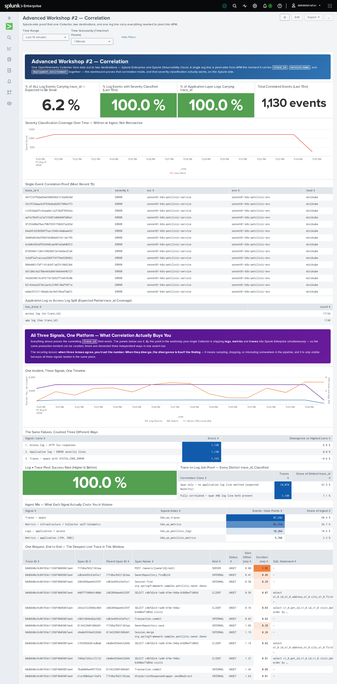

Thirteen panels, all verified against live data. The first half answers one question —
*does a log line actually carry what APM needs to pivot to it?* — with the percentage of app
events carrying `trace_id`, the percentage with severity classified, a severity-coverage
timechart proving it's written at ingest and not retroactive (the exact §5 warning, now
permanent), the single-event correlation proof (`trace_id`, `severity`, `service.name`,
`deployment.environment`, `host` on one row), and the app-log-vs-access-log split that
explains why coverage is partial by design.

The second half uses that correlation rather than just proving it. By this point your single
Collector is shipping **logs, metrics and traces into Splunk Enterprise simultaneously**, so
the same incident can be counted, timed and dissected three independent ways in one search
bar. Six panels do exactly that: all three signals on one timeline, the same failures counted
three different ways (access-log 5xx, ERROR-severity app logs, and spans with
`STATUS_CODE_ERROR` — which agree to within a fraction of a percent), the log→trace pivot
success rate, a join proof classifying every distinct `trace_id` as span-only, fully
correlated, or log-only-with-no-span, the ingest mix showing what each signal actually costs
you in volume, and one real request rendered end to end as a span waterfall — parent/child,
kind, offset, duration and SQL text, picked live from the deepest trace in the window.

!!! tip "The recurring lesson"
    When three lenses agree, you trust the number. When they diverge, **the divergence is
    itself the finding** — it means something is sampling, dropping or misrouting in the
    pipeline, and it is only visible because all three signals landed in the same place.

### Observability Cloud — APM, RUM, Profiling

This one *is* a download: a `.json` **export package**, imported into Observability Cloud.
A Splunk app can only carry Splunk Enterprise views, so this cannot ride along with the rest.

```bash
cd ~/k8s_workshop
curl -fsSLO https://raw.githubusercontent.com/gdcosta/k8s-otel-workshop-2026/main/labs/dashboards/aw2-o11y-dashboard.json
```

In Observability Cloud: **Dashboards → Create (+) → Import → Dashboard** (pick or create a
dashboard group first if you're not already in one), then select the file.

Import assigns fresh chart and dashboard IDs, so nothing collides with anyone else's copy.
Three filter variables — **Service**, **Environment**, **RUM Application** — come
pre-selected to this workshop's names; change them to point the whole dashboard at your own
if you're viewing someone else's import.

Four content panels, deliberately not five — profiling has no meaningful time-series shape,
so rather than force a fake chart, that panel is explanatory and points at **APM → your
service → AlwaysOn Profiling** for the real flame-graph view. The other three are real
charts on real data: APM error rate (color-banded), request-and-error volume over time, and
RUM page views — genuine browser sessions, bursty in a way synthetic APM load never is.

---

## Reference — complete files at the end of this module

If something isn't behaving, compare your files against these rather than re-reading the
steps. They're the exact files this module was tested with.

The petclinic manifest is **unchanged** from FW #2/AW #1 — nothing in this module edits it.
Profiling and log-correlation both go through `instrumentation.spec.java.env`, not the
manifest; RUM goes through `scripts/inject-rum-snippet.sh`'s own `ConfigMap` + `subPath`
mount, applied on top of `api-gateway`'s Deployment, not a change to the manifest file
itself. See [FW #2's reference section](../02-foundational-2/index.md#reference-complete-files-at-the-end-of-this-module)
for the base manifest, and step 7 above for exactly what the RUM script does to
`api-gateway`.

??? example "values-aw2.yaml (collector overlay, end of this module)"
    Placeholders are rendered with `envsubst`; substitute your own values by hand if you prefer.
    ```yaml
    # Splunk OTel Collector — Advanced Workshop #2 overlay
    # (logs + metrics + traces to Splunk Enterprise, plus Observability Cloud).
    # Snapshot of values-workshop.yaml as it stands at the END of AW #2.
    #
    # Render:  WS_USER=<you> LOCAL_IP=$(ec2metadata --local-ipv4) \
    #          HEC_TOKEN=<hec> \
    #          envsubst < values-aw2.yaml > my-values.yaml
    #
    # The Observability Cloud ingest token is NOT rendered into the file. It is
    # passed at install time, straight out of ~/.o11y-token:
    # Install: helm upgrade <you>-k8s-ws splunk-otel-collector-chart/splunk-otel-collector \
    #            --version 0.158.0 -f my-values.yaml \
    #            --set splunkObservability.accessToken="$(cat ~/.o11y-token)"
    #
    # Validate first — the chart schema is the only check that fails loudly:
    #          helm upgrade ... --dry-run=client

    # [FW2] Identifies this cluster on every metric, trace and log.
    clusterName: ${WS_USER}-minikube-cluster

    # [AW1] Required once operator.enabled=true + tracesEnabled=true + agent.enabled=true —
    # the chart's schema refuses to render without it. Sets the newer
    # deployment.environment.name resource attribute.
    # [AW2] Also reconciled onto the OLD-semconv deployment.environment (no ".name")
    # that transform/petclinic_logs sets on logs by hand — see transform/traces_index
    # and transform/app_metrics_index below. AW2 is the module about correlation
    # fields matching exactly, so the two attributes carrying the same value under
    # two different names was worth fixing now. Verified live.
    environment: "${WS_USER}-k8s-petclinic-env"

    # [AW1] Auto-instrumentation via the OpenTelemetry Operator's admission webhook,
    # instead of a hand-built -javaagent + Dockerfile — see AW1 §3 for why.
    operatorcrds:
      install: true

    operator:
      enabled: true

    # [AW2] instrumentation.spec.java.env REPLACES the chart's own default env
    # list — it does not merge. Verified live: installing with only the
    # profiler/logging vars below (no chart defaults re-listed) produced an
    # Instrumentation CR missing OTEL_RESOURCE_DISABLED_KEYS and
    # OTEL_JAVA_ENABLED_RESOURCE_PROVIDERS entirely, silently — no error, no
    # warning, just an agent running without those two settings. Every entry
    # below is therefore explicit: the chart's own two defaults, verbatim, PLUS
    # AW2's four additions. Drop the "chart defaults" entries only if you've
    # confirmed the chart's own default list hasn't changed:
    #   kubectl get instrumentation -n default \
    #     <release>-splunk-otel-collector -o jsonpath='{.spec.java.env}'
    instrumentation:
      enabled: true
      spec:
        java:
          env:
            # --- chart defaults (would silently vanish if omitted — see above) ---
            - name: OTEL_RESOURCE_DISABLED_KEYS
              value: "process.executable.path,process.command_args"
            - name: OTEL_JAVA_ENABLED_RESOURCE_PROVIDERS
              value: "io.opentelemetry.instrumentation.resources.ContainerResourceProvider,io.opentelemetry.sdk.autoconfigure.EnvironmentResourceProvider,io.opentelemetry.instrumentation.resources.ProcessResourceProvider"
            # --- AW1: disable PetClinic's own bundled Zipkin auto-export
            # (Spring Boot Actuator's ZipkinAutoConfiguration — unrelated to
            # the OTel Java agent). See AW1 §3's danger box for the two fixes
            # tried and confirmed NOT to work before this one. Carried forward
            # here unchanged, same as the two chart defaults above it. -------
            - name: SPRING_AUTOCONFIGURE_EXCLUDE
              value: "org.springframework.boot.actuate.autoconfigure.tracing.zipkin.ZipkinAutoConfiguration"
            # --- AW2: AlwaysOn Profiling. Applies to every operator-instrumented
            # pod uniformly, with no per-service edit needed. ---------------------
            - name: SPLUNK_PROFILER_ENABLED
              value: "true"
            - name: SPLUNK_PROFILER_MEMORY_ENABLED
              value: "true"
            # Real gotcha, caught live by verify-aw2.sh failing: the OLD manual
            # approach's OTEL_EXPORTER_OTLP_ENDPOINT was hand-set to gRPC on
            # :4317, so an earlier version of this workshop set "grpc" here. The
            # OPERATOR's own default endpoint is different — confirmed live as
            # http://<collector-agent-svc>:4318, i.e. HTTP, not gRPC. Left as
            # "grpc" it looks plausible and matches nothing: the profiler starts,
            # sends nothing, no error either side.
            - name: SPLUNK_PROFILER_OTLP_PROTOCOL
              value: "http/protobuf"
            # --- AW2: trace context in the log line. The agent already puts
            # trace_id/span_id in the MDC; Spring Boot's default pattern just
            # never prints them. Works identically via the Instrumentation CR as
            # a hand-written manifest env var would — Spring Boot's relaxed env
            # binding doesn't care which mechanism set it.
            - name: LOGGING_PATTERN_LEVEL
              value: "%5p [trace_id=%X{trace_id:-} span_id=%X{span_id:-}]"

    # [AW2] Second destination. Added without changing how anything is collected.
    splunkObservability:
      realm: "us1"          # your realm — see AW2 step 1
      # accessToken is deliberately absent. It is supplied at install time with
      #   --set splunkObservability.accessToken="$(cat ~/.o11y-token)"
      metricsEnabled: true
      tracesEnabled: true
      profilingEnabled: true     # enabled in step 6
      # NOTE: no logsEnabled here — the chart schema rejects it. Logs reach O11y
      # via Log Observer Connect, which queries Splunk Enterprise directly.

    # [FW2] Splunk Enterprise via HEC.  [AW1] adds metricsIndex / tracesIndex.
    splunkPlatform:
      endpoint: "http://${LOCAL_IP}:8088/services/collector"
      token: "${HEC_TOKEN}"
      index: "k8s_ws_logs"
      metricsIndex: "k8s_ws_metrics"
      tracesIndex: "k8s_ws_traces"
      logsEnabled: true
      metricsEnabled: true
      tracesEnabled: true

    # [FW2] Container log collection, plus multiline recombine.
    logsCollection:
      containers:
        excludeAgentLogs: false
        multilineConfigs:
          - namespaceName:
              value: petclinic
            podName:
              value: .*
              useRegexp: true
            firstEntryRegex: ^[^\s].*

    # [FW2] Promote pod annotations onto events.
    extraAttributes:
      # Promotes each pod's app.kubernetes.io/name label to service.name — see
      # AW1 §2's comment for the full reasoning.
      fromLabels:
        - key: app.kubernetes.io/name
          from: pod
          tag_name: service.name
      fromAnnotations:
        - key: docker_image_author
          from: pod
          tag_name: docker_image_author

    # [FW2] Cluster-level objects and events.
    clusterReceiver:
      eventsEnabled: true
      k8sObjects:
        - name: pods
          mode: pull
          interval: 60s
        - name: events
          mode: watch

    # [FW2] OTTL transforms.  [AW1] metric/trace index routing.
    # [AW2] deployment.environment reconciled onto one attribute name.
    agent:
      config:
        processors:
          transform/app_metrics_index:
            metric_statements:
              - set(resource.attributes["com.splunk.index"], "k8s_ws_petclinic_metrics")
                  where resource.attributes["k8s.namespace.name"] == "petclinic"
              - set(resource.attributes["deployment.environment"], "${WS_USER}-k8s-petclinic-env")
                  where resource.attributes["k8s.namespace.name"] == "petclinic"

          transform/traces_index:
            trace_statements:
              - set(resource.attributes["com.splunk.index"], "k8s_ws_traces")
              - set(resource.attributes["deployment.environment"], "${WS_USER}-k8s-petclinic-env")

          transform/petclinic_logs:
            log_statements:
              - set(resource.attributes["com.splunk.sourcetype"], "petclinic:app:log")
                  where resource.attributes["k8s.namespace.name"] == "petclinic"
              - set(resource.attributes["deployment.environment"], "${WS_USER}-k8s-petclinic-env")
                  where resource.attributes["k8s.namespace.name"] == "petclinic"
              - merge_maps(log.attributes,
                  ExtractPatterns(log.body, "(?P<log_level>INFO|WARN|ERROR|DEBUG|TRACE)"),
                  "upsert")
                  where resource.attributes["k8s.namespace.name"] == "petclinic"
              - set(log.severity_text, log.attributes["log_level"])
                  where log.attributes["log_level"] != nil
              - set(log.severity_number, SEVERITY_NUMBER_ERROR) where log.attributes["log_level"] == "ERROR"
              - set(log.severity_number, SEVERITY_NUMBER_WARN)  where log.attributes["log_level"] == "WARN"
              - set(log.severity_number, SEVERITY_NUMBER_INFO)  where log.attributes["log_level"] == "INFO"
              - set(log.severity_number, SEVERITY_NUMBER_DEBUG) where log.attributes["log_level"] == "DEBUG"
              - set(log.severity_text, "ERROR")
                  where log.attributes["log_level"] == nil and IsMatch(log.body, "Exception")
              - set(log.severity_number, SEVERITY_NUMBER_ERROR) where log.severity_text == "ERROR"
              - merge_maps(log.attributes,
                  ExtractPatterns(log.body,
                    "^\\S+ \\S+ \\S+ \\[[^\\]]+\\] \"(?P<http_method>[A-Z]+) (?P<http_path>\\S+)[^\"]*\" (?P<http_status>\\d{3}) (?P<http_bytes>\\S+) (?P<http_duration_us>\\d+)"),
                  "upsert")
                  where resource.attributes["k8s.namespace.name"] == "petclinic"
              - set(log.severity_text, "INFO")  where log.attributes["http_status"] != nil
              - set(log.severity_text, "WARN")  where IsMatch(log.attributes["http_status"], "^4")
              - set(log.severity_text, "ERROR") where IsMatch(log.attributes["http_status"], "^5")
              - set(log.severity_number, SEVERITY_NUMBER_INFO)  where log.severity_text == "INFO"
              - set(log.severity_number, SEVERITY_NUMBER_WARN)  where log.severity_text == "WARN"
              - set(log.attributes["severity"], log.severity_text) where log.severity_text != nil
        service:
          pipelines:
            metrics:
              processors:
                - memory_limiter
                - k8s_attributes
                - transform/app_metrics_index
                - batch
                - resource_detection
                - resource
            traces:
              processors:
                - memory_limiter
                - k8s_attributes
                - transform/traces_index
                - batch
                - resource_detection
                - resource
            logs:
              processors:
                - memory_limiter
                - k8s_attributes
                - filter/logs
                - transform/petclinic_logs
                - batch
                - resource_detection
                - resource
                - resource/logs
    ```

!!! tip "Diff instead of re-reading"
    ```bash
    curl -fsSL -o /tmp/reference.yaml \
      https://raw.githubusercontent.com/gdcosta/k8s-otel-workshop-2026/main/labs/collector/values-aw2.yaml
    diff <(sed 's/[[:space:]]*$//' ~/k8s_workshop/k8s_otel/values-workshop.yaml) \
         <(sed 's/[[:space:]]*$//' /tmp/reference.yaml)
    ```
    Each top-level section is tagged `[FW2]`, `[AW1]` or `[AW2]` with the module that
    introduces it, so ignore anything tagged for a module you haven't reached yet.

## ✅ Module checkpoint

```bash
~/k8s-otel-workshop/scripts/verify-aw2.sh
```

---

## Troubleshooting

??? failure "`helm upgrade` fails with a schema error"
    You've added a key the chart doesn't recognise — most often `logsEnabled` under
    `splunkObservability`. The message names the exact path. Run with `--dry-run=client`
    to check before installing.

??? failure "No data in Observability Cloud"
    Test the token directly with the `curl` from step 1. `401` means the token or realm is
    wrong. If that returns `200`, check the Collector:
    ```bash
    kubectl logs daemonset/${WS_USER}-k8s-ws-splunk-otel-collector-agent | grep -iE 'signalfx|401|403'
    ```

??? failure "Log Observer Connect shows `0/7` indexes with mappings"
    You almost certainly haven't generated the mappings. Creating the connection does not
    create them — it's a separate action: **Logs → Logs connections → ⋮ → Generate
    mappings**, tick the two log indexes, **Generate**, then refresh until the status reads
    **Completed**. See step 4.

    Only if it is *still* 0/7 after that is this the caching problem: access is evaluated
    once at creation, so re-save the connection and generate again.

??? failure "Log Observer Connect shows `7/7`"
    That is a broken setup, not a good one. Your role is inheriting `srchIndexesAllowed`
    from another role — Splunk unions it across `importRoles`. Remove `importRoles` from
    `authorize.conf` and restart Splunk. The correct number is **2/7**.

??? failure "Severity is UNKNOWN on most rows in Log Observer"
    Check which index they're in. If it's `k8s_ws_traces`, your service account should never
    have had access to it — those are spans, not logs. Remove it from `srchIndexesAllowed`,
    restart Splunk, and regenerate mappings. See step 4.

    In `k8s_ws_logs`, roughly 13% UNKNOWN is expected and correct: Kubernetes audit records
    have no severity to extract.

    In `k8s_ws_petclinic_logs`, check the *time range* before the configuration — severity
    is written at ingest, so events indexed before the transform was complete stay UNKNOWN
    permanently. See step 5.

??? failure "`Could not find role loc_service`"
    Roles load at startup. Restart Splunk between writing `authorize.conf` and creating the
    user.

??? failure "Service map shows Infrastructure (0) and Logs (0)"
    Correlation needs four matching values on the logs: `host.name`, `service.name`,
    `deployment.environment` and `trace_id`. Check them on a recent event, per service:
    ```
    index=k8s_ws_petclinic_logs "service.name"=customers-service trace_id=*
    | rename "service.name" as svc, "deployment.environment" as env
    | table trace_id, svc, env, host
    ```
    `service.name` should already match — it comes from the same
    `app.kubernetes.io/name` label on both sides (step 5). `deployment.environment`
    should too, once `values-aw2.yaml`'s reconciliation statements are in place — compare
    against the span itself (`index=k8s_ws_traces "service.name"=customers-service`), not
    the pod's own env, since `deployment.environment` isn't set there directly. Also
    narrow the time picker: correlation only applies to logs written *after* the fields
    were configured.

??? failure "`instrumentation.spec.java.env` change made, but the old value's still there"
    This block sets container env vars at pod-creation time — it doesn't reach pods that
    are already running. `kubectl rollout restart deployment -n petclinic <service>` after
    every change to it, the same as a new `helm upgrade` value that only takes effect on
    the next rollout.

??? failure "Severity column shows UNKNOWN"
    You set a log **attribute** named `severity` rather than the record's severity. Only
    `log.severity_text` and `log.severity_number` drive that column. See FW #2, step 11.

??? failure "Only a fraction of logs have trace_id"
    Expected. Application logs pass through logback and pick up trace context from the
    agent's MDC injection; **Tomcat access logs bypass logback**, so they never have it.

??? failure "Profiling enabled but no flame graphs"
    Protocol mismatch — check per service, since it's now set uniformly rather than on one
    Deployment:
    ```bash
    pod=$(kubectl get pod -n petclinic -l app.kubernetes.io/name=customers-service -o jsonpath='{.items[0].metadata.name}')
    kubectl get pod -n petclinic "$pod" \
      -o jsonpath='{range .spec.containers[0].env[*]}{.name}={.value}{"\n"}{end}' \
      | grep -E 'SPLUNK_PROFILER_OTLP_PROTOCOL|OTEL_EXPORTER_OTLP_ENDPOINT'
    ```
    The protocol must match the endpoint's actual transport — `http/protobuf` for `:4318`
    (the operator's default), not `grpc`/`:4317` (the OLD manual approach's endpoint, which
    doesn't apply here). See step 6's danger box.

??? failure "`instrumentation.spec.java.env` is missing settings you didn't remove"
    This field **replaces** the chart's default `java.env` list rather than merging with
    it — a list that omits the chart's own defaults silently drops them, with no error.
    Compare against what the chart actually ships:
    ```bash
    kubectl get instrumentation -n default \
      ${WS_USER}-k8s-ws-splunk-otel-collector -o jsonpath='{.spec.java.env}'
    ```
    and make sure `values-aw2.yaml` lists every entry you need, not just the ones you
    meant to add.

??? failure "No RUM data"
    Work through it in this order.

    1. **Did `scripts/inject-rum-snippet.sh` actually run and succeed?** Check its own
       output — it ends with `✓ RUM snippet is live` or a clear failure. A redeploy of
       `api-gateway` from the base manifest afterward drops the mount; re-run the script.
    2. **Did a real browser run the page?** `curl` and JMeter never execute JavaScript, so
       neither produces RUM data no matter how much traffic they generate.
    3. **Did the snippet execute?** `grep` only proves the text is served. Run the
       Playwright script — it asserts `SplunkRum` is defined in the page. If that assertion
       fails while the `grep` passes, the snippet is present and **invalid JavaScript**:
       look for a `#` comment, a missing comma after `realm`, or an unclosed brace.
    4. **Is the token the right kind?** RUM ingest needs a token scoped **RUM**, not INGEST.
    5. **Are you looking at the right application?** Filter on the `applicationName` you set
       in the snippet.

??? failure "`sudo: a password is required` during the Playwright install"
    You're on the `splunk` account, which has no sudo by design. Open a second session as
    `ubuntu` for `apt-get install python3-venv` and for `playwright install-deps`. See
    step 7 — the order of the four commands matters, because `install-deps` needs the venv
    to exist already.

??? failure "`python3 -m venv` fails with `ensurepip is not available`"
    `python3-venv` isn't installed, and installing it needs root: run
    `sudo apt-get install -y python3-venv` from your **`ubuntu`** session, then repeat the
    venv creation as `splunk`. Ubuntu 24.04 ships Python without it.

---

## Where to go next

You've built a complete observability pipeline: one collector, four signals, two
destinations, and the ability to move between them.

Worth exploring from here:

- **Detectors and alerting** on the error rate you can now see
- **Instrumenting the rest of the six services** — AW #1 §3 and this module's
  `instrumentation.spec.java.env` both apply per-Deployment; `visits-service`,
  `api-gateway`, `discovery-server` and `config-server` are still un-instrumented if you
  only did the minimum two
- **The Kubernetes audit log** as a security data source — see the
  [facilitator guide](../facilitator/index.md) for ready-made detections
- **Tearing it down** — `helm uninstall`, `minikube delete`, and terminating the instance
