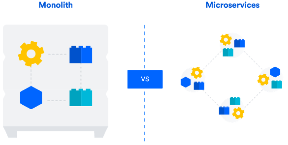
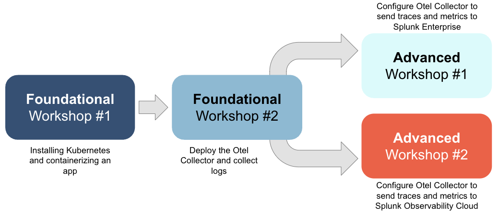

# Containers and Kubernetes

!!! info "Read once, referenced by every module"
    This is background. You don't need it to run the labs, but the labs make far more sense
    with it. Roughly five minutes.

## What is the need?

With society's increased adoption of powerful devices such as smartphones, tablets, and
laptops comes the increasing need for new online capabilities — app stores, e-commerce
sites, on-demand services delivered anywhere in the world.

To meet that need, software development teams had to become faster at delivering new
products and services: deployed, tested live, rolled back quickly, and updated to deal with
a growing set of security issues and an expanding threat surface.

## Monolithic vs. microservice development

Agile development and DevOps methodologies enabled that pace, but they translated poorly to
traditional monolithic application development.



In a **monolithic** application, a single software issue could mean hundreds of person-hours
spent debugging and rebuilding an entire application stack — and downtime until the issue
was resolved.

The same issue in a **microservice** application allows for better resiliency. Each major
function is broken out into its own containerised service, so problems can be isolated and
fixed while most of the application keeps running.

!!! abstract "What a container actually is"
    A container packages an application together with everything it needs to run — runtime,
    libraries, configuration — into a single image that behaves identically wherever it's
    started.

    It is *not* a virtual machine. There's no guest operating system; containers share the
    host kernel and isolate at the process level. That's why a container starts in
    milliseconds where a VM takes tens of seconds, and why the PetClinic image you build in
    FW #1 is around 360 MB rather than several gigabytes.

    You'll see this directly: in FW #1 you build an image `FROM eclipse-temurin:21-jre-noble`
    and add only your application jar. Everything beneath — the Java runtime, the base
    filesystem — is a layer you inherit rather than rebuild.

## Why Kubernetes?

Software and IT operations practitioners — DevOps teams — found that as they built services
using containers, the real power came from keeping them **stateless**. If a container
doesn't have to worry about application consistency (a database, say), it can be destroyed,
rebuilt, and scaled up and down freely.

That capability created a new requirement: something to manage the *orchestration* of
containers. If load on a container gets too high, scale it and its load balancer up. If a
container fails, restart it automatically to keep the service resilient.

**Kubernetes**, initially developed by Google, became the standard for how containers are
deployed, managed, and orchestrated. Kubernetes — shortened to **k8s** — manages how
containers run, continuously gathers statistics on their operating state, and can be
configured to make decisions that keep an application running optimally.

The combination of containers *and* Kubernetes is what we call a **microservice
architecture**.

DevOps teams in every organisation are now rapidly building applications on this
foundation. With that rapid adoption comes an accelerated need for visibility into these
environments — for performance, security, and reliability. That need is what the rest of
this workshop is about.

## The objects you'll actually use

Kubernetes has a large vocabulary. Five objects carry the whole workshop:

| Object | What it does | Where you meet it |
|---|---|---|
| **Pod** | The smallest deployable unit — one or more containers sharing a network identity | FW #1 |
| **Deployment** | Declares what to run and how many copies; replaces pods that die | FW #1 |
| **Service** | A stable network identity in front of pods whose IPs keep changing | FW #1 |
| **DaemonSet** | Runs exactly one pod per node — how the Collector agent reads every node's logs | FW #2 |
| **ConfigMap** | Configuration delivered to pods; the Collector's generated config lives in one | FW #2 |

!!! tip "Declarative, not imperative"
    You don't tell Kubernetes *"start a container"*. You declare *"one replica of this image
    should be running"* and Kubernetes continuously reconciles reality against that
    statement. Delete the pod and it comes back, because your declaration didn't change.

    This is why the workshop applies YAML files with `kubectl apply` rather than issuing
    run commands — and why `kubectl apply` twice is harmless.

## Namespaces

!!! abstract "Learning moment — scope and isolation"
    A namespace provides scope for Kubernetes resource names, and is the method Kubernetes
    offers to isolate resources logically — particularly where multiple teams contribute to
    one microservice application.

    In production, a Kubernetes administrator would likely put the PetClinic application in
    one namespace and the OpenTelemetry Collector in another.

    **In this workshop** everything is deployed to the `default` namespace, to keep the
    exercises simple. That's why every resource you create is prefixed with your username
    instead — it's the isolation mechanism standing in for namespaces when several people
    share a cluster or a Splunk instance.

You'll see namespaces regardless, because the cluster's own components live in one:

```bash
kubectl get pods -n kube-system
```

That's where `kube-apiserver` runs — the component whose audit log FW #1 switches on and
FW #2 collects.

## Where this workshop sits



You'll build a microservice environment from the ground up — containerise an application,
orchestrate it with Kubernetes, then instrument the result — and end up with the visibility
problem that OpenTelemetry exists to solve.

**Next:** [Why observability](observability.md) · [The OpenTelemetry Collector and Helm](otel-collector.md)
