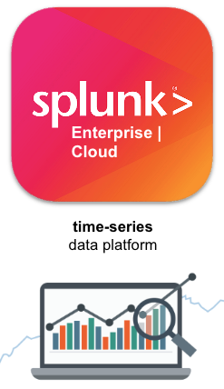
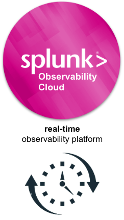

# Why observability

!!! info "Read once, referenced by every module"
    Background for Foundational Workshop #2 onward. Roughly five minutes.

Once you've built a microservice architecture, you've made your application resilient and
scalable — and you've made it much harder to see inside. This page covers what you need to
collect, and why the workshop collects it in three distinct forms.

## Data collection gets obscured

In a traditional monolithic environment, an application writes a log file. That file, along
with server metrics, is ingested into a platform like Splunk, and operations and
application teams troubleshoot from there. One application, one host, one log.

In a microservice architecture that access is obscured. Applications run as stateless
containers inside a Kubernetes orchestrator. Containers are created and destroyed
constantly, they have no fixed address, and their local filesystems disappear with them.
Every component still generates data — but you need a purpose-built tool to gather it and
send it somewhere durable *before* the container is gone.

## The three signals

OpenTelemetry standardises telemetry into three forms. The workshop collects each in turn,
one module at a time.

### Logs

Events emitted by an application or system component, usually as lines of text. The
richest, least structured signal — good for forensic detail, expensive at volume.

You'll collect two very different kinds in FW #2: **application logs** from PetClinic, and
the **Kubernetes audit log**, which records every request made against the cluster API.

### Metrics

!!! abstract "Learning moment — what is a metric?"
    Think of a metric as a **numeric value that provides a measurement on a very specific
    resource**, or a KPI used to track performance. CPU, disk, memory, application latency
    — all metrics, all quantifiable by a number.

    Many applications and devices generate metric data continuously, and it requires a
    specific way to capture and measure it. The Splunk Data Platform provides that, through
    dedicated **metric indexes** rather than ordinary event indexes.

In Advanced Workshop #1 you'll collect metrics from three sources at once: the Kubernetes
infrastructure, the PetClinic application's JVM, and the Collector itself.

### Traces

!!! abstract "Learning moment — what is a trace?"
    A trace — an *application* trace, in our context — is a method for keeping track of how
    a request made on an application moves between all the microservices that make up that
    application.

    Traces are assigned **trace IDs**, and are themselves made up of **spans** (each with
    its own span ID). Because microservice applications can become incredibly complex as
    they scale, the ability to view traces and spans is what lets you troubleshoot and
    remediate issues quickly.

A trace answers the question logs and metrics can't: *this one request was slow — which
service made it slow?*

### How they fit together

| Signal | Answers | Collected in |
|---|---|---|
| **Logs** | What happened, in detail? | FW #2 |
| **Metrics** | How much, how many, how fast — over time? | AW #1 |
| **Traces** | Where did this specific request spend its time? | AW #1, AW #2 |

The value is in the correlation. A metric shows latency rising; a trace identifies the slow
service; its logs explain why. Advanced Workshop #2 walks that exact path from APM to
infrastructure to logs.

## Two platforms, two jobs

You'll send data to both Splunk Enterprise and Splunk Observability Cloud, which raises a
fair question: why both?

**Splunk Enterprise / Cloud** — a time-series data platform, most effective at identifying
historical trends and deep forensic searching and analysis. The ideal platform for
correlating with other data sources — network, firewall, operating system — to identify
long-term trends and patterns.

**Splunk Observability Cloud** — a real-time platform providing rapid detections for fast
time to detection and resolution (MTTD / MTTR). Its sweet spot is detections for
cloud-native Kubernetes and application workloads.

!!! tip "Same collector, both destinations"
    This is the practical reason the OpenTelemetry Collector matters. You configure
    collection *once*, then choose destinations. In FW #2 you send to Splunk Enterprise; in
    AW #2 you add Observability Cloud by adding a `realm` and `accessToken` — with no change
    to how anything is collected, and no change to the application.

    That's the vendor-neutrality argument made concrete.

## What you'll have built

By the end you'll have a single agent collecting logs, metrics and traces from a Kubernetes
cluster and a Java application, enriching them with Kubernetes metadata, transforming them
in flight, routing them to separate indexes by retention and access needs, and delivering
them to two platforms with different strengths.

**Next:** [The OpenTelemetry Collector and Helm](otel-collector.md) — how that agent is
configured and deployed.
