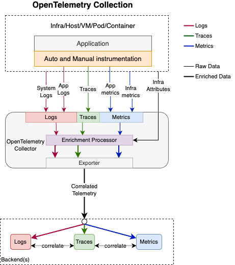
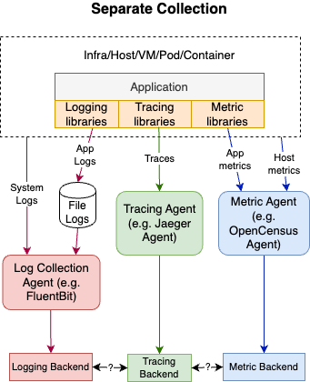
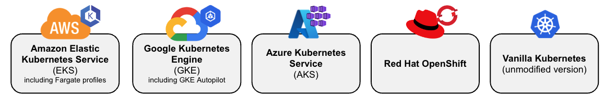

# The OpenTelemetry Collector and Helm

!!! info "Written once, referenced everywhere"
    This page is shared by Foundational Workshop #2 and both Advanced workshops. In the
    original Word guides this material was duplicated verbatim into four documents; here
    it lives in one place, so a correction only has to be made once.

## Why microservice data is harder to get at

With containers and Kubernetes, DevOps teams need a way to monitor the health of those
systems to make fast, data-driven operational decisions — enough resources allocated,
applications running correctly.

In a traditional monolithic environment an application typically writes a log file. That
file, together with server metrics, gets ingested into a platform like Splunk, and
operations and application teams troubleshoot from there.

In a microservice architecture that access is obscured. Applications run as stateless
containers inside a Kubernetes orchestrator. Every component generates data, but you need
a purpose-built tool to gather it and forward it somewhere useful.

## Enter OpenTelemetry



Originally, each vendor building tools for microservice monitoring shipped its own
proprietary collection agent. With the explosion of cloud-native development this became a
serious problem: it locked customers in. Moving to another vendor meant changing code
across every microservice.

There was also no standard way to describe the *origin* of telemetry — which application
emitted it, and what infrastructure it was running on.



That led to the open-source OpenTelemetry community, whose goal is a standard methodology
and toolset for collecting microservice telemetry and sending it to any vendor that
adheres to the standard. The data comes in three primary forms:

| Signal | What it captures |
|---|---|
| **Metrics** | Numeric measurements — CPU, disk, memory, latency |
| **Traces** | How a request moves between microservices |
| **Logs** | Events emitted by the application itself |

This workshop uses **Splunk's distribution** of the Collector — a fork of the community
collector — configured to send data to Splunk Enterprise and, in Advanced Workshop #2,
to Splunk Observability Cloud.

## Anatomy of the Collector configuration

The Collector is an agent deployed into Kubernetes to collect information about running
resources. It's driven by a configuration file built from four kinds of component:

<div class="grid cards" markdown>

- { width="48" }
  **Receivers** — how data gets *into* the Collector. Push or pull based; a receiver may
  support one or more data sources.

- { width="48" }
  **Processors** — run on data between being received and being exported. Optional, though
  some are recommended.

- { width="48" }
  **Exporters** — how you send data *out* to one or more backends. Push or pull based.

- { width="48" }
  **Services** — which components are actually enabled, assembled into pipelines from the
  receivers, processors, exporters and extensions defined above.

</div>

Writing that configuration by hand is fiddly, so most Collector distributions — Splunk's
included — ship a **Helm chart** that abstracts and simplifies it.

## What is a Helm chart?

A Helm chart is the packaging format DevOps practitioners use to deploy containerised
applications into Kubernetes. From the Helm documentation:

> Helm uses a packaging format called charts. A chart is a collection of files that
> describe a related set of Kubernetes resources. A single chart might be used to deploy
> something simple, like a memcached pod, or something complex, like a full web app stack
> with HTTP servers, databases, caches, and so on.

## How chart values map to Collector configuration

The chart lets you express intent in a logical layout, and translates it into the
receiver / processor / exporter / pipeline structure the Collector expects.

You write this in your values file:

```yaml
splunkPlatform:
  endpoint: "http://splunk.example.com:8088/services/collector"
  token: "<YOUR_HEC_TOKEN>"
```

…and the chart generates this Collector configuration:

```yaml
exporters:
  splunk_hec/platform_logs:
    token: "<YOUR_HEC_TOKEN>"
    endpoint: "http://splunk.example.com:8088/services/collector"
service:
  pipelines:
    logs:
      receivers: [file_log, otlp]
      exporters: [splunk_hec/platform_logs]
```

!!! tip "You can inspect the translation yourself"
    This isn't a black box. To see exactly what your values produce before installing
    anything:

    ```bash
    helm template t splunk-otel-collector-chart/splunk-otel-collector \
      --version 0.158.0 -f values-workshop.yaml
    ```

    And to read what's running right now:

    ```bash
    kubectl get cm ${WS_USER}-k8s-ws-splunk-otel-collector-otel-agent \
      -o go-template='{{index .data "relay"}}'
    ```

    That second command is the single most useful debugging tool in this workshop. When
    configuration appears to do nothing, read the generated config and confirm your change
    is actually in it.

Notable top-level sections in the chart's values file:

`clusterName` · `splunkPlatform` · `splunkObservability` · `agent` ·
`clusterReceiver` · `logsCollection` · `extraAttributes` · `isWindows`

!!! warning "Pin the chart version"
    This chart is pre-1.0 and takes breaking changes on minor releases — 10 of the last 12
    releases carried breaking-change notes, roughly every two weeks. Always install with an
    explicit `--version`, and keep your settings in a small **overlay file** rather than
    editing the chart's own `values.yaml`. An overlay survives a version bump; an edited
    upstream file does not.

## Running the Collector in production

The configurations in this workshop are a teaching aid for understanding how the Collector
works. A production deployment needs additional consideration of resource limits, buffering
and retry behaviour, namespace isolation, and RBAC scope.

## Supported Kubernetes distributions


<!-- STATUS: review — verify this list against current Splunk docs before publishing -->
